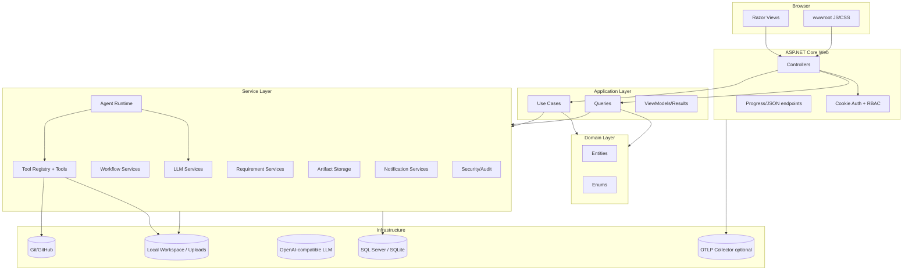
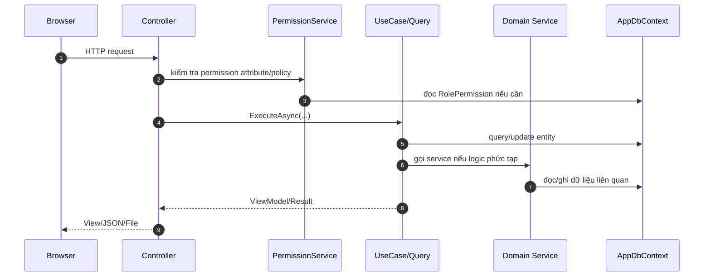
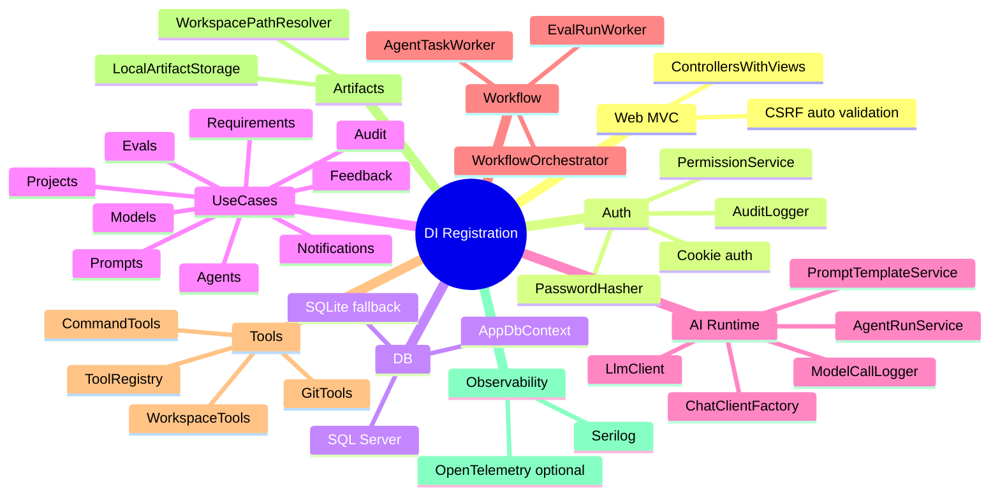
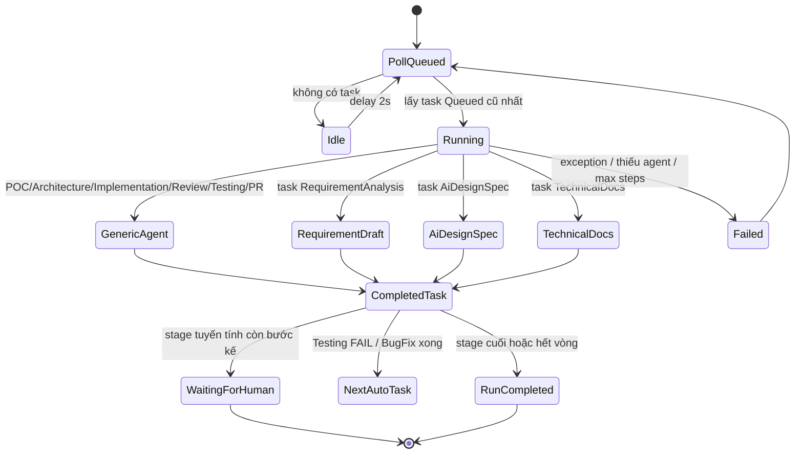
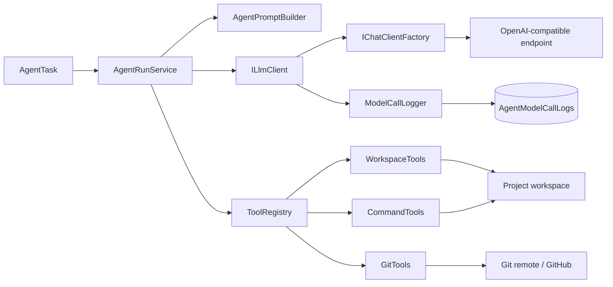
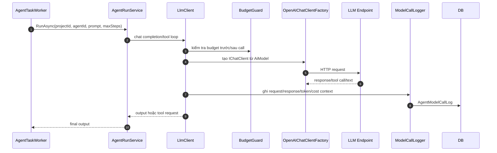
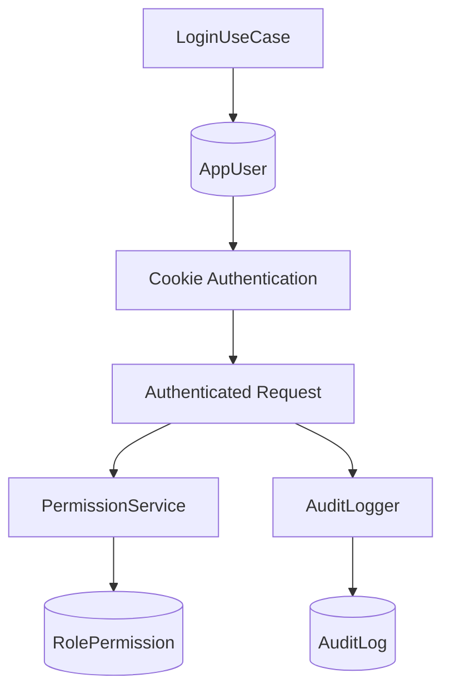
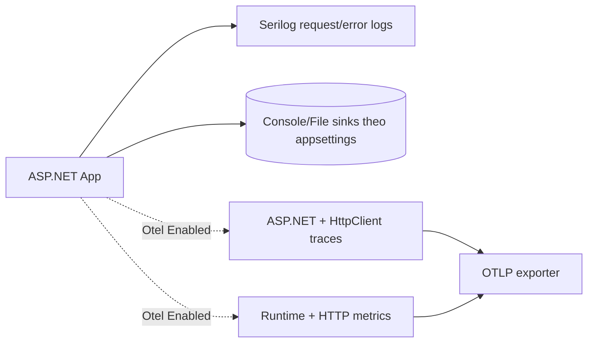

# Architecture Overview — ICOGenerator v4

## 1. Kiến trúc tổng thể

ICOGenerator v4 dùng kiến trúc nhiều lớp theo kiểu **MVC + Application Use Cases + Domain + Services + EF Core**.

## 2. Layer responsibilities

| Layer | Trách nhiệm | Không nên làm |
|---|---|---|
| `Controllers` | Nhận request, authorize, validate model cơ bản, gọi use case/query, trả view/json/file | Không chứa business logic dài, không gọi LLM trực tiếp |
| `Application/*` | Use case/query theo feature, dựng ViewModel/Result, điều phối DB/service ở mức nghiệp vụ | Không chứa logic hạ tầng phức tạp như tool execution/LLM protocol |
| `Domain/*` | Entity, enum, navigation, trạng thái nghiệp vụ | Không phụ thuộc ASP.NET, controller, service cụ thể |
| `Services/*` | Logic nghiệp vụ/hạ tầng reusable: LLM, workflow, requirement generation, artifacts, notification, security | Không trả Razor view |
| `Data/*` | EF DbContext, mapping, seed, migration bootstrap | Không chứa flow nghiệp vụ UI |
| `Prompts/*` | Prompt template theo domain/agent/workflow | Không hardcode prompt dài trong use case nếu đã có file prompt |

## 3. Request/response path chuẩn

## 4. Dependency Injection composition root

`AddIcoGeneratorApplication` là composition root của ứng dụng. Các nhóm service chính:

## 5. Background workers

### 5.1 AgentTaskWorker

`AgentTaskWorker` là worker trung tâm cho delivery/requirement workflow:

### 5.2 EvalRunWorker

Eval worker poll `EvalRun` trạng thái `Queued`, chạy các scenario, gọi target model và judge model, lưu `EvalResult`, cập nhật điểm trung bình/token/duration.

## 6. Agent/tool architecture

Tool access không phải global: `AgentTool` nối `Agent` với `ToolDefinition`. Khi app khởi động, `ToolDiscoveryService` đồng bộ method tool vào DB; seed mặc định cấp tool theo vai trò.

## 7. LLM call path

## 8. Security architecture

Các điểm quan trọng:

- Fallback authorization policy yêu cầu mọi endpoint phải authenticated trừ khi `[AllowAnonymous]`.
- Cookie auth dùng `HttpOnly`, `SameSite=Lax`, HTTPS-only ngoài development.
- CSRF được bật mặc định cho unsafe HTTP verbs bằng `AutoValidateAntiforgeryTokenAttribute`.
- Security headers baseline: `X-Content-Type-Options`, `X-Frame-Options`, `Referrer-Policy`.
- `Admin` implicit-all; role khác đọc quyền từ `RolePermission`.

## 9. Storage architecture

| Storage | Nội dung |
|---|---|
| Database | Entity nghiệp vụ, workflow/task, model config, prompt versions, logs, eval results, notifications |
| Local artifact storage | Workspace project, mockup HTML, source generated, feedback/source uploads |
| Prompt files | Prompt gốc versioned trong repo; Prompt Studio có thể override bằng DB |
| Templates | DOCX templates dùng để xuất BRD/SRS/FSD/User Stories |

## 10. Observability

Ngoài log hệ thống, app còn có log nghiệp vụ rất quan trọng:

- `AgentModelCallLog`: request/response/token/duration/error từng LLM call.
- `AuditLog`: thay đổi cấu hình quan trọng.
- `AgentTask`/`WorkflowRun`: trạng thái delivery.
- `EvalRun`/`EvalResult`: chất lượng prompt/model theo scenario.
