# Business Flow — ICOGenerator v4

## 1. Big picture

ICOGenerator tổ chức công việc theo một chuỗi có kiểm soát:

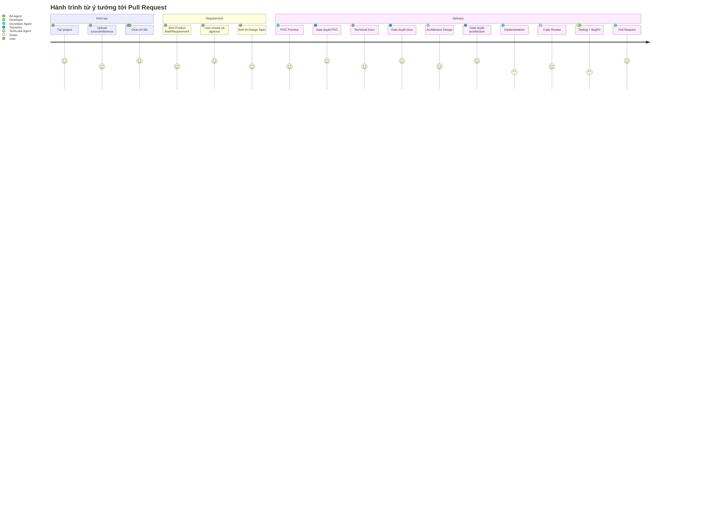

## 2. Flow 1 — Login và phân quyền

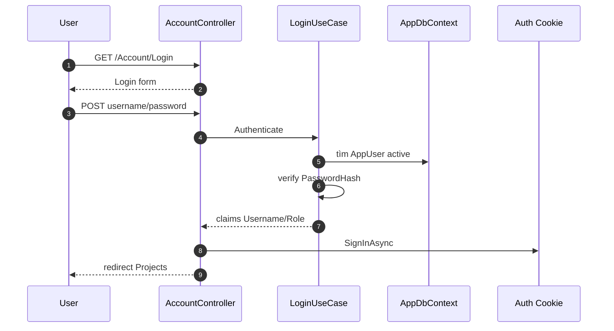

Sau login, mọi request đi qua authorization fallback. Permission chi tiết dựa vào role + `RolePermission`.

## 3. Flow 2 — Tạo project

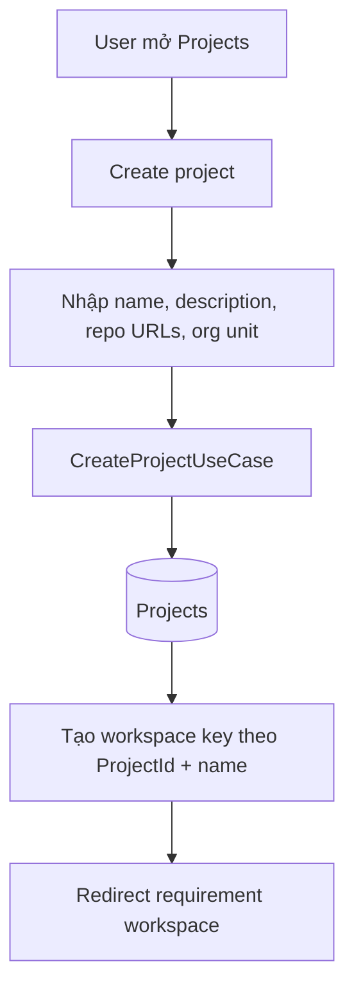

Dữ liệu cốt lõi tạo ra:

- `Project`: metadata project, owner, org unit, repo URL, status.
- Workspace local: nơi agent ghi mockup/source/artefact.

## 4. Flow 3 — Requirement discovery với BA

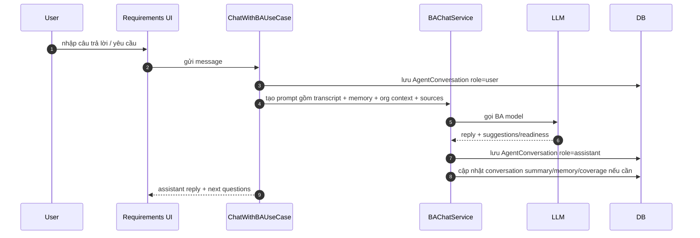

BA không chỉ trả lời chat; service còn duy trì ngữ cảnh dài hạn:

| Context | Lưu ở đâu | Mục đích |
|---|---|---|
| Conversation transcript | `AgentConversation` | Lịch sử trao đổi chi tiết |
| Conversation summary | `Project.ConversationSummary` | Rút gọn hội thoại dài |
| User memory | `AppUser.UserMemory` | Ghi nhớ preference/đặc thù người dùng |
| Checklist gap notes | `Agent.LearnedChecklistNotes` | Học các điểm BA thường hỏi thiếu |
| Requirement coverage | `Project.RequirementCoverageMap` | Theo dõi coverage requirement |
| Source files | `ProjectSourceFile` | Bối cảnh từ PDF/image user upload |

## 5. Flow 4 — Sinh draft requirement

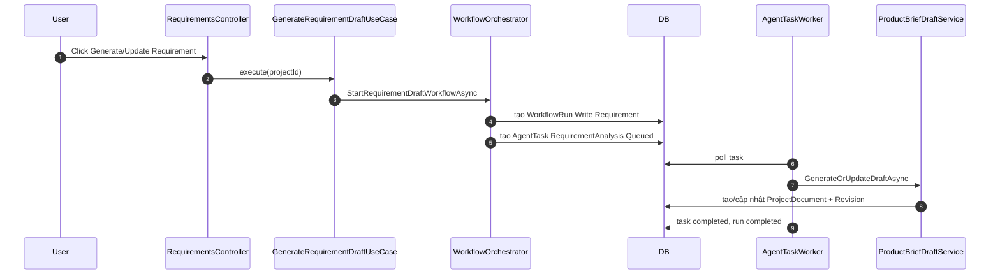

Kết quả có thể là:

- Đủ thông tin: tạo/cập nhật requirement docs.
- Chưa đủ thông tin: worker trả marker `NeedsMoreInfo`, BA đặt câu hỏi tiếp trong chat.

## 6. Flow 5 — Approve requirement và sinh AI Design Spec

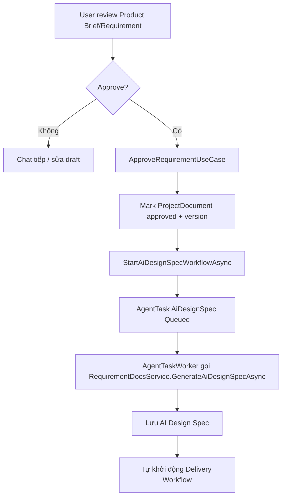

Điểm quan trọng: sinh AI Design Spec chạy nền để UI không bị treo trong lúc đợi LLM.

## 7. Flow 6 — Delivery pipeline có gate duyệt

Pipeline delivery được khai báo tập trung trong `DeliveryPipeline`:

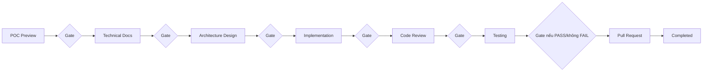

Mỗi bước tuyến tính có pattern:

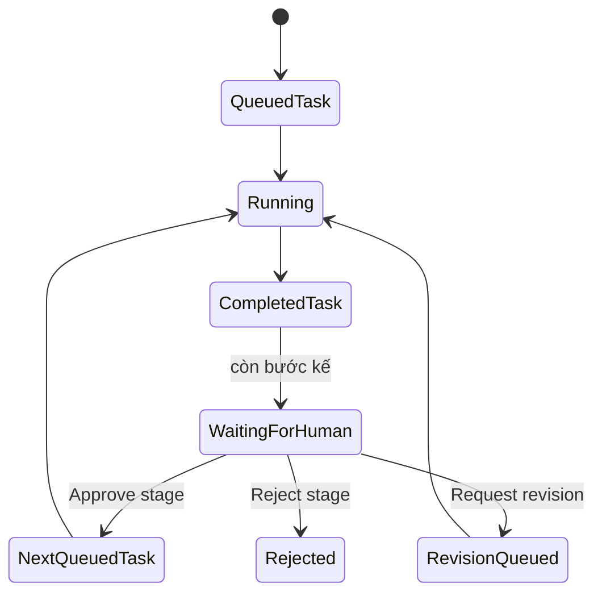

## 8. Flow 7 — Request revision tại gate

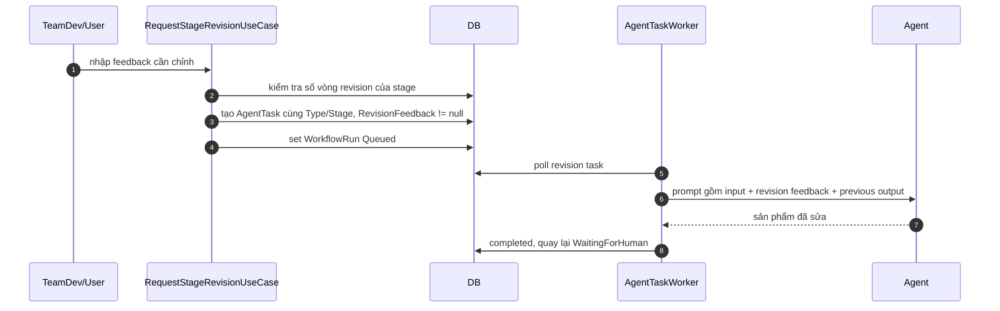

Giới hạn mặc định: tối đa 3 vòng revision cho mỗi bước để tránh đốt token vô hạn.

## 9. Flow 8 — Testing và BugFix loop tự động

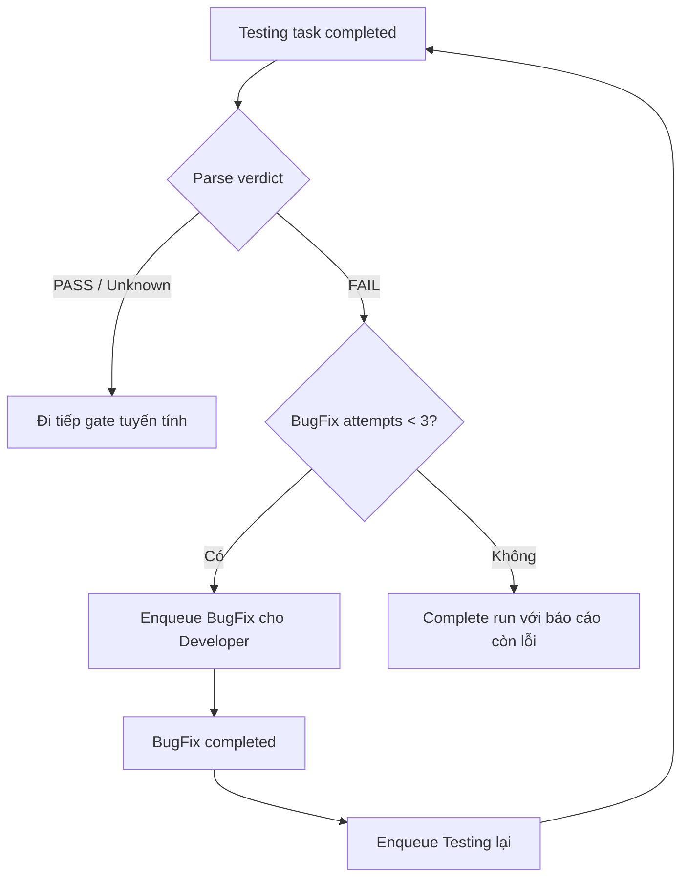

Điểm khác với các stage khác: Testing↔BugFix là chu trình tự động, không chờ gate giữa BugFix và retest.

## 10. Flow 9 — Pull Request

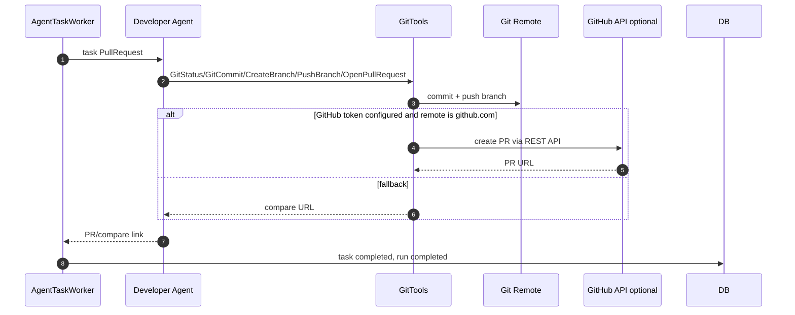

## 11. Flow 10 — Prompt Studio và Eval

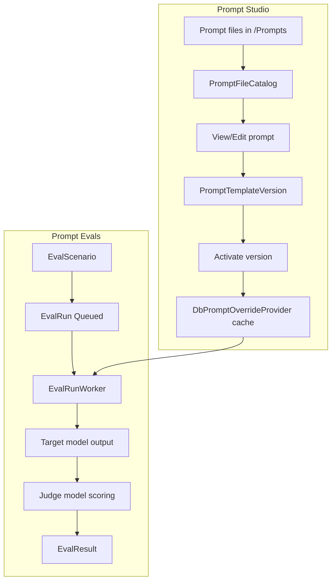

Prompt file trong repo là source gốc; version active trong DB override prompt tại runtime.

## 12. Notification flow

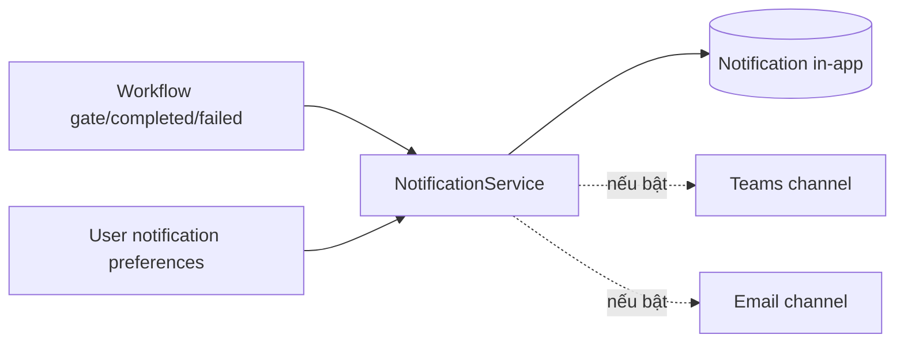

Thông báo xuất hiện ở chuông in-app; Teams/email chỉ hoạt động khi được cấu hình.
