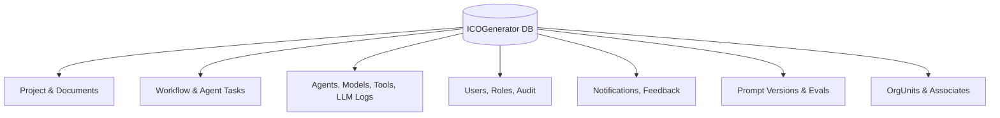
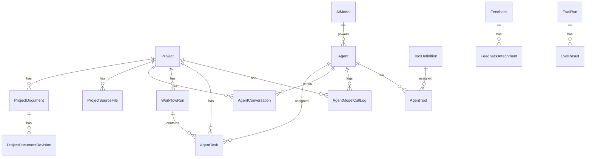
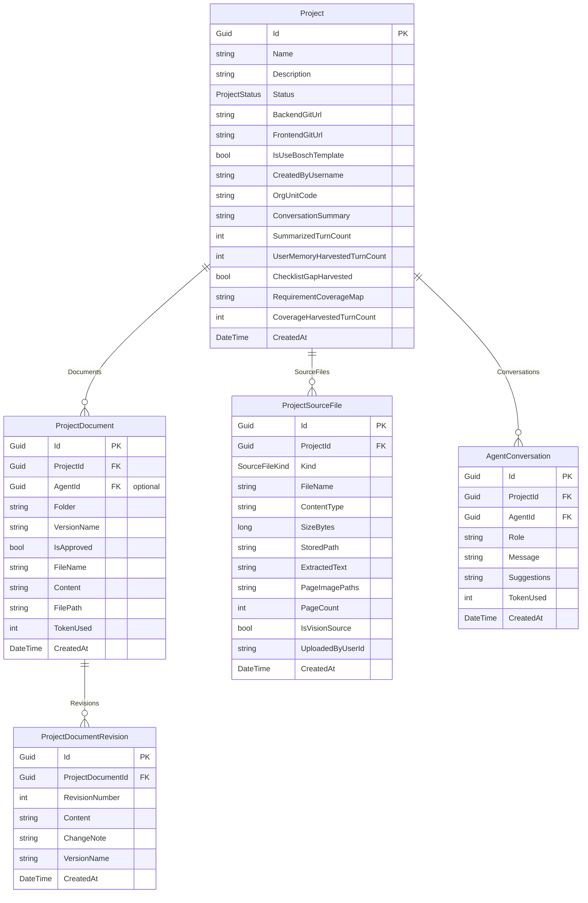
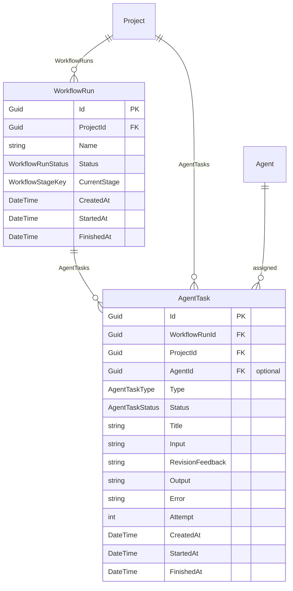
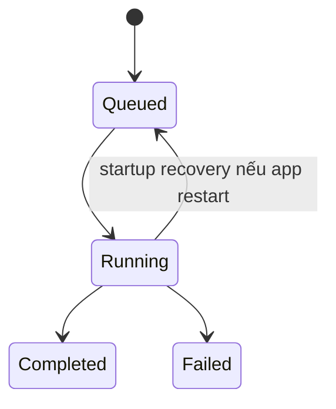
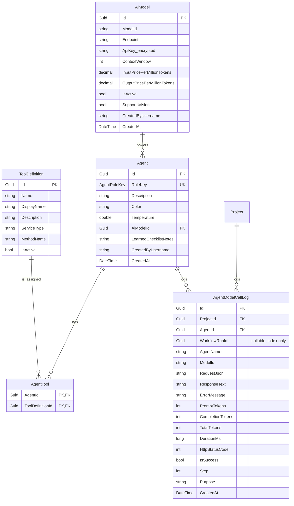
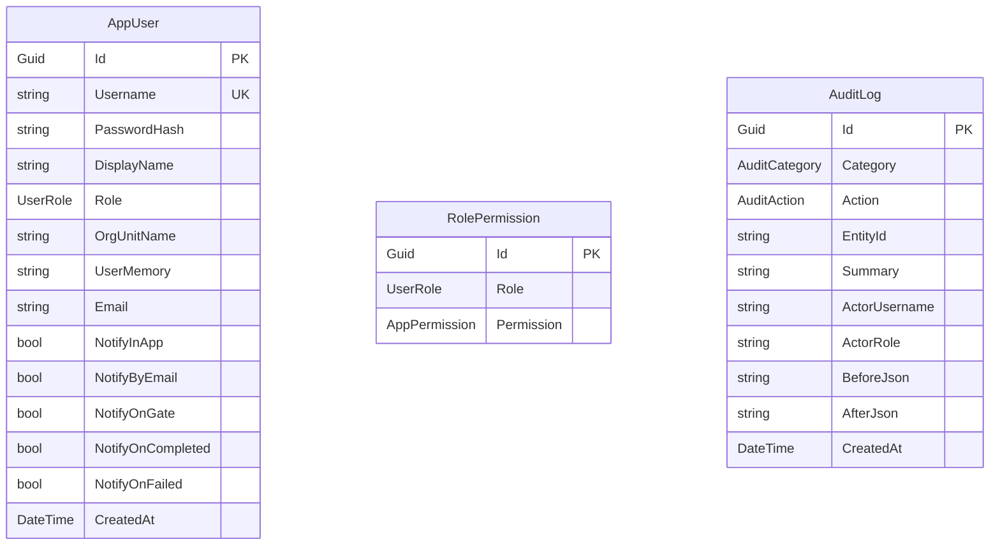
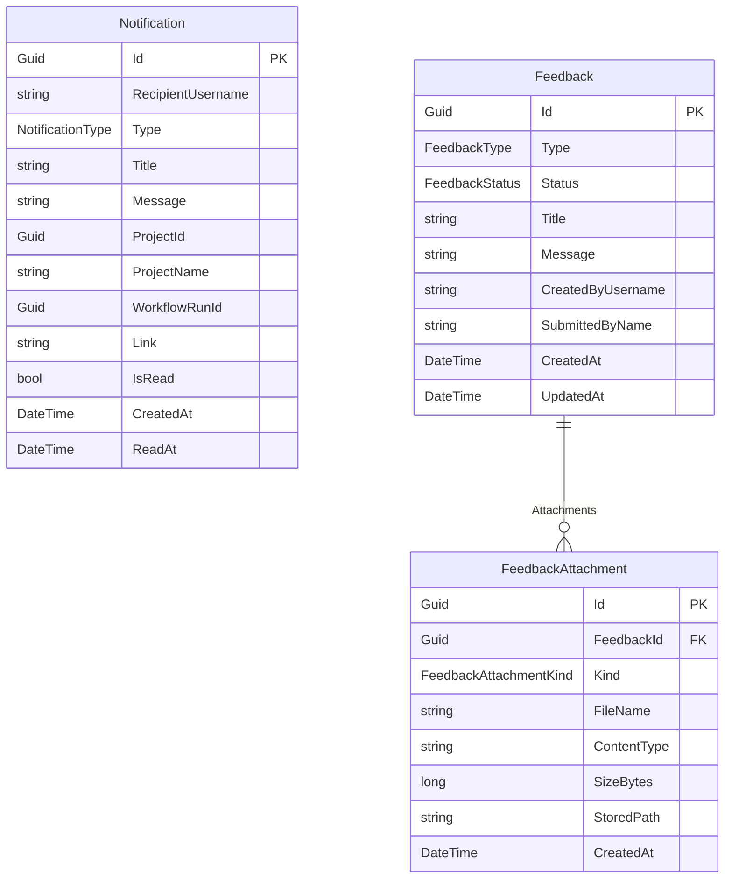
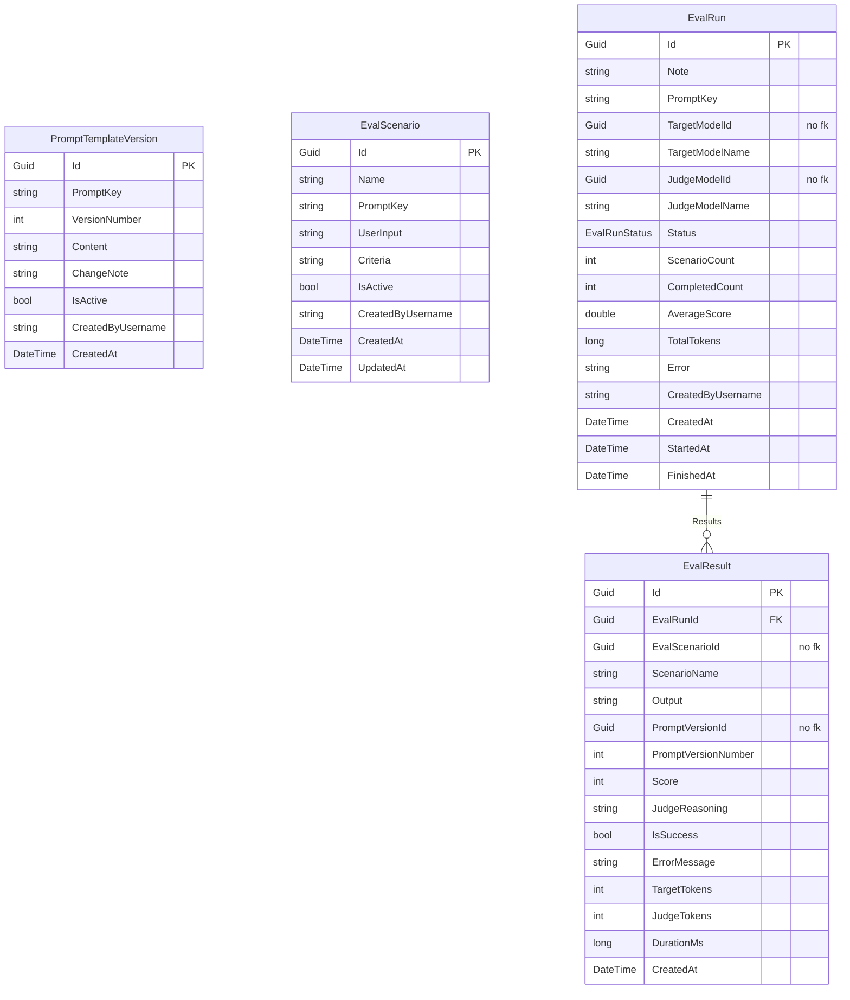
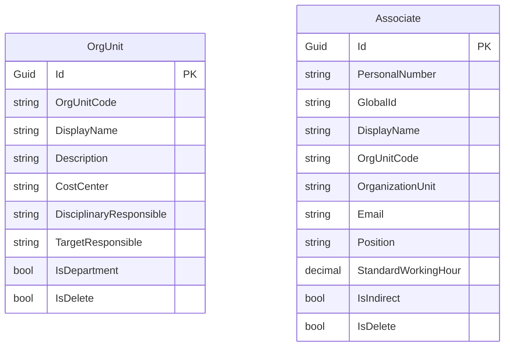

# Database Design — ICOGenerator v4

## 1. Tổng quan database

Database được quản lý bằng Entity Framework Core qua `AppDbContext`. Provider mặc định là SQL Server; SQLite được hỗ trợ để chạy end-to-end trong môi trường không có SQL Server.

## 2. Entity groups

| Group | Tables | Mục đích |
|---|---|---|
| Project core | `Projects`, `ProjectDocuments`, `ProjectDocumentRevisions`, `ProjectSourceFiles`, `AgentConversations` | Dữ liệu project, tài liệu, upload, chat BA |
| Workflow | `WorkflowRuns`, `AgentTasks` | Điều phối các run/task nền |
| AI config/runtime | `Agents`, `AiModels`, `ToolDefinitions`, `AgentTools`, `AgentModelCallLogs` | Cấu hình agent/model/tool và log LLM |
| Security | `AppUsers`, `RolePermissions`, `AuditLogs` | Login, RBAC, audit cấu hình |
| Notifications/Feedback | `Notifications`, `Feedbacks`, `FeedbackAttachments` | Thông báo và phản hồi người dùng |
| Prompt/eval | `PromptTemplateVersions`, `EvalScenarios`, `EvalRuns`, `EvalResults` | Prompt override và benchmark prompt/model |
| Organization | `OrgUnits`, `Associates` | Dữ liệu tổ chức seed từ HR_Portal |

## 3. ERD mức cao

## 4. Core project schema

### Ghi chú thiết kế

- `Project.OrgUnitCode` không FK tới `OrgUnits` để project cũ vẫn giữ nhãn lịch sử nếu dữ liệu HR bị đồng bộ lại/xóa.
- `ProjectDocumentRevision` có unique index `(ProjectDocumentId, RevisionNumber)` để bảo toàn thứ tự version.
- `ProjectSourceFile.ExtractedText` và `PageImagePaths` là LOB, dùng cho context BA/vision.

## 5. Workflow schema

### Status model

`WorkflowRunStatus` có thêm `WaitingForHuman` để biểu diễn gate duyệt giữa các stage.

### Index quan trọng

| Entity | Index | Lý do |
|---|---|---|
| `WorkflowRun` | `(ProjectId, Status, CreatedAt)` | Query status theo project |
| `AgentTask` | `(ProjectId, Status, CreatedAt)` | Query task theo project/status |
| `AgentTask` | `(Status, CreatedAt)` | Worker poll task queued cũ nhất mỗi ~2 giây |

## 6. AI config/runtime schema

### Ghi chú thiết kế

- `AiModel.ApiKey` được encrypt/decrypt bằng EF value converter. `IApiKeyProtector` phải là singleton vì EF cache model toàn cục.
- `AgentModelCallLog.WorkflowRunId` có index nhưng không khai FK để tránh multiple cascade path; truy vấn join thủ công khi cần.
- `AgentTool` là bảng many-to-many explicit với composite key.
- `ToolDefinition` unique theo `(ServiceType, MethodName)` để đồng bộ discovery không tạo trùng.
- `Agent.RoleKey` là unique: mỗi role đúng một agent — mọi lookup agent trong hệ thống đều theo `RoleKey`.

## 7. Security/RBAC/Audit schema

| Constraint/index | Ý nghĩa |
|---|---|
| `AppUser.Username` unique | Không trùng tài khoản đăng nhập |
| `RolePermission(Role, Permission)` unique | Một permission chỉ được cấp một lần cho role |
| `AuditLog.CreatedAt`, `(Category, CreatedAt)` | Lọc/sắp xếp audit log |

## 8. Notifications và Feedback schema

`Notification` index `(RecipientUsername, IsRead, CreatedAt)` phục vụ chuông thông báo: đếm unread và lấy danh sách mới nhất.

## 9. Prompt/eval schema

### Index/constraint quan trọng

| Entity | Index | Lý do |
|---|---|---|
| `PromptTemplateVersion` | `(PromptKey, VersionNumber)` unique | Version history không trùng |
| `PromptTemplateVersion` | `(PromptKey, IsActive)` | Lấy bản active nhanh |
| `EvalScenario` | `(IsActive, CreatedAt)` | Lọc scenario active |
| `EvalRun` | `(Status, CreatedAt)` | Worker poll queued + UI list |
| `EvalResult` | `EvalRunId`, `EvalScenarioId` | Chi tiết run và so sánh scenario |

## 10. Organization schema

Hai bảng này được seed từ dữ liệu HR_Portal mẫu. Index chính:

- `OrgUnit.OrgUnitCode`
- `Associate.OrgUnitCode`
- `Associate.GlobalId`

## 11. Cascade/delete behavior

| Relationship | Delete behavior | Lý do |
|---|---|---|
| `Project -> ProjectDocuments` | Cascade theo convention/relationship | Xóa project dọn tài liệu |
| `ProjectDocument -> ProjectDocumentRevisions` | Cascade | Xóa document dọn revision |
| `Project -> ProjectSourceFiles` | Cascade | Xóa project dọn source upload metadata |
| `Project -> WorkflowRuns` | Cascade | Xóa project dọn workflow |
| `WorkflowRun -> AgentTasks` | Cascade | Xóa run dọn task |
| `AgentTask -> Project` | Restrict | Tránh multiple cascade path |
| `AgentTask -> Agent` | SetNull | Xóa agent vẫn giữ task history |
| `AgentModelCallLog -> Project` | Cascade | Xóa project dọn call logs |
| `AgentModelCallLog -> Agent` | Restrict | Xóa agent không wipe audit lịch sử |
| `AgentConversation -> Project` | Cascade | Xóa project dọn chat |
| `AgentConversation -> Agent` | Restrict | Giữ lịch sử theo agent |
| `Agent -> AiModel` | Restrict | Không xóa model đang được agent dùng |
| `Feedback -> FeedbackAttachment` | Cascade | Xóa feedback dọn attachment metadata |
| `EvalRun -> EvalResult` | Cascade | Xóa run dọn result |

## 12. Seed data

Khi DB khởi tạo rỗng, `DbInitializer` seed:

| Data | Nội dung |
|---|---|
| Users | `admin/Admin@123`, `teamdev/TeamDev@123`, `user/User@123` |
| Role permissions | TeamDev gần đủ quyền vận hành; User quyền project/requirement/feedback cơ bản; Admin implicit-all |
| Org/Associates | Dữ liệu mẫu HR_Portal |
| Tool definitions | Đồng bộ từ tool discovery |
| AI models | LM Studio local + DeepSeek mẫu |
| Agents | BA, Tech Lead, Developer, Tester, UI/UX |
| Agent tools | Tool mặc định theo role |

> Lưu ý: mật khẩu seed chỉ phù hợp dev/internal, cần đổi ở môi trường thật.
