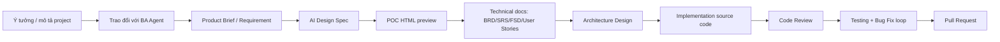
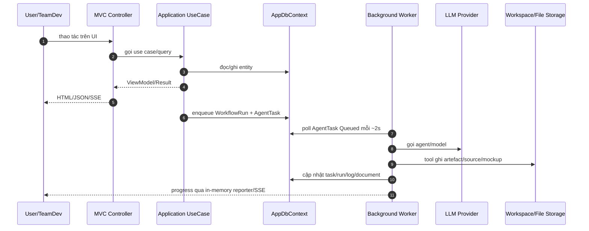

# Project Overview — ICOGenerator v4

> Tài liệu này giúp developer mới hiểu nhanh **ICOGenerator v4 là gì, giải quyết bài toán nào, có các module nào và bắt đầu đọc code từ đâu**.

## 1. ICOGenerator là gì?

ICOGenerator v4 là một ứng dụng web ASP.NET Core MVC dùng nhiều AI Agent để biến ý tưởng/yêu cầu ban đầu thành bộ artefact giao hàng phần mềm:



Ứng dụng tập trung vào quy trình **requirement → design → code → test → PR**, trong đó mỗi bước được ghi nhận bằng workflow/task, có cổng duyệt của con người và có audit/cost/log để theo dõi.

## 2. Tech stack chính

| Nhóm | Công nghệ / thư viện | Vai trò |
|---|---|---|
| Web | ASP.NET Core MVC .NET 8 | Controller + View + static JS/CSS |
| Persistence | Entity Framework Core 8 | ORM, migration, mapping domain model |
| Database | SQL Server mặc định, SQLite fallback | SQL Server cho môi trường thật; SQLite cho dev/CI không có SQL Server |
| AI | Microsoft.Extensions.AI + OpenAI-compatible endpoint | Gọi model LLM qua cấu hình `AiModel` |
| Agent runtime | Microsoft.Agents.AI + tool registry nội bộ | Chạy agent theo vai trò và tool được cấp |
| Logging | Serilog | Log request và lỗi có cấu trúc |
| Observability | OpenTelemetry opt-in | Trace/metrics ASP.NET + HttpClient/LLM |
| Document | OpenXML, PdfPig | Xuất/đọc tài liệu requirement/source |

## 3. Các persona / role nghiệp vụ

| Role | Ý nghĩa trong app |
|---|---|
| `Admin` | Có toàn quyền implicit, quản lý cấu hình, role, model, prompt, audit... |
| `TeamDev` | Người vận hành delivery pipeline, duyệt gate, quản lý agent/model/prompt/eval trong phạm vi team |
| `User` | Tạo/xem project, trao đổi requirement, gửi feedback |

## 4. Các AI Agent mặc định

Khi DB rỗng, hệ thống seed các agent sau:

| Agent | RoleKey | Trách nhiệm chính |
|---|---|---|
| BA | `BusinessAnalyst` | Chat khai thác yêu cầu, sinh Product Brief, AI Design Spec, technical docs |
| Tech Lead | `TechLead` | Đề xuất kiến trúc, review code |
| Developer | `Developer` | Sinh POC, implementation, bug fix, branch/commit/PR |
| Tester | `Tester` | Viết/chạy test, trả verdict PASS/FAIL |
| UI/UX | `UiUx` | Hỗ trợ thiết kế flow/wireframe |

## 5. Module chức năng theo thư mục

```text
ICOGenerator-v4/
├── Program.cs                         # Bootstrap host, middleware, routing
├── Extensions/                        # Đăng ký DI, DB, auth, observability, services
├── Controllers/                       # MVC endpoint layer
├── Views/                             # Razor UI
├── wwwroot/                           # CSS/JS tĩnh theo màn hình
├── Application/                       # Use case/query theo feature
├── Domain/                            # Entity + enum thuần nghiệp vụ
├── Data/                              # AppDbContext, seed, migration bootstrap
├── Services/                          # Hạ tầng nghiệp vụ: LLM, agent, workflow, tools, requirement...
├── Prompts/                           # Prompt file theo vai agent (BusinessAnalyst/TechLead/Developer/Tester/UiUx) + Shared/Eval/Design
├── Templates/                         # Mẫu DOCX cho requirement docs
├── Migrations/                        # EF Core migrations
└── tests/ICOGenerator.Tests/          # Unit tests theo module
```

## 6. Feature map

| Feature | UI/Controller | Application | Services/Domain liên quan |
|---|---|---|---|
| Project list/create/config | `ProjectsController`, `Views/Projects` | `Application/Projects` | `Project`, `OrgUnit`, `WorkspacePathResolver` |
| Requirement workspace | `RequirementsController`, `Views/Requirements` | `Application/Requirements` | `BAChatService`, `ProductBriefDraftService`, `ProjectDocument`, `ProjectSourceFile`, `AgentConversation` |
| Delivery workflow | `AgentsController`, `AgentDashboardController` | `Application/Agents` | `WorkflowOrchestrator`, `AgentTaskWorker`, `DeliveryPipeline` |
| Agent/model management | `AgentsController`, `ModelsController` | `Application/Agents`, `Application/Models` | `Agent`, `AiModel`, `AgentTool`, `ToolDefinition` |
| Prompt Studio | `PromptsController` | `Application/Prompts` | `PromptTemplateService`, `PromptTemplateVersion` |
| Eval harness | `EvalsController` | `Application/Evals` | `EvalRunWorker`, `EvalScenario`, `EvalRun`, `EvalResult` |
| Usage/quality dashboards | `UsageController`, `QualityController` | `Application/Usage`, `Application/Quality` | `AgentModelCallLog`, workflow/task metrics |
| Notifications | `NotificationsController` | `Application/Notifications` | `NotificationService`, `Notification` |
| Security/RBAC/Audit | `AccountController`, `RolesController`, `AuditController` | `Application/Account`, `Application/Roles`, `Application/Audit` | `AppUser`, `RolePermission`, `AuditLog` |
| Feedback | `FeedbackController` | `Application/Feedback` | `Feedback`, `FeedbackAttachment` |

## 7. Runtime lifecycle tổng quan



## 8. Những điểm nên đọc đầu tiên

1. `Program.cs` — hiểu bootstrap, middleware, route mặc định.
2. `Extensions/ApplicationServiceCollectionExtensions.cs` — hiểu dependency injection và module nào được đăng ký.
3. `Domain/Project.cs`, `Domain/WorkflowRun.cs`, `Domain/AgentTask.cs` — hiểu trục dữ liệu chính.
4. `Services/Workflows/DeliveryPipeline.cs` — hiểu thứ tự pipeline delivery.
5. `Services/Workflows/AgentTaskWorker.cs` — hiểu worker chạy task nền.
6. `Services/Requirements/BAChatService.cs` + `ProductBriefDraftService.cs` — hiểu requirement/BA flow.
7. `Data/AppDbContext.cs` — hiểu mapping, quan hệ, index, cascade.

## 9. Cấu hình đáng chú ý

| Key | Ý nghĩa |
|---|---|
| `ConnectionStrings:DefaultConnection` | Chuỗi kết nối DB |
| `Database:Provider` | `SqlServer` mặc định hoặc `Sqlite` |
| `Llm:Proxy:*` | Bật/tắt proxy khi gọi LLM |
| `Otel:Enabled` | Bật OpenTelemetry |
| `Notifications:*` | Bật/tắt kênh Teams/email |
| `PullRequest:GitHubToken` | Nếu có token và remote GitHub, app có thể tạo PR thật |

## 10. Định nghĩa “done” trong hệ thống

Một project được coi là đi hết delivery khi:

1. Requirement/Product Brief được BA sinh và user approve.
2. AI Design Spec được sinh.
3. Delivery workflow lần lượt hoàn thành các stage.
4. Mỗi stage tuyến tính phải qua gate duyệt của người dùng.
5. Testing PASS hoặc hết vòng tự sửa lỗi có báo cáo.
6. Pull Request stage hoàn tất, trả link PR/compare.
