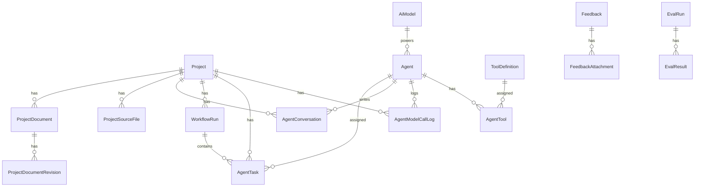
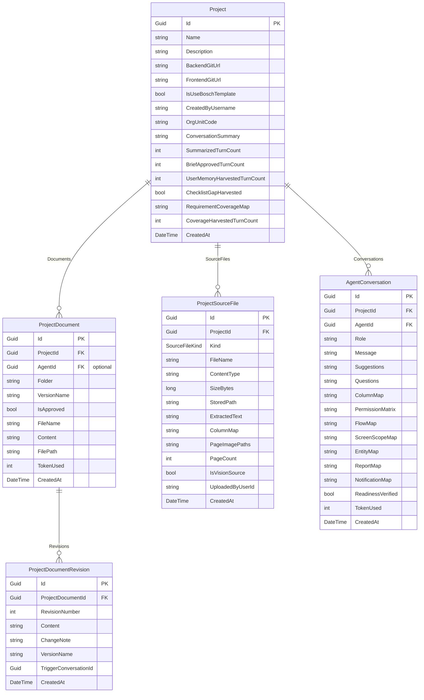
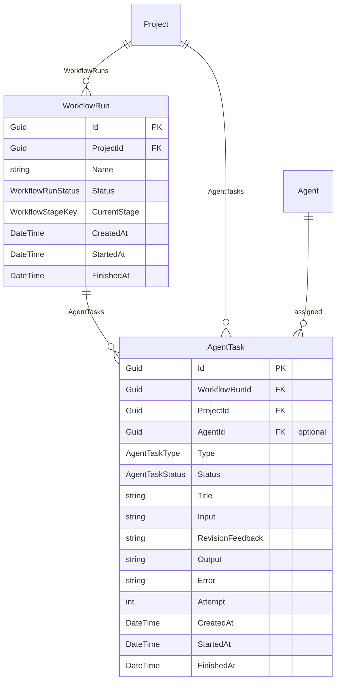
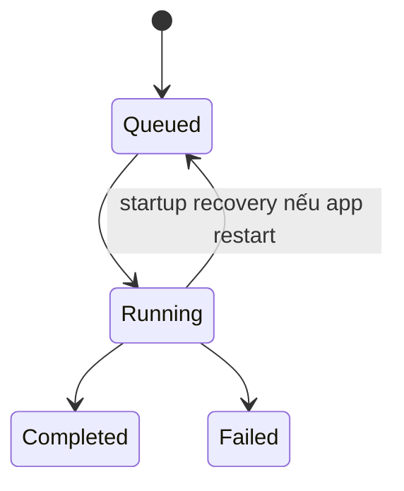
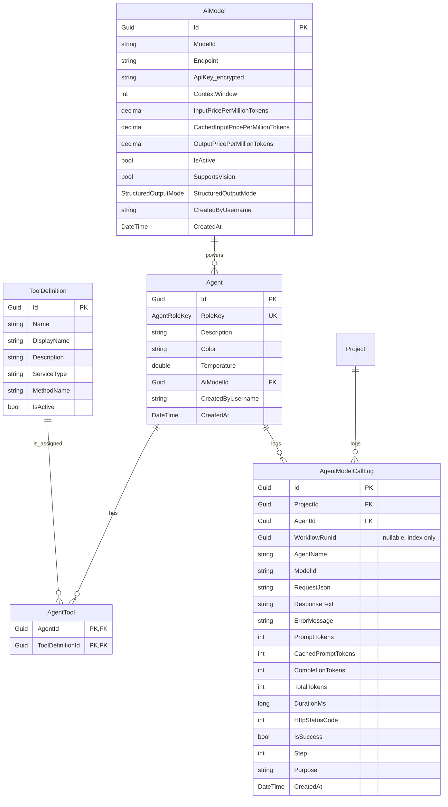
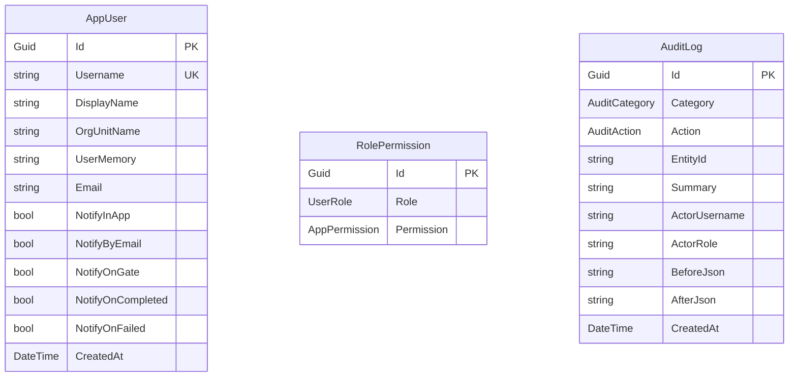
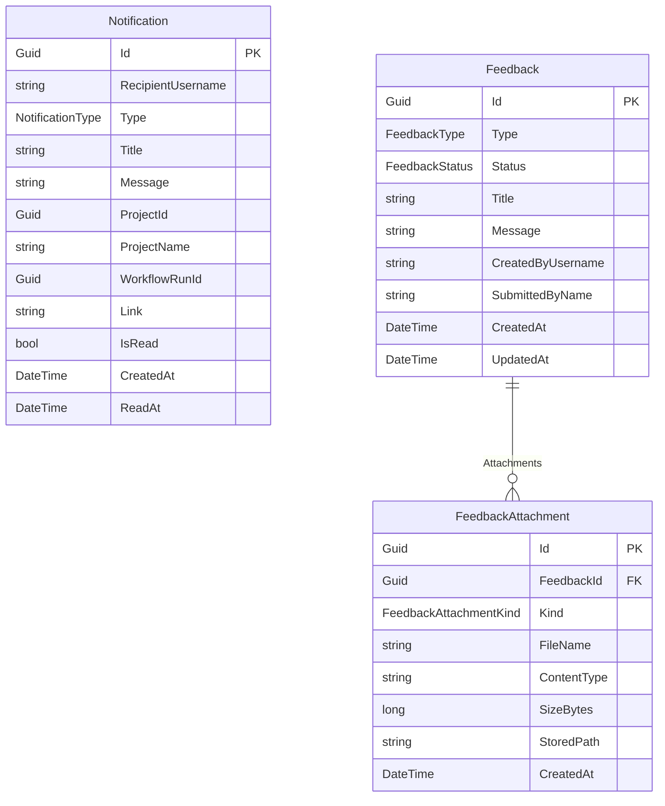
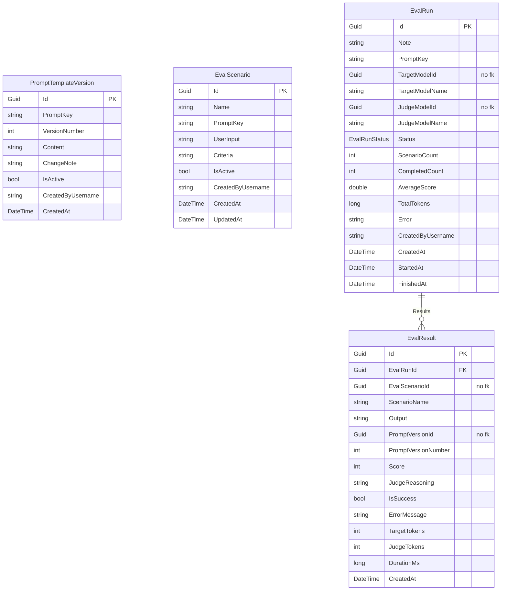
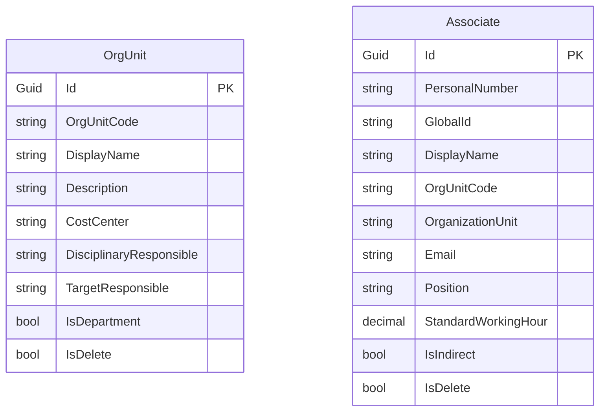

# Mô hình dữ liệu

`Data/AppDbContext.cs` khai báo **27 DbSet**. Điểm chung cần biết trước:

- **Mọi cột `DateTime` được chuẩn hóa `Kind=Utc` khi đọc** (`UtcDateTimeConverter`) để JSON trả ra có hậu tố `Z` — tránh lệch múi giờ trên client.
- **Hầu hết enum lưu dạng chuỗi** (tên enum, ví dụ `'WaitingForHuman'`) — dễ đọc trong DB và bền khi chèn giá trị enum mới. ⚠️ Vì vậy **đừng đổi tên giá trị enum đã có dữ liệu**.
- **`AiModel.ApiKey` được mã hóa AES** bằng value-converter gắn `AesApiKeyProtector`. Protector **bắt buộc là Singleton** (EF cache model toàn cục, converter capture instance đầu tiên) — đừng đổi lifetime, đừng bật `AddDbContextPool`.

## Bản đồ các bảng

### Nhóm lõi: Project & Agent

| Bảng | Vai trò | Điểm đáng chú ý |
|---|---|---|
| `AgentChecklistItem` | Một bài học trong "checklist BA học được": `DepartmentCode` (mã phòng ban của đơn vị yêu cầu; null = mọi dự án), `Text` (phần duy nhất vào prompt), `Rationale`/`Evidence` (vì sao rút ra — chỉ cho trang quản trị), `SourceKind` (`Conversation` / `PocFeedback` / `SpecAssumption` — ba đường harvest đổ vào kho này)/`SourceProjectId`, `Status` (Active/DisabledByUser/DisabledByOverflow) | Trần 25 mục đang dùng mỗi bucket; vượt thì mục cũ nhất tự chuyển `DisabledByOverflow` (vẫn thấy, bật lại được). FK dự án nguồn là `SetNull` — xóa dự án không xóa bài học |
| `Projects` | Dự án — gốc nối tới tài liệu, hội thoại, workflow | Ngoài metadata còn mang **bộ nhớ của luồng BA**: `ConversationSummary` + `SummarizedTurnCount` (tóm tắt hội thoại dài), `BriefApprovedTurnCount` (số lượt hội thoại tại lần Approve gần nhất — mốc để vòng soạn Brief nén phần transcript trước đó), `UserMemoryHarvestedTurnCount`, `RequirementCoverageMap` + `CoverageHarvestedTurnCount` (bản đồ bao phủ 12 nhóm thông tin, lưu **JSON** — `CoverageMapDocument`; bản đồ dạng text của format cũ vẫn đọc được, xem [requirement-flow.md](requirement-flow.md)), `ChecklistGapHarvested`; **cổng xác nhận giả định** `PendingAssumptionsVersion` (phiên bản spec đang chờ rà), `SpecAssumptionCorrections` (điểm đã bác — nạp vào prompt sinh spec), `ConfirmedAssumptions` (điểm đã duyệt — cổng không hỏi lại) và `PendingAssumptionGaps` (hàng đợi điểm bị bác chờ `SpecAssumptionMemoryService` chắt thành bài học cho BA; xoá sau khi học); và **nghiệm thu bản demo** `PocAcceptedAtUtc` + `PocAcceptedBy` (null = người yêu cầu chưa xác nhận POC đạt). `CreatedByUsername` để lọc "chỉ thấy project mình tạo"; `OrgUnitCode` (không FK) gắn đơn vị yêu cầu — **bắt buộc khi tạo project** (`CreateProjectUseCase`), cột vẫn nullable vì dự án tạo trước khi có luật này có thể trống; `IsUseBoschTemplate` (mặc định true) do TeamDev đổi ở Agent Dashboard. **Không có cột `Status`** — chặng của dự án được suy ra từ hội thoại/tài liệu/dấu nghiệm thu, xem [overview.md](overview.md#chặng-của-dự-án-projectstatus) |
| `Agents` | "Nhân sự AI": `RoleKey` (BusinessAnalyst/TechLead/Developer/Tester/UiUx), `AiModelId`, `Temperature`, `Color` | System prompt **không lưu DB** — nạp từ `Prompts/{RoleKey}/instruction.md` qua `AgentInstructionProvider`. FK sang AiModel là `Restrict` (không xóa được model đang dùng) |
| `AiModels` | Danh mục model LLM: `ModelId`, `Endpoint`, `ApiKey` (mã hóa), `ContextWindow`, đơn giá Input/**CachedInput**/Output per-1M-token (decimal 18,6) | Đơn giá là đầu vào của trang Usage + Budget guard. Model tự host giá 0 ⇒ chi phí 0. `CachedInputPricePerMillionTokens` = 0 nghĩa là **chưa khai báo** ⇒ token cache tính theo giá input đầy đủ ([cached input](llm-and-prompts.md#cached-input-token-prompt-đọc-lại-từ-cache)) |
| `ToolDefinitions` | Danh mục tool (đồng bộ từ code khi khởi động) | Unique index `(ServiceType, MethodName)` |
| `AgentTools` | Bảng nối agent ↔ tool được phép dùng | Khóa chính kép `(AgentId, ToolDefinitionId)` |

### Nhóm tài liệu & hội thoại

| Bảng | Vai trò | Điểm đáng chú ý |
|---|---|---|
| `ProjectDocuments` | Tài liệu sinh ra (ProductBrief/AIDesignSpec/BRD/SRS/FSD/UserStories...): `Folder`, `VersionName`, `FileName`, `FilePath`, `Content`, `IsApproved` | Cascade theo Project |
| `ProjectDocumentRevisions` | **Lịch sử nội dung** mỗi lần document bị ghi đè CÓ thay đổi — snapshot đầy đủ + `ChangeNote` nguồn gốc + `TriggerConversationId` (mốc input) | Chốt chặn duy nhất tạo revision là `RequirementDocumentGenerator.UpsertDocument`. Diff tính lúc xem bằng `DocumentDiffService` (LCS theo dòng). Unique `(DocumentId, RevisionNumber)` |
| `ProjectSourceFiles` | Tài liệu nguồn user upload cho BA đọc (ảnh / PDF / Word .docx / Excel-CSV) — `ExtractedText` do `ProjectSourceIngestor` trích; PDF **scan** không có text thì lấy ảnh nhúng từng trang ra `page-{n}.png`, còn trang PDF **có text** cũng như Word có **hình nhúng** (screenshot, sơ đồ) thì lấy các hình đủ lớn ra `figure-{n}.png` cạnh file gốc (`ScannedPageImageCount` đếm TỔNG cả hai loại) cho model vision | Cascade theo Project |
| `AgentConversations` | Từng lượt hội thoại user ↔ agent trong project | Project FK Cascade, Agent FK **Restrict** (xóa agent không wipe lịch sử) |
| `AgentModelCallLogs` | Log **mỗi lời gọi model**: request/response JSON, token (kể cả `CachedPromptTokens` — phần prompt provider đọc lại từ cache, nằm **trong** `PromptTokens`), thời lượng, `Purpose`, `WorkflowRunId` (cột nhóm, cố ý không FK). Ảnh đã gửi kèm chỉ được **mô tả** trong `RequestJson` (tên/kiểu/dung lượng/số thứ tự), bytes nằm trên đĩa — xem ["Ảnh trong call log"](requirement-flow.md#tài-liệu-nguồn-ảnh-và-call-log) | Nguồn dữ liệu của trang Usage, popup AI Call Logs, Delivery Quality |

### Nhóm workflow

| Bảng | Vai trò | Điểm đáng chú ý |
|---|---|---|
| `WorkflowRuns` | Một lần chạy quy trình cho project: `Status` (Queued/Running/WaitingForHuman/Completed/Failed/Canceled), `CurrentStage` (`WorkflowStageKey`) | Cascade theo Project; index `(ProjectId, Status, CreatedAt)` |
| `AgentTasks` | Một đầu việc giao cho một agent trong run: `Type`, `Status`, `Input`, `Output`, `Error`, `Attempt`, `RevisionFeedback` (null = task thường) | Agent FK `SetNull`, Project FK `Restrict`. **Index `(Status, CreatedAt)` phục vụ worker poll mỗi 2s** — đừng xóa |

### Nhóm người dùng & bảo mật

| Bảng | Vai trò | Điểm đáng chú ý |
|---|---|---|
| `AppUsers` | Tài khoản đăng nhập: `Username` (unique), `DisplayName`, `OrgUnitName` (đồng bộ từ claim `department` của SSO), `UserMemory` (hồ sơ cá nhân hóa BA học được), tùy chọn thông báo (`NotifyInApp/ByEmail/OnGate/OnCompleted/OnFailed`, `Email`) | **Không có cột mật khẩu và không có cột vai trò** — cả hai do provider ngoài quyết định: vai trò chỉ sống trong claim của phiên đăng nhập (xem [screens-and-permissions.md](screens-and-permissions.md#xác-thực--hai-provider-không-có-mật-khẩu-trong-app)). Chưa có UI tạo user — seed 4 tài khoản cố định |
| `RolePermissions` | Cấp quyền `(Role, Permission)` — cấu hình runtime ở màn Roles | Unique `(Role, Permission)`. SuperAdmin implicit-all, không có dòng nào |
| `AuditLogs` | Nhật ký thay đổi cấu hình (Settings/Roles/Agent/Model/Prompt): actor, before/after JSON | Ghi qua `IAuditLogger` |

### Nhóm vệ tinh

| Bảng | Vai trò |
|---|---|
| `Feedbacks` + `FeedbackAttachments` | Phản hồi người dùng toàn app (bug/góp ý/trải nghiệm) kèm file đính kèm; file gốc lưu đĩa (`Feedback:UploadRootPath`), DB chỉ giữ metadata |
| `OrgUnits` + `Associates` | Dữ liệu tổ chức đồng bộ từ HR_Portal (phòng ban, nhân sự) — nguyên liệu cho `OrganizationContextService` |
| `Notifications` | Thông báo in-app (chuông): index `(RecipientUsername, IsRead, CreatedAt)` |
| `EvalScenarios` / `EvalRuns` / `EvalResults` | Prompt eval harness (golden set + LLM-judge). Model/scenario tham chiếu bằng **Guid + snapshot tên, không FK** — xóa không mất lịch sử điểm |
| `PromptTemplateVersions` | Phiên bản prompt chỉnh runtime (Prompt Studio): snapshot đầy đủ, unique `(PromptKey, VersionNumber)`, tối đa một `IsActive` mỗi key |
| `PocComments` | **Lịch sử ghi chú của người review** — hai nguồn chung một bảng theo `Target`: `Poc` (ghim lên phần tử trong POC: màn hình + nhãn + CSS selector + vị trí) và `Brief` (ghim lên một đoạn bản xem trước Product Brief, đoạn trích ở `Quote`). `Open` → gom vào "Yêu cầu chỉnh sửa" ở cổng POC → `Sent` (không gửi lặp) → `Addressed`. `BriefVersion` đóng dấu bản Brief mà ghi chú nói VỀ; `Route` là đường đã gửi (`FixPoc`/`Requirement`, null = chưa gửi) — tách khỏi `Status` (vòng đời); `RevisionTaskId` trỏ vòng sửa đã xử lý nó. **Không xoá cứng**: bỏ ghi chú là `WithdrawnAtUtc`/`WithdrawnByUsername`. Index `(ProjectId, Status, CreatedAt)` cho đường làm việc, `(ProjectId, BriefVersion, CreatedAt)` cho bảng lịch sử |
| `PocShareLinks` | Link chia sẻ bản demo cho người **không có tài khoản** (sếp, người dùng cuối): `Token` (base64url 32 byte, unique), `Label`, `ExpiresAtUtc` (**bắt buộc**), `RevokedAtUtc`. Ba lớp giới hạn: chỉ mở đúng demo của một project, luôn có hạn dùng, thu hồi được. Token lưu nguyên văn để copy lại link — đánh đổi có chủ ý, chấp nhận được vì thứ nó mở ra là demo dữ liệu giả |

## Migration

- Đổi entity ⇒ `dotnet ef migrations add <Tên>`; `DbInitializer` tự `MigrateAsync` lúc khởi động (SqlServer).
- Lịch sử migration bắt đầu từ **baseline `V1`** (đã gộp toàn bộ lịch sử trước đó), sau đó là các migration tiến bình thường. Khi cần sinh migration, để `Database:Provider` là `SqlServer` (mặc định) — **đừng** đặt `Database__Provider=Sqlite` — để nó sinh theo provider SqlServer (không phải Sqlite).
- Sqlite **không chạy migration** (dùng `EnsureCreated`) ⇒ đổi schema khi dev Sqlite = xóa file `ICOGenerator.db*` để dựng lại.

---

## ERD mức cao

## Core project schema

### Ghi chú thiết kế

- `Project.OrgUnitCode` không FK tới `OrgUnits` để project cũ vẫn giữ nhãn lịch sử nếu dữ liệu HR bị đồng bộ lại/xóa.
- `ProjectDocumentRevision` có unique index `(ProjectDocumentId, RevisionNumber)` để bảo toàn thứ tự version.
- `ProjectDocumentRevision.TriggerConversationId` **không FK** tới `AgentConversations` — cố ý. Lượt hội thoại bị xóa cứng ở đường retry (`BAChatService`) và bị lưu trữ ở "New Chat"; một ràng buộc cascade sẽ kéo theo cả revision, tức xóa mất lịch sử tài liệu vì một thao tác trên khung chat. Mốc trỏ hụt thì đường đọc lùi về `CreatedAt` của revision — xem [supporting-features.md](supporting-features.md#lịch-sử-revision-tài-liệu-sinh-ra-version-history--diff).
- `ProjectSourceFile.ExtractedText` và `PageImagePaths` là LOB, dùng cho context BA/vision.
- `ProjectSourceFile.ColumnMap` (JSON `SourceColumnNote[]`) là **bảng cột đã được người dùng chốt** cho nguồn bảng tính: cột nào ứng dụng mới dùng và nghĩa của nó. `SourceContextBuilder` gắn nó vào ngữ cảnh mọi lượt chat, `RealSampleDataReader` lọc dữ liệu mẫu theo nó — xem [requirement-flow.md](requirement-flow.md#bảng-cột-chốt-phạm-vi-cột-của-file-bảng-tính). **Không** mã hóa at rest, cùng lý do với `ExtractedText` nằm cạnh nó dưới dạng plaintext.
- `AgentConversation.ColumnMap` giữ **bản đề xuất** của BA ở lượt đọc file (để F5 không mất bảng chưa tích); nó là nội dung hội thoại nên **có** mã hóa at rest như `Message`/`Suggestions`/`Questions`.
- `AgentConversation.ReadinessVerified` là **dấu đóng của cổng readiness**: `true` ⇔ tại thời điểm lượt đó được lưu, `RequirementReadinessGate.Evaluate` đã xét trên bản đồ bao phủ hiện hành và cho qua. Bước soạn tài liệu đọc cờ của lượt ĐANG ĐỨNG CUỐI để biết có được bỏ qua lần xét lại hay không — thay cho việc dò cụm "Write Requirement" trong transcript, thứ phụ thuộc vào chữ model sinh ra và bị mọi lượt ghi thêm phía sau xoá mất. Fail-closed: mặc định `false`, chỉ hai đường được bật — lượt chat (tự dựng, khi cổng vừa cho lời mời đi qua) và đường chốt mâu thuẫn (chỉ CHÉP LẠI cờ của lượt nó vừa đè lên, không bao giờ tự dựng). Xem [requirement-flow.md](requirement-flow.md#hai-cổng-chất-lượng-phía-yêu-cầu-đủ-và-không-mâu-thuẫn).
- `Project.PermissionMatrix` (JSON `PermissionMatrixRow[]`) là **bảng phân quyền đã được người dùng chốt**: màn hình × chức năng × vai trò, mỗi ô mang **phạm vi dữ liệu** (`của mình` / `của đơn vị` / `tất cả`, rỗng = không có quyền). Nó là nguồn bằng chứng RIÊNG của nhóm «Phân quyền theo nghiệp vụ» trong bản đồ bao phủ, và là đường duy nhất đưa phân quyền tới POC ở dạng máy đọc được — xem [requirement-flow.md](requirement-flow.md#bảng-phân-quyền-chốt-nhóm-phân-quyền-ở-cuối-buổi). `AgentConversation.PermissionMatrix` giữ **bản đề xuất** của BA ở lượt bày bảng (để F5 không mất các ô chưa chọn), mã hóa at rest như `ColumnMap`.
- `Project.FlowMap` / `ScreenScopeMap` / `EntityMap` / `ReportMap` / `NotificationMap` là **năm bảng chốt còn lại của buổi phỏng vấn** (cùng `PermissionMatrix` là sáu), cùng khuôn với `PermissionMatrix` (BA điền sẵn → người dùng sửa/bỏ tích → chốt một lần → khối "đã chốt" đi vào ngữ cảnh chat, lượt distill bản đồ bao phủ và prompt sinh AI Design Spec). Cột tương ứng trên `AgentConversation` giữ bản đề xuất của lượt bày bảng, mã hóa at rest như `ColumnMap`. Xem [requirement-flow.md](requirement-flow.md#sáu-bảng-chốt-của-buổi-phỏng-vấn).
  - `FlowMap` (JSON `FlowMapRow[]`): luồng nghiệp vụ theo vai trò, luồng chính + ngoại lệ, mỗi luồng là chuỗi bước `{actor, action, outcome}`.
  - `ScreenScopeMap` (JSON `ScreenScopeRow[]`): màn hình dự kiến + việc của từng màn + **các chức năng trên màn** (`ScreenFunction[]`, mỗi chức năng có cờ tích riêng và các **bước luồng** nó phục vụ) + `Covers` (các mục phạm vi đã được gộp vào màn này thay vì đứng thành dòng riêng). **NGOẠI LỆ của khuôn "null = chưa chốt"** ở khối này: nó là nguồn phạm vi màn hình DUY NHẤT của dự án nên chở cả phần chưa ai rà — mỗi dòng và mỗi chức năng có cờ `ConfirmedByUser`, và "đã chốt" phải hỏi `ScreenScopeMapBuilder.IsConfirmed` chứ không hỏi cột khác `null` (xem [requirement-flow.md](requirement-flow.md#bảng-màn-hình-nguồn-phạm-vi-duy-nhất-và-cờ-chờ-duyệt)). Là nguồn DÒNG của bảng phân quyền (`PermissionMatrixGate.EffectiveScreens`), nên dòng của nó chỉ được là MÀN HÌNH — xem [requirement-flow.md](requirement-flow.md#ba-cột-của-bảng-màn-hình-và-vì-sao-cột-màn-hình-chỉ-được-chứa-màn-hình). Riêng cột `Screen` viết bằng **tiếng Anh** (nó là nhãn menu của bản demo), các cột còn lại giữ ngôn ngữ nghiệp vụ của người dùng: [luật đặt tên màn hình](requirement-flow.md#tên-màn-hình-là-nhãn-menu-của-bản-demo-nên-nó-ngắn-và-bằng-tiếng-anh).
  - `EntityMap` (JSON `EntityMapRow[]`): đối tượng nghiệp vụ + thông tin cần lưu + vòng đời trạng thái. Mỗi thông tin chở thêm HAI TRỤC — `Input` (nhập thế nào: `text`/`number`/`date`/`choice-one`/`choice-many`/`auto`) và `Source` (danh sách lấy ở đâu, chỉ có nghĩa với hai kiểu chọn: `inline`/`app`/`external`) — cùng `Required`, ba ô của ba nhánh nguồn (`Options`, `SourceSystem`, `Rule`) và `SourceColumn` — ô MÁY (người dùng không thấy) chở tên nguyên văn của cột tài liệu nguồn, vì ba cột TÊN của bảng này là tiếng Anh nên không còn khớp thẳng tên cột tiếng Việt của file được nữa (xem [requirement-flow.md](requirement-flow.md#ba-cột-tên-của-bảng-đối-tượng-cũng-là-tiếng-anh)). Chuỗi, không phải enum: dữ liệu đến từ model và từ trình duyệt nên giá trị lạ phải chuẩn hoá được về mặc định an toàn thay vì làm hỏng cả lượt deserialize; JSON thiếu hẳn trường `input` đọc ra `Input = text` nhờ giá trị khởi tạo của contract. Thông tin có `Source = app` còn gieo một dòng màn hình `<tên> Catalog` (ở trạng thái chờ duyệt) vào `Project.ScreenScopeMap` lúc chốt. Một dòng có `ParentEntity` (kèm `MinRows`/`MaxRows`) không phải hồ sơ độc lập mà là các DÒNG của một đối tượng khác trong cùng bảng — quan hệ 1-n, tối đa một cấp, tên cha phải khớp một dòng khác còn được giữ. Vòng đời của nó là nguồn DÒNG của bảng thông báo ngay dưới — dòng gieo ra có cột To/CC rỗng, vì "ai được báo" là câu hỏi của bảng đó chứ không phải của bảng này.
  - `ReportMap` (JSON `ReportMapRow[]`): **bảng báo cáo / thống kê** — mỗi báo cáo một dòng: `Report` (tên, đọc được như một màn hình và theo [luật đặt tên màn hình](requirement-flow.md#tên-màn-hình-là-nhãn-menu-của-bản-demo-nên-nó-ngắn-và-bằng-tiếng-anh): tiếng Anh, 2–4 từ), `Question` (báo cáo đó trả lời câu hỏi gì, bằng lời người dùng), `Source` (lấy số từ đối tượng nào — chỉ giữ khi khớp một tên trong `EntityMap` đã chốt, so khớp theo cụm chứa nhau), `Breakdown` (gộp/lọc theo gì), `Included`. Mỗi dòng còn `Included` gieo một dòng màn hình (ở trạng thái chờ duyệt) vào `Project.ScreenScopeMap` lúc chốt (`ReportMapBuilder.ReportScreens`) — đó là lý do bảng này đứng TRƯỚC bảng phân quyền và **không có cột "ai xem"**: quyền xem của một báo cáo được chốt ở bảng phân quyền như mọi màn hình khác. Không có `Locked`/`Evidence`, cùng lý do với `FlowMap`/`ScreenScopeMap`. Xem [requirement-flow.md](requirement-flow.md#bảng-báo-cáo-mỗi-báo-cáo-là-một-màn-hình).
  - `NotificationMap` (JSON `NotificationMapRow[]`): **bảng cuối cùng** — mỗi sự kiện một dòng (`Entity` + `Event` + `Trigger`), người nhận chính `To` và đồng gửi `Cc` là mảng các mục của **danh sách người nhận** của dự án (`NotificationRecipients` ngay dưới). Cờ `Needed` phân biệt "không gửi" với "có gửi": một dòng đã lưu chỉ có HAI trạng thái đó, vì đường gửi (`ConfirmNotificationMapUseCase`) **không lưu** bảng nào còn dòng `Needed = true` mà `To` rỗng. Xem [requirement-flow.md](requirement-flow.md#bảng-thông-báo-bảng-cuối-cùng).
  - `NotificationRecipients` (JSON `string[]`): **danh sách người nhận** của dự án — nguồn DUY NHẤT của hai ô `To`/`Cc`, và là một bảng người dùng thêm/sửa/xóa ngay trên panel bảng thông báo. `null` = chưa chốt lần nào ⇒ danh sách bày ra là bản gieo tất định (`NotificationMapBuilder.SeedRecipients`: bốn quan hệ với bản ghi + các vai trò của bảng phân quyền đã chốt, nguyên tên). Lưu **cùng lượt** với `NotificationMap` (cùng một `SaveChangesAsync`) vì đường gửi đối chiếu `To`/`Cc` theo đúng nó — xem [requirement-flow.md](requirement-flow.md#bảng-thông-báo-bảng-cuối-cùng).
  - `NotificationMap` theo luật KHẮT KHE MỘT CHIỀU của `PermissionMatrix` (nhóm của nó KHÔNG BAO GIỜ `[RÕ]` khi chưa có bảng, vì nó cũng không còn được hỏi bằng câu hỏi); **bốn** bảng còn lại thì chỉ **xác nhận lại** thứ hội thoại đã trả lời. Áp luật một chiều cho bốn bảng đó là dựng một vòng khóa kín — cổng bày bảng đòi nhóm `[RÕ]`, bản đồ đòi có bảng. Với `ReportMap` điều đó còn là điều kiện MỞ CỔNG: bảng chỉ bày ra khi nhóm «Báo cáo / thống kê» đã `[RÕ]`, vì một bảng báo cáo trống thu về ít hơn cả ô kể tự do nó thay thế.
- `PocComments` giữ **cả** ghi chú Brief lẫn ghi chú POC (`Target`) vì chúng là cùng một dòng lịch sử: người yêu cầu chê bản mô tả hay chê bản demo thì đều là "điểm chưa đạt của phiên bản Brief thứ n". Ghi chú Brief trước đây chỉ tan vào transcript nên sau khi Brief lên bản mới là không truy lại được. Bảng thứ hai bị loại vì sẽ trùng gần hết cột với bảng này, mà pin trên bản demo vẫn phải đọc bảng cũ.
- `PocComment.BriefVersion` đóng dấu bản Brief mà ghi chú nói VỀ, theo hai quy tắc khác nhau có chủ ý: ghi chú POC lấy bản **đã duyệt** hiện hành (POC dựng từ chính nó), còn ghi chú Brief đóng dấu `draft` rồi được `ApproveRequirementUseCase` **nâng lên `V{n}` cùng lúc với file draft**. Đoán trước số version lúc ghim là gán ghi chú cho một bản có thể không bao giờ tồn tại (bản draft bị bỏ).
- `PocComment.Route` tách khỏi `Status`: trạng thái cũ `RoutedToRequirement` vừa là vòng đời vừa là đường đi, nên ghi chú đi đường tài liệu không bao giờ có được trạng thái "đã sửa xong". Giá trị enum cũ **giữ nguyên** (đã nằm trong DB dạng chuỗi), migration chỉ backfill sang cột mới.
- **Không xoá cứng ghi chú.** Nút 🗑 đổi thành thu hồi (`WithdrawnAtUtc`), và chỉ áp dụng cho ghi chú còn `Open` — đã gửi đi thì việc đã xảy ra. Đổi lại, trần 300 ghi chú/dự án đếm theo dòng **chưa thu hồi**, nếu không "không xoá được" sẽ tự khoá trang review lại sau vài buổi.

## Workflow schema

### Status model

`WorkflowRunStatus` có thêm `WaitingForHuman` để biểu diễn gate duyệt giữa các stage.

### Index quan trọng

| Entity | Index | Lý do |
|---|---|---|
| `WorkflowRun` | `(ProjectId, Status, CreatedAt)` | Query status theo project |
| `AgentTask` | `(ProjectId, Status, CreatedAt)` | Query task theo project/status |
| `AgentTask` | `(Status, CreatedAt)` | Worker poll task queued cũ nhất mỗi ~2 giây |

## AI config/runtime schema

### Ghi chú thiết kế

- `AiModel.ApiKey` được encrypt/decrypt bằng EF value converter. `IApiKeyProtector` phải là singleton vì EF cache model toàn cục.
- `AgentModelCallLog.WorkflowRunId` có index nhưng không khai FK để tránh multiple cascade path; truy vấn join thủ công khi cần.
- `AgentModelCallLog.Step` là **lượt gọi model thứ mấy trong một task agent**, do `ModelCallLoggingChatClient`
  đếm từ 1 theo instance. Đường agent (`AgentRunService`, purpose `AgentRun`) dùng chung một instance cho cả
  task nên thấy 1, 2, 3… — đọc cùng `MaxSteps` của bước pipeline để biết task có tiêu hết ngân sách bước không.
  Mọi lời gọi qua `LlmClient` (các purpose `BA*`, review POC) dựng đường ống mới mỗi lần nên **luôn bằng 1**;
  popup AI Call Logs vì thế chỉ hiện nhãn "Step" khi `Step > 1`.
- `AgentTool` là bảng many-to-many explicit với composite key.
- `ToolDefinition` unique theo `(ServiceType, MethodName)` để đồng bộ discovery không tạo trùng.
- `ToolDefinition.Description` để `nvarchar(max)`: nó là bản chép nguyên `[Description]` của tool trong
  code — prompt gửi cho LLM, chỉ dài thêm theo thời gian. Cột bound (từng là `nvarchar(3000)`) khiến
  `ToolDiscoveryService` ném `String or binary data would be truncated` **ngay lúc khởi động** khi có tool
  vượt trần. `ToolDefinitionColumnTests` chốt điều này ở CI.
- `Agent.RoleKey` là unique: mỗi role đúng một agent — mọi lookup agent trong hệ thống đều theo `RoleKey`.

## Security/RBAC/Audit schema

| Constraint/index | Ý nghĩa |
|---|---|
| `AppUser.Username` unique | Không trùng tài khoản đăng nhập |
| `RolePermission(Role, Permission)` unique | Một permission chỉ được cấp một lần cho role |
| `AuditLog.CreatedAt`, `(Category, CreatedAt)` | Lọc/sắp xếp audit log |

## Notifications và Feedback schema

`Notification` index `(RecipientUsername, IsRead, CreatedAt)` phục vụ chuông thông báo: đếm unread và lấy danh sách mới nhất.

## Prompt/eval schema

### Index/constraint quan trọng

| Entity | Index | Lý do |
|---|---|---|
| `PromptTemplateVersion` | `(PromptKey, VersionNumber)` unique | Version history không trùng |
| `PromptTemplateVersion` | `(PromptKey, IsActive)` | Lấy bản active nhanh |
| `EvalScenario` | `(IsActive, CreatedAt)` | Lọc scenario active |
| `EvalRun` | `(Status, CreatedAt)` | Worker poll queued + UI list |
| `EvalResult` | `EvalRunId`, `EvalScenarioId` | Chi tiết run và so sánh scenario |

## Organization schema

Hai bảng này được seed từ dữ liệu HR_Portal mẫu. Index chính:

- `OrgUnit.OrgUnitCode`
- `Associate.OrgUnitCode`
- `Associate.GlobalId`

## Cascade/delete behavior

| Relationship | Delete behavior | Lý do |
|---|---|---|
| `Project -> ProjectDocuments` | Cascade theo convention/relationship | Xóa project dọn tài liệu |
| `ProjectDocument -> ProjectDocumentRevisions` | Cascade | Xóa document dọn revision |
| `Project -> ProjectSourceFiles` | Cascade | Xóa project dọn source upload metadata |
| `Project -> WorkflowRuns` | Cascade | Xóa project dọn workflow |
| `WorkflowRun -> AgentTasks` | Cascade | Xóa run dọn task |
| `AgentTask -> Project` | Restrict | Tránh multiple cascade path |
| `AgentTask -> Agent` | SetNull | Xóa agent vẫn giữ task history |
| `AgentModelCallLog -> Project` | Cascade | Xóa project dọn call logs |
| `AgentModelCallLog -> Agent` | Restrict | Xóa agent không wipe audit lịch sử |
| `AgentConversation -> Project` | Cascade | Xóa project dọn chat |
| `AgentConversation -> Agent` | Restrict | Giữ lịch sử theo agent |
| `Agent -> AiModel` | Restrict | Không xóa model đang được agent dùng |
| `Feedback -> FeedbackAttachment` | Cascade | Xóa feedback dọn attachment metadata |
| `EvalRun -> EvalResult` | Cascade | Xóa run dọn result |

## Seed data

Khi DB khởi tạo rỗng, `DbInitializer` seed:

| Data | Nội dung |
|---|---|
| Users | `superadmin`, `admin`, `teamdev`, `user` — chỉ danh tính, **không kèm vai trò** (không mật khẩu: Local tự đăng nhập bằng tài khoản ở `Authentication:LocalUsername` với vai trò `Authentication:LocalRole`, SSO đồng bộ user từ IdentityServer và lấy vai trò từ role claim) |
| Role permissions | SuperAdmin implicit-all; Admin mặc định toàn bộ quyền (cấu hình được); TeamDev gần đủ quyền vận hành; User quyền project/requirement/feedback cơ bản |
| Org/Associates | Dữ liệu mẫu HR_Portal |
| Tool definitions | Đồng bộ từ tool discovery |
| AI models | LM Studio local + DeepSeek mẫu |
| Agents | BA, Tech Lead, Developer, Tester, UI/UX |
| Agent tools | Tool mặc định theo role |

> Lưu ý: mật khẩu seed chỉ phù hợp dev/internal, cần đổi ở môi trường thật.
