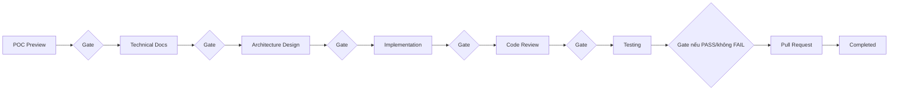
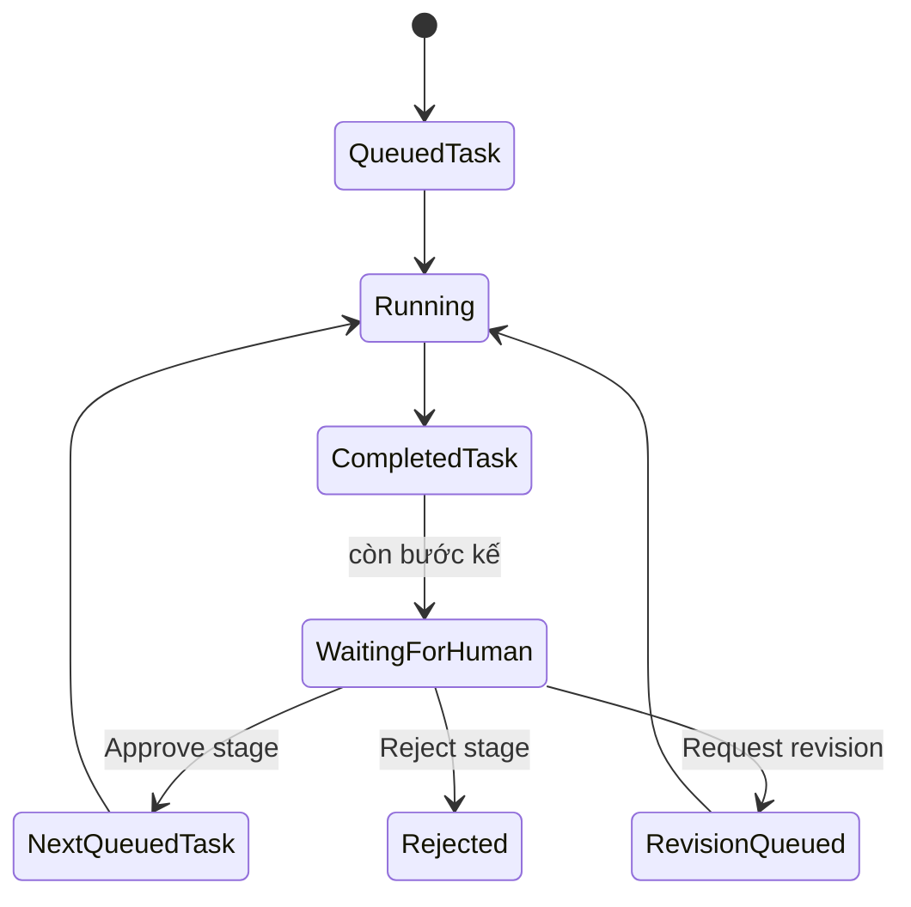
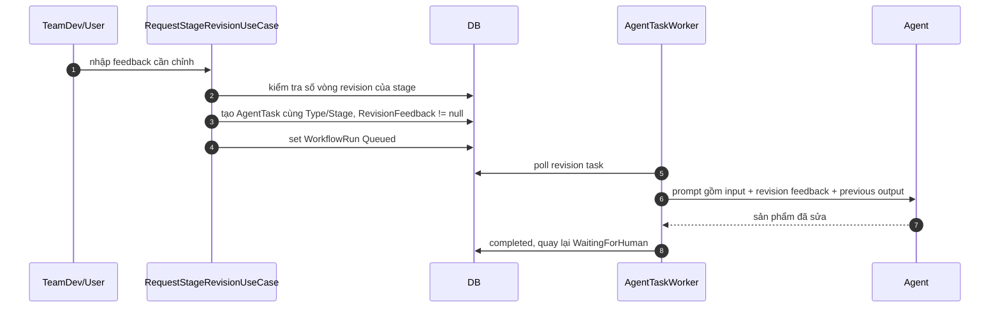
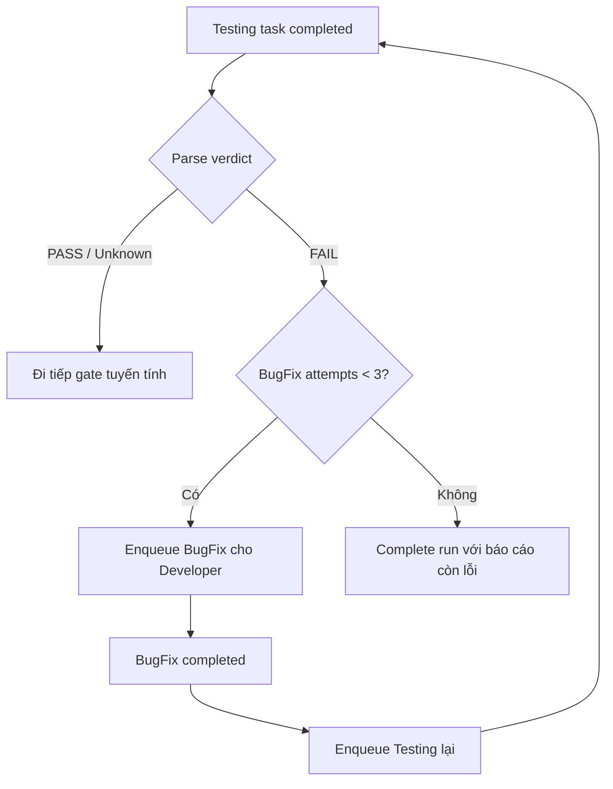
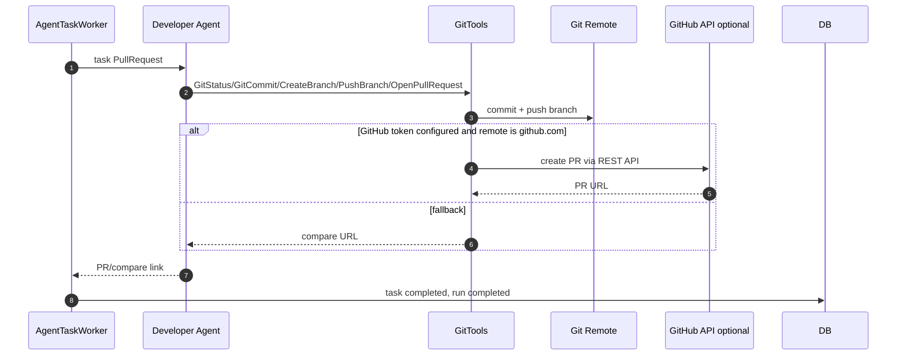

# Delivery Pipeline

> Đây là "động cơ 2": pipeline nền chạy bất đồng bộ qua hàng đợi, có cổng duyệt của con người giữa mọi bước.
> Động cơ còn lại (chat BA) nằm ở [requirement-flow.md](requirement-flow.md).

## Pipeline nền — worker & hàng đợi

```
IWorkflowOrchestrator.Start...WorkflowAsync           [Services/Workflows]
   tạo WorkflowRun + AgentTask đầu tiên (Status=Queued)

AgentTaskWorker : BackgroundService                    — dispatch mỗi 2 GIÂY
   lấy các AgentTask Queued cũ nhất (index (Status, CreatedAt)), tối đa
   Workers:MaxConcurrentAgentTasks task chạy SONG SONG — mỗi PROJECT một task
   một thời điểm (chung workspace); claim Queued→Running nguyên tử qua
   concurrency token (AgentTask.Status) nên không bao giờ chạy đôi một task
     └► AgentRunService.RunAsync(projectId, agentId, prompt)   [Services/Agents]
          Microsoft Agent Framework tự lo vòng: LLM ⇄ tool cho tới khi xong
     └► cập nhật Task.Output; còn bước kế → run dừng WaitingForHuman (cổng duyệt)
        hết bước → Completed; lỗi → Failed
```

Điểm cốt lõi: **worker là generic** — nó không biết gì về từng vai. "Ai làm sau ai" nằm ở dữ liệu khai báo `DeliveryPipeline.Steps`; việc enqueue bước kế nằm ở `ApproveStageUseCase` (vì giữa các bước có cổng duyệt). Mặc định `MaxConcurrentAgentTasks = 1` (tuần tự như trước — an toàn cho LLM tự host); tăng lên khi endpoint model chịu tải song song để nhiều project không phải xếp hàng chờ nhau.

**Chống double-submit ở cổng duyệt:** `WorkflowRun.Status` và `AgentTask.Status` là **concurrency token** (EF thêm `AND Status = @original` vào mọi UPDATE — không đổi schema, chạy được cả Sqlite). Hai người cùng bấm Duyệt/Chỉnh sửa/Từ chối một cổng thì chỉ một bên thắng; bên thua nhận `DbUpdateConcurrencyException` và các use case cổng duyệt trả về "không còn bước chờ duyệt" thay vì enqueue task trùng.

## Tiến độ realtime

`WorkflowProgressReporter` (singleton, in-memory) nhận event tiến độ từ agent run (bước "thinking", tool call, token) và đẩy ra UI qua:
- `GET /Requirements/WorkflowStatus?projectId=&runId=&afterSeq=` — poll JSON tăng dần theo `afterSeq`;
- `GET /Requirements/WorkflowStream` — Server-Sent Events;
- Agent Dashboard có bộ endpoint tương tự (`/AgentDashboard/WorkflowStatus`, `ActiveAgents`, `AgentActivity`...).

Vì reporter là in-memory, **restart app là mất tiến độ live** (trạng thái bền vẫn nằm trong DB).

### Ai nói gì ở mốc kết thúc

Một lượt chạy có nhiều tầng cùng chạm tới thời điểm "xong", và mỗi tầng chỉ được nói **phần của
mình** — nếu không, feed hiện mấy dòng liền kề nói lại đúng một việc:

| Tầng | Kind | Nói về |
|---|---|---|
| Service (`ProductBriefDraftService`, `RequirementDocsService`) | `final` | **Vừa tạo ra cái gì**; `detail` mang lời nhắn của agent |
| `AgentTaskWorker` / `AdvanceLinearPipelineAsync` | `completed` | **Run chuyển sang trạng thái gì** — chờ duyệt bước nào, người dùng làm gì tiếp, hay workflow đã hết bước |
| Banner ở `requirement-workflow.js` | (không phải event) | Dải trạng thái cuối — giữ phần CTA (link mở tài liệu / dashboard) |

Hệ quả thực tế: bước nào đã đi qua `AdvanceLinearPipelineAsync` thì **không** tự phát thêm mốc
`completed` của riêng nó, vì hàm đó đã phát mốc chuyển trạng thái rồi.

Bản đồ `kind` → icon dùng chung ở `wwwroot/js/site.js` (`EVENT_ICON_CLASS`); `final` và `completed`
cùng là dấu tích nhưng khác nét (viền / đặc) để phân biệt hai tầng.

---

Pipeline là **dữ liệu khai báo** ở `Services/Workflows/DeliveryPipeline.cs` — thêm/chèn vai = thêm một dòng, không sửa worker.

## Bảng các bước (thứ tự phần tử = thứ tự hand-off)

| # | Stage (`WorkflowStageKey`) | Agent | `AgentTaskType` | Input | MaxSteps | Prompt template |
|---|---|---|---|---|---|---|
| 1 | `PocPreview` | Developer | `PocPreview` | AI Design Spec | 18, **nới theo số màn hình** của spec\*\* | `Developer/poc-preview.v1.md` |
| 2 | `TechnicalDocs` | BA | `TechnicalDocs` | AI Design Spec | (8, không tiêu thụ*) | `BusinessAnalyst/technical-docs.v1.md` |
| 3 | `ArchitectureDesign` | Tech Lead | `ArchitectureDesign` | AI Design Spec | 8 | `TechLead/architecture-design[-bosch].v1.md` |
| 4 | `Implementation` | Developer | `Implementation` | Output bước trước | 40 | `Developer/implementation[-bosch].v1.md` |
| 5 | `CodeReview` | Tech Lead | `CodeReview` | Output bước trước | 12 | `TechLead/code-review.v1.md` |
| 6 | `Testing` | Tester | `Testing` | Output bước trước | 8 | `Tester/testing.v1.md` |
| 7 | `PullRequest` | Developer | `PullRequest` | Output bước trước | 6 | `Developer/pull-request.v1.md` |

\*\* POC dựng qua nhiều call nhỏ (một `AppendPocContent` cho MỖI màn hình), nên ngân sách bước suy từ số màn hình spec khai báo — `DeliveryPipeline.PocStepBudget` (≈ `10 + 1.5×số màn hình`, trần `PocMaxStepsCeiling = 30`). Chỉ NỚI, không siết dưới con số khai báo: `MaxSteps` là trần chứ không phải mức tiêu.

\* Bước TechnicalDocs **không** chạy qua agent + prompt chung: worker xử lý nhánh riêng, gọi `RequirementDocsService.GenerateTechnicalDocsAsync` (BA cần đọc context project) — sinh BRD/SRS/FSD/UserStories từ Product Brief + AI Design Spec đã duyệt.

Ngoài chuỗi tuyến tính còn **`BugFixStep`** (Developer, `BugFix`, MaxSteps 30) — cố tình không nằm trong `Steps` vì nó là chu trình quanh Testing (xem [Chu trình tự sửa lỗi](#chu-trình-tự-sửa-lỗi-testing--bugfix-không-cần-cổng-duyệt)).

## Cổng duyệt (gates) — trạng thái `WaitingForHuman`

Mỗi bước chạy xong, run **dừng** ở `WaitingForHuman`. Trên **Agent Dashboard** (yêu cầu quyền `DeliveryAdvance`), người duyệt có 4 lựa chọn:

| Hành động | Use case | Hệ quả |
|---|---|---|
| **Duyệt & tiếp tục** | `ApproveStageUseCase` | Resolve input theo `InputSource` (spec hoặc output task Completed mới nhất — tức bản đã-sửa nếu có revision) → enqueue bước kế |
| **Yêu cầu chỉnh sửa** (kèm nhận xét) | `RequestStageRevisionUseCase` | Enqueue lại **đúng bước hiện tại**: `Input` giữ NGUYÊN BẢN, nhận xét nằm riêng ở `AgentTask.RevisionFeedback`; prompt gốc + nối khối `Shared/revision.v1.md`. Trần `MaxRevisionRounds = 3` mỗi bước (đếm bằng số task có `RevisionFeedback != null` cùng loại trong run). **Riêng cổng POC**: popup còn gom các ghi chú GHIM trực tiếp trên POC (`PocComments` Open, từ trang POC Review — xem [workspace-and-poc.md](workspace-and-poc.md#poc-demo)) vào nhận xét, kèm màn hình + CSS selector từng phần tử để Developer sửa đúng chỗ; ghi chú đã gom chuyển `Sent`, và khi có ghi chú gửi kèm thì nhận xét gõ tay được phép trống. Vòng sửa xong, các ghi chú ấy còn được chắt lọc thành **quy ước trình bày của dự án** để chúng sống sót khi POC bị dựng lại — xem [workspace-and-poc.md](workspace-and-poc.md#góp-ý-giao-diện-sống-sót-qua-một-vòng-dựng-lại-poc-poc-ui-conventionsjson) |
| **Từ chối** | `RejectStageUseCase` | Hủy run (`Canceled`) — quay về chat BA sửa requirement, Approve lại tạo run phiên bản kế. **Ngoại lệ: cổng POC không Reject được** (`PocGateNotRejectable`) — POC sai nghĩa là requirement sai, việc của user; "Yêu cầu chỉnh sửa" thì vẫn được |
| **Thử lại** | `RetryWorkflowUseCase` | Chạy lại khi task Failed |

Triết lý: *xem trước rẻ (POC) → chốt từng cổng → mới đầu tư bước đắt (full code)*. Kết quả chỉ *gần* đúng thì đừng Reject — dùng "Yêu cầu chỉnh sửa", rẻ hơn nhiều.

### Dải timeline hiện ở mọi project, kể cả project vừa tạo

`GetWorkflowStatusQuery` **luôn** trả đủ các bước theo `DeliveryPipeline.Steps`; khi project chưa có
run delivery nào (mới tạo, hoặc mới chỉ có run phía requirement) thì mọi bước mang trạng thái
`pending` và `HasWorkflow = false`. Dashboard nhờ đó hiện lộ trình POC → … → PR ngay từ đầu — kèm
badge "Chưa bắt đầu" và một dòng chỉ đường sang màn hình Requirements — thay vì một khoảng trống
khiến người dùng tưởng màn hình hỏng. Các nút cổng duyệt vẫn ẩn cho tới khi có run delivery thật:
danh sách bước là **thông tin**, quyền hành động vẫn bám trạng thái run.

## Chu trình tự sửa lỗi Testing ↔ BugFix (không cần cổng duyệt)

Tester **bắt buộc** chốt dòng máy-đọc-được `VERDICT: PASS` / `VERDICT: FAIL` cuối báo cáo (`TestVerdictParser` — khoan dung hoa/thường, `**bold**`, `:`/`=`; không rõ ⇒ coi như PASS).

```
Testing ──FAIL──► BugFix (Developer sửa) ──► Testing (kiểm lại) ──► ...
   │                                  (tối đa MaxBugFixAttempts = 3 vòng)
   └──PASS──► sang cổng duyệt bước kế (PullRequest)
```

Worker xử lý chu trình này trong `TryAdvanceTestFixCycleAsync` (set run về `Queued`, tự chạy tiếp — không chờ người). Số vòng đếm bằng số task `BugFix` trong run.

## Bước Pull Request

Developer tạo nhánh feature, commit, push (qua GitTools), rồi `OpenPullRequest`:
- Có `PullRequest:GitHubToken` + remote là github.com ⇒ **tạo PR thật** qua GitHub REST API (`GitHubPullRequestPublisher`).
- Không ⇒ fallback trả **link compare** sẵn-mở-PR theo nhà cung cấp Git (GitHub/GitLab/Azure DevOps/Bitbucket — `PullRequestUrlBuilder`).

## Vòng đời một AgentTask

```
Queued ──worker nhặt──► Running ──xong──► Completed
                          │                └► (còn bước kế? run = WaitingForHuman : run = Completed)
                          ├─lỗi──► Failed (run Failed; RetryWorkflow enqueue lại)
                          └─app restart──► DbInitializer re-queue (Attempt++ trước đó; quá 3 lần ⇒ Failed)
```

---

## Kịch bản nghiệm thu (UAT) là ĐÍCH của bước POC, không phải phụ lục
`UatScenarioService` sinh bộ kịch bản từ AI Design Spec **TRƯỚC** khi Developer dựng POC (trước đây
sinh sau, chỉ để người đọc). Điều đó đổi nó từ tài liệu thành **cổng**:
- Bộ kịch bản được nối vào prompt POC (`BuildPromptBlock`) — agent biết trước mình sẽ bị nghiệm thu
  bằng đường đi nào.
- `PocUatCoverage` đối chiếu máy móc: mỗi kịch bản phải có một mục cùng tiêu đề trong
  `window.pocScenarios()` và mục đó phải PASS. Lý do tồn tại: mọi assertion runtime khác đều do
  CHÍNH agent dựng POC viết ra, nên nó pass đúng những gì nó đã hiểu — kể cả khi hiểu sai.
- `PlaywrightPocRuntimeChecker` còn **lái thật** từng kịch bản bằng click (mỗi kịch bản một lần tải
  trang sạch): tìm nút theo nhãn ghi trong bước rồi bấm. Chỉ kết luận hai khuyết tật không thể chối
  cãi — nhãn không tồn tại trên POC, và bấm mà màn hình không đổi gì (toast của shell bị loại khỏi
  phép so vì shell tự toast cho mọi `.btn`).
- `PocCrossScreenConsistency` bắt lớp lỗi mà mọi cổng khác mù vì cổng nào cũng xét từng màn riêng:
  cùng một bản ghi hiện ở hai màn với con số/trạng thái khác nhau. Chỉ so khoá **duy nhất trong từng
  bảng** để "một khách hàng có nhiều đơn" không thành báo động giả.

---

## Câu nghiệm thu của người dùng đi được tới POC (AC-n)
`Prompts/BusinessAnalyst/product-brief.v3.md` bắt mỗi tính năng chính phải kèm một dòng
*"Hoàn thành khi: …"*. Đó là **tiêu chí nghiệm thu duy nhất do chính người dùng viết và đã bấm
Approve** — nhưng trước đây nó chết ở Product Brief: prompt sinh AI Design Spec không có mục nào nhận
nó, còn `UatScenarioService` lại sinh kịch bản nghiệm thu **từ spec**. Nghĩa là bộ kịch bản người dùng
sắp bấm thử được suy diễn lại từ bản kỹ thuật thay vì bám câu họ đã duyệt; grep cả repo chỉ còn thấy
chuỗi đó trong dữ liệu eval. Nay nó chạy suốt chuỗi:

```
Product Brief "Hoàn thành khi: …"   (BriefAcceptanceCriteria.Parse)
        │  render sẵn thành các dòng "- AC-n (<tính năng>): <câu>"
        ▼
AI Design Spec § 14. Acceptance Criteria   (PocSpec.AcceptanceCriteria)
        │  mỗi AC-n phải có ≥1 kịch bản trỏ về (UatScenario.AcRefs)
        ▼
Bộ UAT  ──► prompt dựng POC + cổng PocUatCoverage + checklist trang POC Review
```

Ba chốt giữ chuỗi không đứt, tất cả đều **fail-open** (Brief cũ không có dòng nào ⇒ mọi tầng im lặng
và hành vi y như trước):
- **Chép, không diễn đạt lại**: `BriefAcceptanceCriteria.BuildPromptBlock` render sẵn đúng các dòng mà
  § 14 phải chứa. Bảo model "viết mục Acceptance Criteria" là mời nó viết lại câu của người dùng bằng
  chữ của nó — thứ đắt nhất ở đây là **nguyên văn**.
- **`SpecBriefParityChecker` soát 3 tầng** thay vì chỉ màn hình (xem [workspace-and-poc.md](workspace-and-poc.md#parity-brief--spec-soát-ba-tầng-không-chỉ-màn-hình)).
- **Vòng bổ sung kịch bản**: sau khi sinh UAT, `FindUncoveredAcceptanceCriteria` đối chiếu tất định;
  còn AC nào chưa có kịch bản thì chạy đúng MỘT vòng xin bổ sung, và bản sửa chỉ được nhận khi nó phủ
  **nhiều hơn** bản cũ (model trả về bộ nghèo hơn thì giữ bộ đang có).

`PocAudit` cũng in danh sách AC vào báo cáo cho Developer agent — cùng chỗ nó đang in Business Rules,
nhưng khác về bản chất: rule là câu BA phát biểu cho máy kiểm, AC là câu người nghiệp vụ đọc để nói
"đạt / chưa đạt".

---

## Sơ đồ luồng

### Delivery pipeline có gate duyệt

Pipeline delivery được khai báo tập trung trong `DeliveryPipeline`:



Mỗi bước tuyến tính có pattern:



### Request revision tại gate



Giới hạn mặc định: tối đa 3 vòng revision cho mỗi bước để tránh đốt token vô hạn.

### Testing và BugFix loop tự động



Điểm khác với các stage khác: Testing↔BugFix là chu trình tự động, không chờ gate giữa BugFix và retest.

### Pull Request


