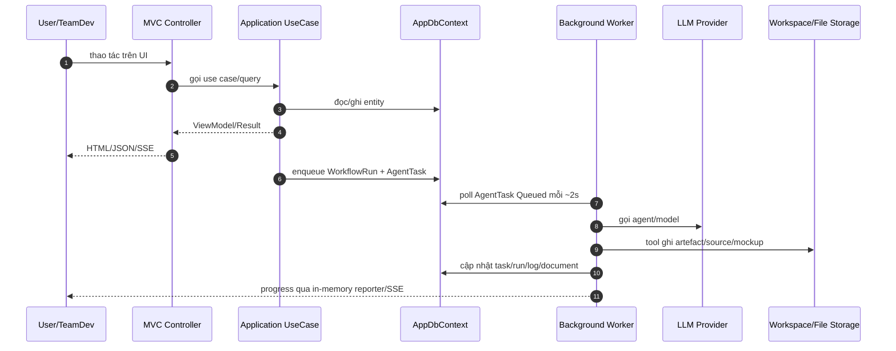

# ICOGenerator — Tổng quan

> Đọc file này trước. Nó trả lời: app giải quyết bài toán gì, ai dùng, và các mảnh ghép lớn nằm ở đâu.

**ICOGenerator là một hệ thống multi-agent dùng LLM để biến *một cuộc trò chuyện về yêu cầu phần mềm* thành *tài liệu đặc tả + demo chạy được + source code + Pull Request*, với con người duyệt ở từng cổng.**

Luồng end-to-end nhìn từ người dùng:

```
User tạo Project
  └► Chat với agent BA (hỏi đáp làm rõ yêu cầu, có thể upload tài liệu nguồn:
       ảnh, PDF — kể cả bản scan, Word .docx, Excel/CSV)
       └► "Write Requirement" → BA sinh Product Brief (ngôn ngữ đời thường, dạng draft, sửa được nhiều lần)
            └► User bấm "Approve"
                 ├► Product Brief được chốt thành V{n}
                 ├► BA sinh AI Design Spec (bản kỹ thuật) ở một run nền riêng
                 ├► CỔNG XÁC NHẬN GIẢ ĐỊNH: spec có giả định tự đưa ⇒ dừng cho user rà
                 │  (Đồng ý → dựng POC; Chưa đúng → ghi đính chính rồi sinh lại spec)
                 └► Delivery Pipeline khởi động, chạy nền với CỔNG DUYỆT giữa mỗi bước:
                      POC HTML → Tài liệu kỹ thuật (BRD/SRS/FSD/UserStories) → Kiến trúc
                      → Code đầy đủ → Code Review → Testing (tự sửa lỗi khi FAIL) → Pull Request
```

Hai nhóm người dùng chính:

| Vai | Làm gì | Dừng ở đâu |
|---|---|---|
| **User** (người có nhu cầu phần mềm) | Tạo project, chat với BA, duyệt Product Brief, xem POC demo | Flow của họ dừng ở bước POC — banner báo "đội Dev sẽ tiếp nhận" |
| **TeamDev / Admin** | Đẩy các bước sau POC trên **Agent Dashboard**: duyệt/yêu cầu chỉnh sửa/từ chối từng cổng, cấu hình delivery, xem log AI | Đến khi PR được tạo |

Bên trong, "nhân sự" là 5 **AI agent** (seed sẵn): **BA** (Business Analyst), **Tech Lead**, **Developer**, **Tester**, **UI/UX** — mỗi agent có system prompt riêng, model riêng, và một tập **tool** được phép dùng (đọc/ghi file, chạy lệnh, git...). Hệ thống có đầy đủ hạ tầng vận hành: phân quyền theo role, audit log, budget chặn chi phí LLM, thông báo (in-app/Teams/email), đo chất lượng prompt (Evals), quản lý phiên bản prompt (Prompt Studio), báo cáo Usage/Delivery Quality.

Ứng dụng được xây trong bối cảnh nội bộ Bosch: có dữ liệu tổ chức (OrgUnits/Associates đồng bộ từ HR_Portal) để BA "hiểu" phòng ban thật, và tùy chọn dựng code trên khung chuẩn Bosch (.NET backend + Angular frontend).

## Các persona / role nghiệp vụ

| Role | Ý nghĩa trong app |
|---|---|
| `SuperAdmin` | Có toàn quyền implicit (không cấu hình được, không tự khóa), quản lý cấu hình, role, model, prompt, audit... |
| `Admin` | Cấu hình quyền được (mặc định seed toàn bộ quyền); quản lý cấu hình, role, model, prompt, audit trong phạm vi được cấp |
| `TeamDev` | Người vận hành delivery pipeline, duyệt gate, quản lý agent/model/prompt/eval trong phạm vi team |
| `User` | Tạo/xem project, trao đổi requirement, gửi feedback |

## Các AI Agent mặc định

Khi DB rỗng, hệ thống seed các agent sau:

| Agent | RoleKey | Trách nhiệm chính |
|---|---|---|
| BA | `BusinessAnalyst` | Chat khai thác yêu cầu, sinh Product Brief, AI Design Spec, technical docs |
| Tech Lead | `TechLead` | Đề xuất kiến trúc, review code |
| Developer | `Developer` | Sinh POC, implementation, bug fix, branch/commit/PR |
| Tester | `Tester` | Viết/chạy test, trả verdict PASS/FAIL |
| UI/UX | `UiUx` | Hỗ trợ thiết kế flow/wireframe |

## Runtime lifecycle tổng quan



## Định nghĩa “done” trong hệ thống

Một project được coi là đi hết delivery khi:

1. Requirement/Product Brief được BA sinh và user approve.
2. AI Design Spec được sinh.
3. Delivery workflow lần lượt hoàn thành các stage.
4. Mỗi stage tuyến tính phải qua gate duyệt của người dùng.
5. Testing PASS hoặc hết vòng tự sửa lỗi có báo cáo.
6. Pull Request stage hoàn tất, trả link PR/compare.
