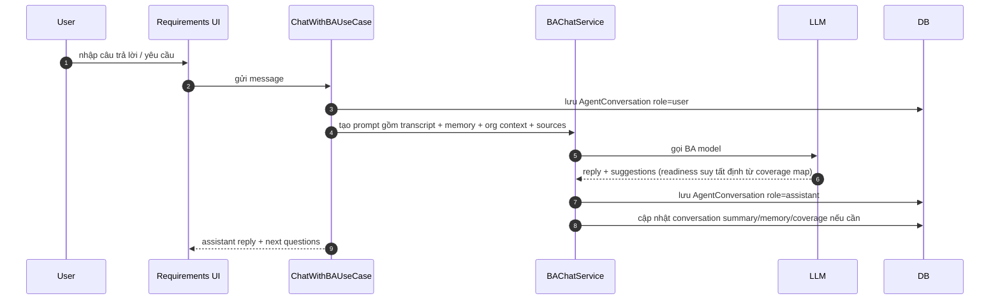
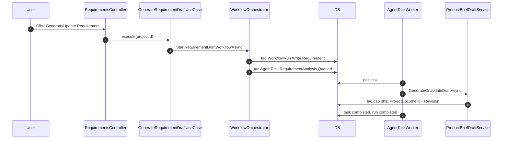
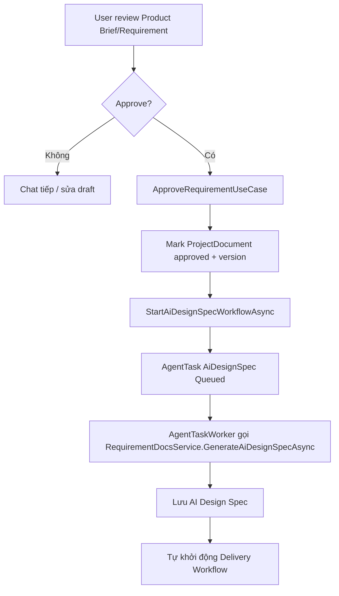

# Luồng yêu cầu — chat với BA

> Đây là "động cơ 1" của hệ thống: một request HTTP xử lý trọn một lượt chat và stream kết quả về.
> Động cơ còn lại (pipeline nền) nằm ở [delivery-pipeline.md](delivery-pipeline.md).

## Đường chat SSE và bốn chốt chặn "không lượt nào được treo"

Đường chat chính là `POST /Requirements/ChatStream` — cùng một request xử lý trọn lượt chat và trả
**Server-Sent Events**: frame `status` ("BA đang soạn câu trả lời…"), frame `token` (BA "đang gõ" —
đã lọc cú pháp JSON qua `BAChatTokenFilter`, chỉ phần `message` hiển thị được stream), và frame `done`
mang bản chốt (reply + suggestions + cờ mời Write Requirement) để client render tại chỗ **không reload
trang**. Client dùng `fetch` + đọc `ReadableStream` (EventSource không POST được); stream hỏng trước khi
nhận frame nào thì `requirements.js` tự rơi về `POST /Requirements/Chat` (postback cổ điển, reload trang).
Lượt chat chạy với `CancellationToken.None` — người dùng đóng tab giữa chừng thì turn vẫn hoàn tất và lưu
DB, chỉ việc ghi response dừng lại.

**Không lượt nào được phép "treo"** — hội thoại luôn kết thúc bằng một lượt assistant, và UI luôn có
đường thoát. Lượt user được lưu TRƯỚC khi gọi LLM, nên nếu phần sau vỡ mà không ai đóng lượt thì hội
thoại nằm lại ở "lượt cuối là user" và trang kẹt vĩnh viễn ở "BA đang soạn câu trả lời…" (F5 cũng không
thoát, không gửi được tin mới). Bốn chốt chặn:

- **Đóng lượt kiểu gì cũng đóng**: mọi ngoại lệ trong một lượt (`BAChatService.RunTurnGuaranteedAsync`,
  và nhánh catch của `AcknowledgeSourcesAsync`) đều ghi một lượt assistant ⚠️ có nút "Thử lại".
- **Nhịp tim SSE**: frame `ping` mỗi 10s trong lúc lượt chạy — client phân biệt được "BA đang nghĩ lâu"
  với "kết nối đã chết". Không có nó, một lời gọi structured-output dài trông y hệt stream đứt.
- **Đồng hồ canh phía client** (`STREAM_IDLE_TIMEOUT_MS`, 45s không nghe thấy gì ⇒ abort) + kiểm tra
  "stream kết thúc mà THIẾU frame `done`": hai kiểu đứt im lặng mà `fetch` không hề báo lỗi.
- **`GET /Requirements/ChatReplyStatus` trả `{pending, stale}`**: `stale` = lượt đang chờ đã chết —
  không tiến trình nào đang chạy nó (`BAChatTurnTracker`, sổ singleton trong bộ nhớ) và lượt user đã cũ
  hơn `BAChatService.ReplyStaleAfter` (3 phút). UI mở khóa ô nhập và mời "Thử lại"; retry lúc này chạy
  lại đúng lượt user còn "cụt" (`RetryLastTurnAsync`) nên người dùng không phải gõ lại câu hỏi.

```
Browser POST /Requirements/ChatStream (SSE)  [hoặc POST /Requirements/Chat — fallback]
  └► RequirementsController.ChatStream               [Controllers]
       └► ChatWithBAUseCase.ExecuteAsync             [Application/Requirements]
            └► BAChatService.ChatAsync               [Services/Requirements]
                 ├► OrganizationContextService       → system message "bức tranh tổ chức" (cache 1h)
                 ├► UserMemoryService                → hồ sơ user (học dần, xuyên project)
                 ├► ConversationMemoryService        → 20 lượt gần nhất nguyên văn + tóm tắt lượt cũ
                 ├► RequirementCoverageService       → bản đồ bao phủ 12 nhóm thông tin
                 ├► SourceContextBuilder             → ngữ cảnh từ tài liệu user upload (text + ảnh/ảnh trang scan)
                 ├► RequirementPromptBuilder         → dựng prompt (template Prompts/BusinessAnalyst/*)
                 ├► ILlmClient                       → gọi LLM  [Services/Llm]
                 └► BAChatReplyParser                → parse trả lời (+ cổng readiness tất định từ bản đồ bao phủ)
       └► AppDbContext.SaveChanges                   [Data] — lưu lượt hội thoại
```

Các cơ chế trí nhớ (chi tiết đầy đủ ở [phần dưới](#các-cơ-chế-trí-nhớ)):

- **Bộ nhớ hội thoại 2 tầng**: 20 lượt gần nhất gửi nguyên văn; lượt cũ gộp dần vào `Project.ConversationSummary` **theo lô ≥10 lượt** (không tóm tắt mỗi lượt — đó là chỗ tiết kiệm token). Fail-open: gọi tóm tắt lỗi thì giữ summary cũ, không mất lượt nào.
- **Bộ nhớ cấp user** (`AppUser.UserMemory`): BA chắt lọc sự thật bền về user (vai trò, lĩnh vực, văn phong...) theo lô, dùng lại ở mọi project của họ.
- **Bản đồ bao phủ yêu cầu** (`Project.RequirementCoverageMap`): 12 nhóm thông tin đánh dấu [RÕ]/[MỘT PHẦN]/[CHƯA HỎI]/[KHÔNG ÁP DỤNG] — NGUỒN CHÂN LÝ DUY NHẤT của độ sẵn sàng: BA chọn câu hỏi kế tiếp dựa vào đây, panel "Tiến độ khai thác" render nó, và cổng "Write Requirement" suy ready TẤT ĐỊNH từ nó (`RequirementReadinessGate.Evaluate`: mọi dòng áp dụng [RÕ] ⇔ cho phép) — không có lời gọi LLM nào chấm lại, nên panel/nút/lời mời không thể vênh nhau.
- **Checklist học được** (`AgentChecklistItem`): sau khi tài liệu sinh thành công (và sau mỗi vòng sửa POC), hệ thống rà "user phải tự nêu thông tin gì mà BA chưa từng hỏi" và ghi nhớ **cho mọi project sau**. Mỗi bài học là MỘT DÒNG có định danh, kèm **lý do rút ra + trích dẫn bằng chứng + dự án nguồn**, bật/tắt được ở trang `Agents/Checklist`. Chỉ phần `Text` của mục đang bật đi vào prompt; mục bị tắt được gửi cho vòng harvest sau như **danh sách cấm** nên bài học sai không quay lại.
- **Bối cảnh tổ chức**: render từ OrgUnits/Associates, chỉ dữ liệu GỘP (không PII), cache 1h. Fail-open toàn tuyến.

## Tài liệu nguồn, ảnh và call log

**Tài liệu nguồn** (`ProjectSourceIngestor`) — người dùng nghiệp vụ mô tả yêu cầu bằng thứ họ đang có, nên đường vào này quyết định chất lượng phỏng vấn:

| Định dạng | Cách đọc |
|---|---|
| Ảnh (PNG/JPG/WebP/GIF) | gửi thẳng cho model vision |
| PDF có text | bóc text từng trang (PdfPig) |
| PDF **scan** | trang không có text ⇒ lấy ảnh nhúng lớn nhất của trang ra `page-{n}.png` (`PdfScanPageRenderer`), gửi cho model vision theo đúng thứ tự trang. Không lấy được ảnh nào mới cảnh báo "không đọc được" |
| Word `.docx`/`.docm` | đoạn văn + bảng (render `ô \| ô`) theo đúng thứ tự tài liệu, **cộng các hình nhúng đủ lớn** (screenshot phần mềm cũ, sơ đồ nghiệp vụ) lấy ra `figure-{n}.png` kèm mốc `[Hình n]` đúng vị trí trong text (`WordDocumentTextExtractor`, tối đa 12 hình/file) — quy trình/biểu mẫu phòng ban gần như luôn ở dạng này, và phần quý nhất của nó thường nằm trong ảnh |
| Excel `.xlsx`/`.xlsm` / CSV | tiêu đề cột + 29 dòng mẫu, **cộng khối `#### Thống kê cột` quét TOÀN BỘ bảng** (`SpreadsheetTextExtractor`) — xem dưới |

**Bảng tính: danh mục lấy từ thống kê, không lấy từ dòng mẫu** (`SpreadsheetTextExtractor`). Dòng mẫu chỉ để BA thấy hình dạng dữ liệu; **danh mục của mỗi cột** — thứ sẽ thành enum/danh mục trong mô hình dữ liệu ở các bước sau — phải lấy từ khối `#### Thống kê cột`, quét cả bảng và ghi cho từng cột: bao nhiêu dòng có giá trị, bao nhiêu giá trị phân biệt, các giá trị đó là gì kèm số dòng (liệt kê **đủ** khi ≤ 12 giá trị, còn lại nêu 5 giá trị hay gặp nhất). Vì sao không thể chỉ gửi dòng mẫu: các dòng đầu của một bản xuất thường được sắp theo người/đơn vị nên không đại diện cho cả bảng — ca thật, file 262 dòng mà 29 dòng đầu chỉ chứa `REQ`/`MAN` nên bản đọc lại của BA bỏ sót `OPT`, đúng giá trị mã hóa "khóa học **tự chọn**" mà người dùng đã nói ngay câu đầu tiên; cùng cửa sổ đó cột `Required Date` trống sạch trong khi cả bảng có 12 dòng mang hạn hoàn thành. Ba chi tiết đi kèm, cả ba đều là lỗi đã gặp:

- Ô được đặt theo **`CellReference`** chứ không theo thứ tự xuất hiện. OpenXML lược bỏ hẳn phần tử của ô rỗng, nên đọc tuần tự thì mọi giá trị sau một chỗ trống trượt sang cột khác — BA từng đi báo với người dùng rằng bảng "bị lệch giữa hàng tiêu đề và các giá trị", trong khi bảng gốc không lệch, chỉ text ta dựng ra mới lệch.
- **Thống kê đứng TRƯỚC các dòng mẫu — nhưng `RealSampleDataReader` cắt ngược lại.** Hai consumer của cùng chuỗi text muốn hai nửa ngược nhau, nên text mang hai mốc hằng số (`ColumnStatsHeading`, `DataRowsHeading`). `SourceContextBuilder.Truncate` cắt ở `Llm:SourceUpload:MaxTextCharsPerFile` (mặc định 20.000) giữ **phần đầu** — một sheet rộng (tới 40 cột, ô tới 200 ký tự) ăn hết ngân sách chỉ bằng 29 dòng mẫu, bảng nhiều sheet thì các sheet sau mất sạch ⇒ thống kê phải đứng trước để sống sót. Ngược lại `RealSampleDataReader` (trần **3.000** ký tự) chỉ lấy từ `DataRowsHeading` trở đi, vì nó cần **bản ghi thật**: đó là dữ liệu POC seed lên màn hình, và là chuẩn để `PocSampleDataCheck` rút token đối chiếu. Để nguyên cả khối thì cái tới POC là mấy dòng *"có giá trị 262/262 · ĐỦ 5 giá trị"* — token đặc trưng thành từ vựng thống kê, POC seed sai mà cổng kiểm cũng mù theo.
- Phần bảng mẫu tự nói rõ nó chỉ là dòng đầu và không được dùng để suy ra danh mục.

Chốt bằng `SpreadsheetTextExtractorTests` + `SourceAckReadbackRuleTests`, và chấm điểm bằng các scenario `source-ack` trong golden set.

**Cột nào được hỏi, và cột nào là của hệ cũ.** Lượt đọc file **chọn** cột đáng nêu thay vì trải cả bảng ra xin giải nghĩa (18 cột thành 18 việc tồn thì cuộc phỏng vấn hết sạch lượt, mà bị hỏi *"Last Name nghĩa là gì"* thì người dùng hiểu là BA chưa mở file). Tiêu chí nêu: cột phân loại ít giá trị, header là mã/viết tắt, **cột chở một quy tắc người dùng đã nói** (ưu tiên cao nhất — `Assignment Type` với `REQ/MAN/OPT` chính là "bắt buộc / tự chọn" họ nói ở câu đầu), hoặc giá trị bất thường. Nêu dưới dạng **đề xuất cách hiểu** để người dùng gật/lắc, không phải câu hỏi trống. Sang lượt chat, các điểm đó được gom vào **một** lượt `questions` thay vì hỏi lẻ từng cột. Riêng phạm vi cột có một lượt chốt riêng — câu đóng `multiSelect`, chip là **tên cột thật** — vì file là bản xuất của hệ cũ và toàn bộ text của nó đi tiếp vào dữ liệu mẫu của POC: không chốt thì bản demo hiện `Revision Number`, `Preferred Time zone` như thể chúng là trường của app mới. Hỏi ở góc nhìn công việc (*"cột nào anh/chị thật sự nhìn vào"*), không hỏi *"cột nào cần đưa vào ứng dụng"* — câu sau bắt người dùng nghiệp vụ đoán hộ phạm vi kỹ thuật.

**Ảnh đi một lần, chữ đi mãi** (`SourceContextBuilder` + `ProjectSourceFile.VisionSummary`). Ảnh nguồn được đính vào lượt user của MỖI lời gọi model, mà mỗi lượt chat là một request mới ⇒ nếu không chặn, một cuộc chat 20 lượt trả tiền upload lại cùng bộ ảnh 20 lần (12 screenshot full-width ≈ 20–40k token/lượt). Chặn bằng cách: lượt BA **xác nhận tài liệu** (`source-ack.v2.md`, chạy ngay sau upload) vừa đọc ảnh vừa ghi lại nội dung từng `[Hình n]` thành chữ vào `VisionSummary`; từ lượt sau builder gửi phần chữ đó thay cho ảnh. Hai rào an toàn đi kèm:

- Chỉ khóa lại khi **TOÀN BỘ** hình của nguồn thật sự đã đi kèm lượt đó — mô tả dựa trên nửa số hình rồi khóa là mất trắng nửa còn lại. Nguồn chưa đủ vẫn được ưu tiên hạn mức ảnh ở lượt sau, nên project nhiều tài liệu tự cuốn chiếu.
- Câu ghi chú gắn kèm mỗi nguồn nói **đúng số ảnh thực sự đi trên dây** (tính sau khi đã chốt danh sách). Nói "kèm 12 hình" rồi chỉ gửi 6 là mời model bịa nội dung 6 hình còn lại — trần `Llm:SourceUpload:MaxImagesPerCall` mặc định **12** để khớp trần bóc hình của Word, hạ xuống 4–6 nếu chạy model vision context nhỏ.

**Ảnh trong call log** (`ModelCallImageStore` + `ModelCallRequestPreview`). `RequestJson` của `AgentModelCallLogs` là một bản DỰNG LẠI để hiển thị, không phải body thật, và trước đây nó chỉ lấy phần text của message ⇒ mọi ảnh đã gửi biến mất khỏi log. Khi truy lỗi, ba tình huống khác hẳn nhau — model không bật vision, ảnh bị cắt vì chạm trần, đọc file ảnh lỗi nên bỏ qua — để lại log **giống hệt nhau**. Nay:

- Message có ảnh thì `content` là **mảng part**: `{"type":"image","index":n,"name":"tai-lieu.docx › Hình 3","mediaType":"image/png","bytes":78138}`. Message toàn chữ vẫn là chuỗi như cũ (UI "Dễ đọc" và log cũ dựa vào dạng đó). **Không nhúng base64** — 12 screenshot là ~1.3MB base64 mỗi dòng, trong bảng mà `BudgetGuard` quét trước mỗi lời gọi.
- Bytes ghi ra **đĩa** trong workspace project (`99_CallLogs/{logId}/image-{n}.{ext}`), mở lại bằng `GET /AgentDashboard/CallLogImage?id=…&index=…` (cùng cổng quyền với `CallLogDetail`; đường dẫn dựng hoàn toàn phía server từ log id — endpoint không bao giờ nhận path). Modal Model Invocation Detail hiện dải thumbnail ở tab Request. Không thể chỉ lưu đường dẫn tới file gốc: ảnh chụp POC do Playwright chụp trong RAM rồi thả, không hề có trên đĩa — mà đó lại là loại ảnh cần xem lại nhất.
- Tắt bằng `Llm:CallLog:StoreRequestImages=false`. Ảnh chết cùng workspace khi xóa project, không cần cơ chế dọn riêng. Log cũ / ảnh đã xóa ⇒ ô "ảnh không còn" thay vì icon vỡ, vì "không xem lại được" khác hẳn "không gửi ảnh nào".

Text bóc từ **Excel/Word** còn được nạp vào prompt sinh AI Design Spec làm **dữ liệu mẫu THẬT** (`RequirementDocsService.BuildRealSampleDataAsync`), để POC demo bằng đúng danh mục/tên của đơn vị yêu cầu thay vì "Sản phẩm A / Nguyễn Văn B".

## Sidebar đã gỡ: soát mâu thuẫn và cổng tổng kết chuyển vào khung chat

**Sidebar không còn panel nào của `InterviewOutlookService`.** Ba danh sách chắt sau mỗi lượt chat — `OpenQuestions`, `PlannedScope`, `WorkedExamples` — nay đều đi thẳng vào đường tiêu thụ của máy: ngữ cảnh chat của BA (`BAChatService`), ngữ cảnh soát mâu thuẫn (`RequirementConflictService`), và mục `## 13. Worked Examples` của AI Design Spec. Panel **"Ví dụ đã xác nhận"** là cái cuối cùng bị bỏ vì nó lặp lại đúng thứ BA vừa nói trong chat: ví dụ ĐỊNH TÍNH trùng gần nguyên văn **sơ đồ luồng** ở cuối lượt (có nút "chưa đúng?" cho từng bước — đúng chỗ để đính chính), ví dụ ĐỊNH LƯỢNG thì đến từ chính câu người dùng vừa chốt. Cái mất kèm theo là đường **sửa tay** danh sách oracle (`UpdateWorkedExamplesUseCase`, đã gỡ): đính chính nay đi qua chat như mọi điều khác, và `WorkedExamples` vẫn là oracle mà POC bị chấm theo (`PocWorkedExampleOracle`) — chỉ khác là nó chỉ được sửa qua lượt chắt lọc chứ không sửa trực tiếp được nữa.
**Stepper 5 chặng ở đầu trang đã bỏ.** Quy trình thực tế không chạy một chiều — người dùng sửa tới sửa lui (chat thêm → sinh lại brief → duyệt lại → dựng lại POC), nên một thanh tuyến tính vừa chiếm chỗ đầu trang vừa mô tả sai việc đang diễn ra. Trạng thái thật vẫn ở đúng chỗ cần đọc: cổng xác nhận giả định và tiến trình workflow nằm trong khung chat, các bản mô tả nằm ở panel tài liệu.

**Sidebar không còn panel "Điều đã chốt" — soát mâu thuẫn chuyển từ NGƯỜI DÙNG sang BA.** Đây là panel cuối cùng của sidebar bị gỡ, và vì đúng cái lý do đã gỡ ba panel trước nó. Panel hiển thị nhật ký `DecisionLogService` (tới 40 dòng) cạnh khung chat để người dùng tự rà, tức bắt họ **vừa kể chuyện nghiệp vụ vừa làm QA cho BA** — hai chế độ tư duy song song, đúng lúc cần tập trung nhất. Nó cũng đặt việc soát mâu thuẫn nhầm vai: người dùng không có nghĩa vụ nhớ mình đã nói gì ở lượt thứ ba, còn BA thì đọc được cả hội thoại. Và "bấm để sửa" không phải công cụ sửa thật — nó chỉ soạn sẵn một câu vào ô chat.

Nhật ký **vẫn được chắt sau mỗi lượt** (không đổi chi phí: lời gọi `BADecisionLog` vốn đã chạy), chỉ đổi người đọc. Nó nay đi vào **ngữ cảnh chat của BA** (`BAChatService`) kèm chỉ dẫn bắt buộc: trước khi soạn câu hỏi kế tiếp, đối chiếu câu người dùng vừa trả lời với danh sách; chọi nhau ⇒ lượt này PHẢI là lượt gỡ mâu thuẫn (nêu cả hai vế, hỏi vế nào đúng, tối đa một mâu thuẫn mỗi lượt, hỏi MỘT MÌNH); không chọi nhau ⇒ coi là điều đã biết, không hỏi lại. Trước đây prompt đã dặn "mâu thuẫn thì nêu lại" nhưng BA **không có gì để đối chiếu**: ngữ cảnh không nạp nhật ký, mà các lượt cũ thì bị `ConversationMemoryService` nén thành tóm tắt — chi tiết đã chốt bị bào mòn đúng ở hội thoại dài, nơi mâu thuẫn dễ xảy ra nhất. `RequirementConflictService` (soát một cục lúc bấm "Write Requirement") **vẫn giữ** làm lưới an toàn, nhưng nay hiếm khi bắt được gì — bắt tại lượt rẻ hơn nhiều so với bắt ở cuối, khi người dùng phải chọn A/B cho một câu đã nói từ rất lâu trước.

**CỔNG TỔNG KẾT CUỐI (`#summaryGate`) — người dùng đội mũ kiểm duyệt đúng MỘT lần.** Chỗ duy nhất còn hiển thị nhật ký cho người dùng: khối cuối khung chat, mở đúng ở lượt BA mời bấm "Write Requirement" (cùng cờ điều khiển nút đó nên không thể vênh nhau), đóng lại ngay khi BA quay lại hỏi tiếp. Đặt trong chat vì cùng lý do đã chuyển cổng xác nhận giả định vào đây: quy trình đang ĐỨNG CHỜ người dùng, câu hỏi và nút trả lời phải nằm cùng chỗ mắt đang nhìn. Mỗi ý có nút **✎ Sửa** mở ô ghi chú; **bôi đen** một đoạn trong ý thì hiện nút nổi "✎ Ghi chú đoạn này" và đoạn đó thành chip gắn kèm ghi chú (tiện ích phụ — các ý là câu ngắn ~25 từ, bôi đen chỉ để nói rõ chỗ sai). Hai nút loại trừ nhau: chưa ghi chú gì ⇒ "✓ Đúng hết — tạo tài liệu" (bấm hộ nút "Write Requirement" thật, nên cổng soát mâu thuẫn và hộp xác nhận "tạo lại" vẫn chạy); đã ghi chú ⇒ nút đổi thành "Gửi N đính chính cho BA", vì soạn tài liệu từ một bản tổng kết người dùng vừa nói là sai chính là điều cổng này sinh ra để chặn.

Đính chính đi qua **một lượt chat bình thường**, không qua endpoint riêng: BA đọc và xác nhận lại cách hiểu mới, nhật ký gộp lượt đó, cổng tự mở lại ở lượt mời kế tiếp với bản đã sửa. Đây cũng là điều kiện để bước soạn tài liệu (vốn đọc transcript) thấy được ghi chú — ghi chú nằm ngoài transcript thì chỉ là trang trí. **Ranh giới với cổng "chốt nhanh" đã bỏ:** mọi dòng trong bản tổng kết đều là điều người dùng ĐÃ nói hoặc đã bấm đồng ý (`decision-log.v1.md` cấm suy diễn); BA không bao giờ điền hộ ô trống rồi ghi vào hội thoại như lời người dùng — chỗ trống vẫn phải hỏi tiếp trong chat, và cổng readiness vẫn là thứ quyết định khi nào cổng tổng kết mở.

## Lượt hỏi GỘP, chuẩn `[RÕ]` và phanh chống hỏi lại

**Lượt hỏi GỘP (2–4 câu hỏi độc lập một lượt).** Phỏng vấn được thiết kế "mỗi lượt một câu hỏi" và cổng readiness chỉ mở khi MỌI nhóm áp dụng đã `[RÕ]` — hai điều đúng về chất lượng nhưng cộng lại thành hàng chục lượt chat, và người dùng nghiệp vụ bận thì bỏ dở chứ không có cách nào rút ngắn. Bản trước rút ngắn bằng cổng **"chốt nhanh phần còn lại"**: BA tự soạn một phương án cho mỗi nhóm còn trống, người dùng duyệt một lần. Cổng đó **đã bỏ**, vì nó rút ngắn ở sai chỗ — phương án do BA soạn được ghi vào hội thoại **như lời của chính người dùng**, nên bản đồ bao phủ đầy lên mà không ai thật sự trả lời câu nào, và mọi tầng phía sau (Product Brief, spec, POC, UAT) tin đó là điều người dùng đã nói. Với hội thoại còn ngắn thì phần lớn phương án là BA phỏng đoán theo thông lệ, tức là tài liệu của BA đoán, ký tên người dùng.

Nay thứ được rút ngắn là **số vòng đi-về**, không phải độ sâu khai thác: BA vẫn là người HỎI, người dùng vẫn là người TRẢ LỜI, nhưng một lượt chở được nhiều câu hỏi.

- **Phép thử để được gộp** (`BusinessAnalyst/requirement-chat.v4.md`): *câu trả lời của câu này có làm ĐỔI câu hỏi kế tiếp không?* Không đổi ⇒ được gộp (các nhóm rời nhau: quy mô sử dụng, thông báo, báo cáo, dữ liệu & danh mục, phân quyền). Có đổi ⇒ **phải hỏi một mình**: xin câu chuyện thật, đào ngoại lệ, chốt ví dụ số, chốt kịch bản luồng, gỡ mâu thuẫn, nhịp tóm tắt kiểm chứng. Gộp mấy câu đó là mất đúng cái phễu mở → đào sâu → chốt.
- **Trần cứng 4 câu/lượt, chặn TẤT ĐỊNH ở `BAChatReplyParser`** — không chỉ dặn trong prompt. Model luôn có xu hướng gộp tối đa để "xong sớm", và một lượt 12 câu hỏi chính là cổng chốt nhanh đội lốt phỏng vấn. Trần áp ở **cả hai** đường vào: `Parse` (model trả text) và `Normalize` (structured output trả thẳng `BAChatReply` — đường mặc định của các model tốt, nếu chỉ chặn trong `Parse` thì đúng những model đó không bị chặn).
- **Hình dạng bộ chip phải khớp cờ `multiSelect`, chặn TẤT ĐỊNH ở `BAChatReplyParser`.** Một bộ gợi ý chỉ thuộc đúng một trong hai kiểu: **phương án thay thế** (mỗi chip là câu trả lời trọn vẹn, chọn cái này loại cái kia ⇒ chọn MỘT) hoặc **liệt kê thành phần** (câu trả lời thật là một danh sách, mỗi chip là một MẢNH ⇒ chọn NHIỀU). Model hay trộn hai kiểu: hỏi *"gồm những vai trò nào?"* — đúng kiểu liệt kê nên bật `multiSelect` — nhưng chip vẫn giữ dạng GÓI lồng nhau và phủ định nhau (`["Nhân viên và HR/đào tạo", "Nhân viên, quản lý và HR", "Thêm HoD phòng ban", "Chỉ bộ phận HR/đào tạo"]`). UI cho tích ô 1 + ô 4 cùng lúc, và thứ gửi đi là một câu trả lời **tự mâu thuẫn** được chắt thẳng vào bản đồ bao phủ với "Điều đã chốt" như lời người dùng — từ đó không tầng nào phía sau phân biệt được nữa. Parser nhận diện ba dấu hiệu "chip này là một PHƯƠNG ÁN, không phải một mảnh" (gói nhiều thứ trong một dòng; mở đầu bằng *"Chỉ…"*/*"Tất cả…"*/*"Không…"*; không tự đứng một mình như *"Thêm HoD…"*) rồi **hạ `multiSelect` về `false`** — áp ở cả hai đường vào và cho cả chip lượt-đơn lẫn chip từng câu của lượt gộp. Sửa **chỉ một chiều**, không bao giờ tự bật: hạ nhầm thì người dùng mất tiện ích tích nhiều ô (vẫn bấm được một chip, vẫn tự nhập được), bật nhầm thì sinh ra dữ liệu sai mà mọi bước sau tin là thật — hai cái giá không cùng hạng. Prompt (`requirement-chat.v4.md`, mục *"HAI KIỂU BỘ GỢI Ý"*) dạy cách viết chip nguyên tử; parser chỉ là cái phanh.
- **Câu ĐÓNG mới có chip; câu MỞ thì KHÔNG, chặn TẤT ĐỊNH ở `BAChatReplyParser`.** Luật trước bắt *"mỗi khi bạn HỎI bất cứ điều gì thì PHẢI kèm gợi ý"*, nên BA xin một câu chuyện rồi vẫn dựng ra một hàng chip. Lỗi thật đã gặp trên màn hình: *"Anh/chị kể giúp một lần gần nhất lập kế hoạch cho các lớp học trong năm: bắt đầu từ đâu, thực hiện những bước nào, và kết quả cuối cùng cần có là gì?"* với `["Đã có danh sách khóa học", "Bắt đầu từ nhu cầu đào tạo", "Đang theo dõi bằng Excel", "Chưa có quy trình cố định"]`. Bốn chip chỉ chạm vế *"bắt đầu từ đâu"*, mà ở lượt hỏi một câu **bấm chip là GỬI NGAY** — nên *các bước* và *kết quả cuối cùng*, đúng hai thứ đắt nhất, không bao giờ được kể; rồi mẩu bốn chữ đó được chắt vào bản đồ bao phủ với "Điều đã chốt" **như câu trả lời thật của người dùng**, và nhóm coi như đã hỏi xong. Chip ở đó không phải tiện ích mà là một cái bẫy. Phép thử của prompt (`requirement-chat.v4.md`, mục *"CÂU ĐÓNG hay CÂU MỞ"*): *viết được 2–5 đáp án mà MỖI đáp án là câu trả lời TRỌN VẸN không?* — được ⇒ câu đóng, bắt buộc kèm chip; các đáp án chỉ trả lời được một MẨU ⇒ câu mở, `suggestions: []` + `openEnded: true`. Parser áp cờ đó ở cả hai đường vào và cho cả câu lượt-đơn lẫn từng câu của lượt gộp: `openEnded` ⇒ **xóa chip** (không bao giờ có hai chỗ trả lời cho một câu), cộng một nhận diện hẹp theo CỤM TỪ (*"kể giúp"*, *"mô tả"*, *"nói rõ hơn"*…) tự chuyển câu xin-lời-kể sang mở. Sửa **chỉ một chiều** (đóng → mở), không bao giờ tắt cờ BA đã đặt: bật nhầm thì người dùng phải gõ thay vì bấm, bỏ sót thì sinh ra một câu trả lời cụt mà mọi tầng sau tin là lời người dùng — hai cái giá không cùng hạng. Mặc định vẫn là câu đóng có chip: bỏ chip ở câu đóng là bắt người dùng nghiệp vụ gõ tay đúng thứ đáng lẽ bấm một cái là xong.
- **Câu hỏi kép mà chip chỉ trả lời được một nửa** (*"những vai trò nào sẽ dùng ứng dụng **và mỗi vai trò chịu trách nhiệm gì**?"* với chip là danh sách vai trò) bị cấm trong prompt — người dùng bấm chip là hết lượt, nửa sau rơi mất trong khi BA tưởng đã hỏi. Chỗ này KHÔNG chặn được bằng máy (tách một câu hỏi làm đôi là việc chỉ model làm đúng), nên lưới an toàn nằm ở tầng chấm điểm: `requirement-coverage.v3.md` nay có chuẩn `[RÕ]` riêng cho **Đối tượng người dùng & vai trò** — phải rõ **mỗi vai trò làm gì**, một danh sách tên vai trò trần chỉ được `[MỘT PHẦN]` kèm *còn thiếu: mỗi vai trò làm/xem được gì*. Nhờ vậy nửa câu trả lời bị chấm là thiếu và BA buộc phải hỏi nốt ở lượt sau, thay vì dựa vào việc BA không bao giờ hỏi câu kép.
- **Contract**: `BAChatReply.Questions` (`BAChatQuestion[]`: nhóm + câu hỏi + gợi ý riêng + cờ chọn-nhiều + cờ `openEnded`), lưu ở cột `AgentConversation.Questions` (mã hóa at rest như `Message`/`Suggestions`). Lượt hỏi một câu vẫn đi đường cũ (`message` + `suggestions`) — đó là ca thường gặp nhất VÀ là ca bắt buộc của mọi câu hỏi đào sâu, nên nó không đổi gì. `Normalize` giữ hai đường **loại trừ nhau**: có thẻ hỏi thì không có chip lượt-đơn (chip bấm là GỬI NGAY, để cả hai cùng sống thì một cú bấm cướp lượt trước khi người dùng kịp trả lời các câu còn lại), và một lượt "gộp" chỉ có một câu bị **hạ về** đường một-câu với câu hỏi nối vào `message`.
- **UI**: thẻ nhiều dòng trong khung chat (`.batchq`), mỗi dòng là một câu hỏi + gợi ý bấm + "Ý khác — tôi tự nhập" (dòng `openEnded` thì bỏ cả hàng gợi ý lẫn nút "Ý khác", **mở sẵn** ô tự nhập — một dòng chỉ có câu hỏi mà không có chỗ trả lời đọc như dòng bị lỗi); nút gửi đếm live số câu đã trả lời và nói rõ **không cần trả lời hết** (câu để trống thì BA hỏi tiếp ở lượt sau). Render ở CẢ hai đường — server lúc tải trang, JS ở frame `done` — vì F5 giữa chừng mà thẻ biến mất thì người dùng mất các câu chưa trả lời, và `message` của lượt gộp chỉ là câu dẫn.
- **Không có endpoint riêng**: cả cụm được soạn thành MỘT tin nhắn `- câu hỏi: trả lời` rồi gửi qua đúng đường chat thường. Nhờ vậy không có đường ghi thứ hai nào lệch khỏi luồng chính, và mọi thứ đã đúng ở lượt chat (cổng readiness, chắt lọc bản đồ bao phủ, decision log) tự khắc đúng ở đây. `ConversationTurnRenderer` render cả các câu hỏi vào transcript — thiếu nó thì reader chỉ thấy câu trả lời mà không biết nó trả lời cho câu nào.

**Chuẩn `[RÕ]` được siết ở `BusinessAnalyst/requirement-coverage.v3.md`.** Lượt gộp làm người dùng dễ trả lời ngắn hơn, nên "giám khảo" của cổng phải khắt khe hơn ở đúng chỗ một câu khẳng định chung chung có thể trôi qua: ngoại lệ phải có **một tình huống hỏng cụ thể kèm cách xử lý**; quy tắc nghiệp vụ phải có **điều kiện và hệ quả**; vòng đời phải **gọi tên các trạng thái** và điều kiện chuyển; thông báo phải rõ **ai nhận, khi nào**; phân quyền phải rõ **vai nào làm/xem được gì** ("phân quyền theo vai trò" là nhắc lại tên nhóm, không phải câu trả lời). Thêm hai điều **không được tính là căn cứ**: (1) lời của BA mà người dùng chưa xác nhận — trích dẫn `{nguồn: …}` phải lấy từ lượt của NGƯỜI DÙNG hoặc tài liệu nguồn, vì một dòng `[RÕ]` sai thì BA sẽ không bao giờ hỏi lại nhóm đó nữa; (2) một tiếng "có/không" trả lời cho một câu hỏi MỞ. Hai chuẩn cũ (định lượng phải có ví dụ số, luồng/trạng thái phải có chuỗi bước xác nhận) giữ nguyên.

**Phanh chống HỎI LẠI (`AskedQuestionHistory`).** Chuẩn `[RÕ]` càng khắt khe thì càng lộ ra một lỗ hổng của thiết kế: thứ DUY NHẤT ngăn BA hỏi lại là bản đồ bao phủ, mà bản đồ chỉ có độ phân giải theo **NHÓM** (12 dòng). Một dòng chưa `[RÕ]` nghĩa là "ưu tiên hỏi nhóm này", và vì mỗi câu hỏi của lượt gộp được gắn `group` = tên dòng bản đồ, model sinh lại đúng **câu hỏi mở đầu** của nhóm đó — người dùng vừa trả lời xong đã bị hỏi lại nguyên văn, chip gợi ý chính là câu họ vừa gõ. Cùng triệu chứng khi lượt chắt lọc bản đồ hỏng (fail-open giữ bản cũ): cả cụm câu hỏi lượt trước được phát lại y nguyên. Prompt đã cấm, nhưng prompt chỉ định hướng — nên có ba lớp:

- **Ngữ cảnh**: system message *"Các câu hỏi BẠN ĐÃ HỎI ở những lượt trước"* dựng từ chính hội thoại (câu của lượt gộp + `message` của lượt hỏi một câu), nạp cạnh bản đồ. Đây là thứ duy nhất phân biệt được "hỏi tiếp phần còn thiếu" với "hỏi lại điều vừa được trả lời" — bản đồ theo nhóm thì không.
- **Chặn tất định**: câu hỏi trùng (khoá chuẩn hoá, hoặc bao phủ tập từ ≥ 0.8 **và** Jaccard ≥ 0.5 — bắt được câu cũ sửa vài chữ mà không chặn oan câu đào sâu mới) bị **loại khỏi lượt trả lời trước khi nó lên màn hình**. Còn ≥ 2 câu ⇒ thẻ hỏi rút gọn; còn 1 ⇒ hạ về đường một-câu; còn 0 ⇒ thay bằng bước kế tiếp suy tất định từ bản đồ (`RequirementReadinessGate`) — nêu đúng nhóm còn thiếu, hoặc mời bấm "Write Requirement" khi bản đồ đã đủ. Không bao giờ để lại một lượt câm hay một câu dẫn cụt.
- **Ngoại lệ đúng chỗ**: nhóm mà người dùng vừa bấm **"chưa đúng?"** (`CoverageMapEditor.ReopenNote`) được MIỄN phanh — họ vừa chủ động xin được hỏi lại, chặn nó là biến nút đó thành nút không làm gì.

Prompt `requirement-chat.v4.md` cũng tách rõ hai việc mà trước đây bị gộp làm một: `[CHƯA HỎI]` ⇒ hỏi câu mở đầu của nhóm; `[MỘT PHẦN]` ⇒ hỏi **đúng phần ghi sau `còn thiếu:`**, bằng câu hỏi khác hẳn, và mỗi nhóm chỉ được quay lại **tối đa một lần** trước khi phải đề xuất phương án xin chốt.

**Bản đồ chắt lọc lỗi thì KHÔNG còn câm.** `RequirementCoverageService` thử lại một lần rồi trả `CoverageUpdate.DistillFailed`; cờ này đi tới `BAChatTurnResult.CoverageStale` → frame `done` → dải cảnh báo trên panel "Tiến độ khai thác". Bản đồ đứng im là chuyện người dùng phải thấy: BA vừa dẫn lượt bằng bản CŨ nên có thể hỏi lại nhóm vừa được trả lời, và triệu chứng đó trông hệt "BA không nghe mình nói". Các lượt gộp CŨ cũng để lại **dấu vết chỉ-đọc** (`.batchq-history`) trong bong bóng đã hỏi chúng — `message` của lượt gộp chỉ là câu dẫn, không có dấu vết này thì lịch sử hội thoại nuốt mất chính các câu hỏi và người dùng không có gì để đối chiếu.

## Từ hội thoại ra tài liệu: Write Requirement → Approve

**"Write Requirement"** chỉ sinh **Product Brief** (ngôn ngữ đời thường, dạng draft — user sửa đi sửa lại không đốt token bản kỹ thuật). Chạy dưới dạng workflow run một-bước loại `RequirementAnalysis` với tiến độ live (xem [delivery-pipeline.md](delivery-pipeline.md#tiến-độ-realtime)).

**"Approve"** (`ApproveRequirementUseCase`): promote Product Brief lên `V{n}`, rồi khởi động run nền **AiDesignSpec** (một bước, BA sinh bản kỹ thuật từ Product Brief đã duyệt — chạy nền để màn hình không treo chờ LLM).

## Cổng xác nhận giả định (giữa spec và POC)

**Cổng xác nhận giả định** (giữa spec và POC): spec được phép tự quyết những điều Product Brief không nói (mục `## 12. Assumptions`). Nếu có giả định nào, worker **KHÔNG** khởi động Delivery Pipeline mà đánh dấu `Project.PendingAssumptionsVersion` — trang Requirements đổi panel giả định thành cổng có nút bấm:

- **"Tất cả đúng — dựng bản demo"** → `ConfirmSpecAssumptionsUseCase`: gỡ cổng rồi `StartDeliveryWorkflowAsync` (đúng lời gọi worker vẫn tự chạy trước đây).
- **"Sửa các điểm đã đánh dấu"** → `ReviseSpecAssumptionsUseCase`: ghi đính chính vào **cả** hội thoại BA (nguồn sự thật cho bản đồ bao phủ/decision log) **lẫn** `Project.SpecAssumptionCorrections` (đường tất định nạp vào prompt sinh spec — spec sinh từ Brief chứ không đọc transcript), rồi sinh LẠI spec; cổng dựng lại ở lượt sinh mới.

**Cổng chỉ hỏi phần MỚI.** Sinh lại spec là sinh lại cả mục `## 12. Assumptions`, và LLM thường chép lại gần như nguyên văn các giả định cũ — nên bản đầu của cổng bắt người dùng duyệt lại đúng những điểm họ vừa bấm "Đúng" ở vòng trước, sửa một điểm là bị hỏi lại cả sáu. Vế đối xứng của cột đính chính vá chỗ này: cả hai nhánh đều ghi phần user để nguyên "Đúng" vào `Project.ConfirmedAssumptions`, và worker chỉ dựng cổng cho những giả định **chưa** có trong trí nhớ đó (`AssumptionMemory.SelectUnconfirmed`) — lượt sinh lại không đẻ ra giả định mới nào thì **tự xác nhận**, đi thẳng sang dựng POC. So khớp bằng khoá chuẩn hoá (bỏ hoa/thường, gộp khoảng trắng, bỏ dấu câu cuối) chứ không nguyên văn: một dấu chấm LLM thêm vào không được phép biến câu đã duyệt thành câu hỏi mới; ngược lại câu bị viết lại thật sự thì cố ý **không** khớp — đó là giả định mới, phải hỏi. Phần đã duyệt vẫn hiện trong cổng nhưng gấp lại (`<details>`), bấm "Chưa đúng" ở đó thì nó rời trí nhớ và được hỏi lại như thường — đổi ý được, chỉ là không bị bắt trả lời lại.

Lý do đặt cổng ở đây chứ không sau POC: một giả định sai chỉ lộ ra khi xem POC là đã tốn trọn lượt dựng đắt nhất tuyến (5–15 phút), trong khi rà vài dòng chữ mất vài giây. Spec không có giả định nào ⇒ chạy thẳng sang [Delivery Pipeline](delivery-pipeline.md) như trước.

---

## Các cơ chế trí nhớ

### Bộ nhớ hội thoại BA (summarization memory — hai tầng nhớ)
Hội thoại BA (`ChatWithBAUseCase` → `BAChatService.ChatAsync`) dùng **hai tầng nhớ** để giữ ngữ
cảnh khi chat dài mà prompt không phình token, do `ConversationMemoryService` lo:

- **Ngắn hạn (working memory):** `RecentWindowSize` (=20) lượt gần nhất luôn gửi **nguyên văn** cho model.
- **Dài hạn:** các lượt **cũ** rơi ra ngoài cửa sổ được **gộp dần** thành một đoạn tóm tắt (text) lưu bền
  trên `Project.ConversationSummary`; `Project.SummarizedTurnCount` là con trỏ "đã gộp tới lượt nào". Đoạn
  tóm tắt được đính vào prompt như một `System` message nền (prompt `BusinessAnalyst/conversation-summary.v1.md`).

Việc tóm tắt **gom theo lô**: chỉ gọi LLM khi đã có ít nhất `SummarizeBatchThreshold` (=10) lượt cũ chưa
gộp — nên KHÔNG tóm tắt trên mỗi lượt chat (đây mới là chỗ tiết kiệm token). Trong lúc chờ đủ lô, các lượt
đó vẫn gửi nguyên văn nên **không mất ngữ cảnh**; cửa sổ verbatim chỉ phình tạm tới `20 + (10-1)` rồi co lại
sau mỗi lần gộp. **Fail-open:** lời gọi tóm tắt lỗi ⇒ giữ nguyên summary cũ, KHÔNG dời con trỏ (các lượt
chưa gộp vẫn được gửi nguyên văn) — không bao giờ fail trắng, không mất lượt nào.

### Bộ nhớ cấp người dùng (personalization — "càng nói càng hiểu user")
Song song với bộ nhớ theo dự án ở 5.11, `UserMemoryService` lo một tầng nhớ **gắn theo NGƯỜI DÙNG** chứ
không theo dự án — đây là thứ tạo cảm giác giống Claude/ChatGPT: trò chuyện càng nhiều, BA càng hiểu user.

- **Lưu ở đâu:** một hồ sơ ngắn gọn các sự thật **bền** về user (vai trò, lĩnh vực, tổ chức, văn phong/định
  dạng ưa dùng, thuật ngữ hay dùng…) lưu trên `AppUser.UserMemory`, dùng lại **xuyên suốt mọi dự án** của họ.
  Hồ sơ được quy về **người tạo dự án** (`Project.CreatedByUsername`); dự án không có chủ thì bỏ qua.
- **Chắt lọc khi nào:** `BAChatService.ChatAsync` gọi `UserMemoryService.UpdateAndLoadAsync` mỗi lượt;
  việc gọi LLM chắt lọc **gom theo lô** — chỉ chạy khi đã có ≥ `HarvestBatchThreshold` (=10) lượt mới chưa
  chắt lọc (con trỏ riêng `Project.UserMemoryHarvestedTurnCount`, tách khỏi `SummarizedTurnCount` vì hai bộ
  nhớ tiến theo nhịp khác nhau). Prompt: `BusinessAnalyst/user-memory.v1.md`.
- **Nạp lại:** hồ sơ user (nếu có) được đính vào prompt BA như một `System` message nền — nên BA "đã biết
  user là ai" ngay từ lượt đầu, kể cả ở dự án mới.
- **Fail-open:** lời gọi chắt lọc lỗi ⇒ giữ hồ sơ cũ, KHÔNG dời con trỏ; lần sau gặp ngưỡng sẽ thử lại.

### Bối cảnh tổ chức Bosch (OrgUnits/Associates → prompt BA + tài liệu + Usage)
Hai bảng **`OrgUnits`/`Associates`** (đồng bộ từ HR_Portal, seed một lần khi trống — xem `DbInitializer`)
được khai thác qua **`OrganizationContextService`** (Services/Requirements):

- **`BuildBaContextAsync`** render một "bức tranh tổ chức" gọn (~3–4KB): danh sách department + HoD
  (tra `TrgtManagerLId` → `Associates.PersonalNumber`), số orgUnit trực thuộc + headcount **roll-up cả cây
  con** (đi theo `TargetResponsible`, chống chu trình), chức danh phổ biến và quy mô. Phần chữ tĩnh nằm ở
  template `Prompts/BusinessAnalyst/organization-context.v2.md` (thay thế bản điền tay v1; comment HTML đầu file bị cắt
  trước khi render); dữ liệu chỉ ở dạng GỘP — **không đưa PII của Associates** (ngày sinh/điện thoại/email)
  vào prompt, tên người thật chỉ xuất hiện ở vai trò HoD/manager. Bản render **cache trong IMemoryCache 1h**.
- **`BuildScopeNote`** đính khối **ranh giới phạm vi** (template tĩnh `BusinessAnalyst/organization-scope.v1.md`)
  vào ĐẦU khối ngữ cảnh: sản phẩm chỉ phục vụ **nhà máy Bosch Đồng Nai**, nên BA bị cấm đưa phương án vượt
  khỏi nhà máy ("Toàn Bosch Việt Nam", "toàn tập đoàn"…) và được cho sẵn thang phạm vi hợp lệ (một orgUnit →
  một department → vài department → toàn nhà máy) để gợi ý bằng tên đơn vị CÓ THẬT. Khối này là sự thật
  nghiệp vụ của sản phẩm chứ không suy ra từ dữ liệu HR ⇒ đính **kể cả khi `OrgUnits` còn trống**, và tách
  khỏi `organization-context.v2.md` để vẫn còn hiệu lực khi khối ngữ cảnh render bị override ở Prompt Studio.
  Vì khối này là **hằng số của sản phẩm chứ không phải lời người dùng**, prompt chốt thêm hai chiều dùng
  sai: người dùng nói *"toàn công ty"/"tất cả nhân viên Bosch"* thì hiểu ngầm là toàn nhà máy (ghi nhận rồi
  đi tiếp, KHÔNG hỏi xác nhận điều đã chốt), và BA không được chèn *"Đồng Nai"* vào câu *"mình ghi nhận…"*
  rồi lượt sau đem chính câu đó ra chất vấn như một mâu thuẫn — xem `BAChatScopeConflictRuleTests`.
- **`BuildProjectUnitNoteAsync`** dựng ghi chú "đơn vị yêu cầu" từ **`Project.OrgUnitCode`** (chọn tùy chọn
  ở modal New Project; `CreateProjectUseCase` chỉ lưu mã có thật trong OrgUnits): orgUnit + manager +
  department cha + HoD.
- Nơi tiêu thụ: `BAChatService.ChatAsync` (system message nền — BA hiểu tên phòng/vai trò, gợi ý
  bằng tên phòng thật, hỏi luồng duyệt đúng ngôn ngữ manager/HoD, biết external KHÔNG nằm trong dữ liệu HR),
  và các lời gọi soạn/soát/sửa Product Brief + Technical Docs (`RequirementPromptBuilder` — tài liệu dùng
  đúng tên phòng ban/HoD thật thay vì "TBD"; khối context đưa cả vào vòng tự soát để reviewer không coi tên
  thật là "tự thêm"). Trang **Usage** thêm bảng "Usage by department" (roll-up orgUnit của project về
  department gần nhất). **Fail-open toàn tuyến**: bảng trống/lỗi ⇒ mọi luồng chạy như trước.

---

### Hai cổng chất lượng phía yêu cầu: ĐỦ và KHÔNG MÂU THUẪN
`RequirementReadinessGate` (đã có) chỉ trả lời *đã rõ hết chưa*. `RequirementConflictService` trả lời
*những điều đã rõ có chọi nhau không* — chạy khi bấm "Write Requirement", trước khi tài liệu được
soạn. Người dùng nói ở lượt 3 rằng quản lý duyệt xong là hết, lượt 12 lại kể thêm HR duyệt: bản đồ
bao phủ đánh dấu [RÕ] cả hai lần, còn bước soạn tài liệu (bị cấm tự giả định) sẽ chọn bừa một bên.
Lựa chọn của người dùng được ghi vào **chính hội thoại** nên mọi thứ đọc transcript đều thấy, không
cần biết cổng này tồn tại. Fail-open toàn phần (`Project.PendingConflicts` + con trỏ
`ConflictCheckedTurnCount` để không gọi lại LLM khi hội thoại chưa đổi).

Cùng tinh thần "người dùng phải kiểm chứng được": bản đồ bao phủ nay mang **bằng chứng**
(`{nguồn: …}` cuối mỗi dòng, `CoverageMapParser.SplitEvidence`) và có nút "chưa đúng?" hạ nhóm xuống
[MỘT PHẦN] bằng phép sửa tất định (`CoverageMapEditor`). Không có đường này thì một nhóm bị chấm [RÕ]
oan là điểm mù kín — prompt cấm BA hỏi lại nhóm đã [RÕ]. Bằng chứng hiện trong **tooltip** của dòng
chứ không phải một hàng riêng dưới nhãn: ở bề rộng sidebar trích dẫn luôn bị cắt giữa chừng và hay lặp
cùng một câu ở nhiều nhóm, làm panel cao gấp đôi mà vẫn không soát được gì.

---

## Sơ đồ luồng

### Requirement discovery với BA



BA không chỉ trả lời chat; service còn duy trì ngữ cảnh dài hạn:

| Context | Lưu ở đâu | Mục đích |
|---|---|---|
| Conversation transcript | `AgentConversation` | Lịch sử trao đổi chi tiết |
| Conversation summary | `Project.ConversationSummary` | Rút gọn hội thoại dài |
| User memory | `AppUser.UserMemory` | Ghi nhớ preference/đặc thù người dùng |
| Checklist học được | `AgentChecklistItem` | Học các điểm BA thường hỏi thiếu (mỗi bài học một dòng, kèm lý do + nguồn, bật/tắt được) |
| Requirement coverage | `Project.RequirementCoverageMap` | Theo dõi coverage requirement |
| Source files | `ProjectSourceFile` | Bối cảnh từ PDF/image user upload |

### Sinh draft requirement



Kết quả có thể là:

- Đủ thông tin: tạo/cập nhật requirement docs.
- Chưa đủ thông tin: worker trả marker `NeedsMoreInfo`, BA đặt câu hỏi tiếp trong chat.

### Approve requirement và sinh AI Design Spec



Điểm quan trọng: sinh AI Design Spec chạy nền để UI không bị treo trong lúc đợi LLM.
