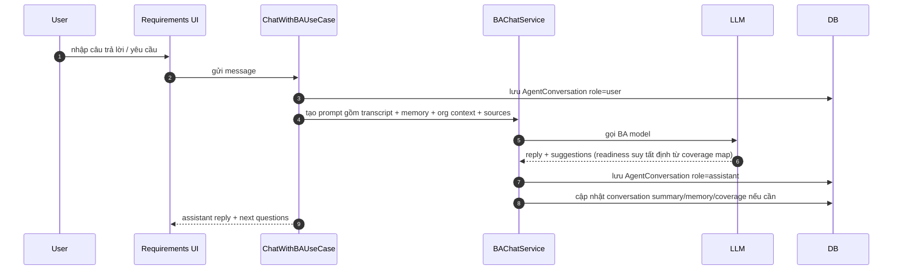
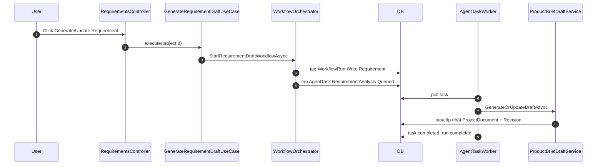
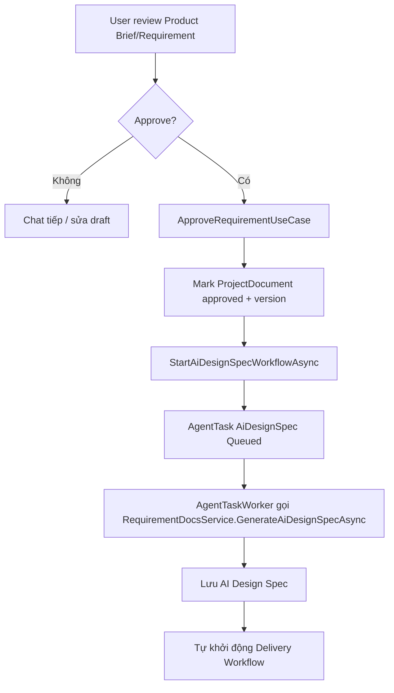

# Luồng yêu cầu — chat với BA

> Đây là "động cơ 1" của hệ thống: một request HTTP xử lý trọn một lượt chat và stream kết quả về.
> Động cơ còn lại (pipeline nền) nằm ở [delivery-pipeline.md](delivery-pipeline.md).

## Đường chat SSE và bốn chốt chặn "không lượt nào được treo"

Đường chat chính là `POST /Requirements/ChatStream` — cùng một request xử lý trọn lượt chat và trả
**Server-Sent Events**: frame `status` ("BA đang soạn câu trả lời…"), frame `token` (BA "đang gõ" —
đã lọc cú pháp JSON qua `BAChatTokenFilter`, chỉ phần `message` hiển thị được stream), và frame `done`
mang bản chốt (reply + suggestions + cờ mời Write Requirement) để client render tại chỗ **không reload
trang**. Client dùng `fetch` + đọc `ReadableStream` (EventSource không POST được); stream hỏng trước khi
nhận frame nào thì `requirements.js` tự rơi về `POST /Requirements/Chat` (postback cổ điển, reload trang).
Lượt chat chạy với `CancellationToken.None` — người dùng đóng tab giữa chừng thì turn vẫn hoàn tất và lưu
DB, chỉ việc ghi response dừng lại.

**Không lượt nào được phép "treo"** — hội thoại luôn kết thúc bằng một lượt assistant, và UI luôn có
đường thoát. Lượt user được lưu TRƯỚC khi gọi LLM, nên nếu phần sau vỡ mà không ai đóng lượt thì hội
thoại nằm lại ở "lượt cuối là user" và trang kẹt vĩnh viễn ở "BA đang soạn câu trả lời…" (F5 cũng không
thoát, không gửi được tin mới). Bốn chốt chặn:

- **Đóng lượt kiểu gì cũng đóng**: mọi ngoại lệ trong một lượt (`BAChatService.RunTurnGuaranteedAsync`,
  và nhánh catch của `AcknowledgeSourcesAsync`) đều ghi một lượt assistant ⚠️ có nút "Thử lại".
- **Nhịp tim SSE**: frame `ping` mỗi 10s trong lúc lượt chạy — client phân biệt được "BA đang nghĩ lâu"
  với "kết nối đã chết". Không có nó, một lời gọi structured-output dài trông y hệt stream đứt.
- **Đồng hồ canh phía client** (`STREAM_IDLE_TIMEOUT_MS`, 45s không nghe thấy gì ⇒ abort) + kiểm tra
  "stream kết thúc mà THIẾU frame `done`": hai kiểu đứt im lặng mà `fetch` không hề báo lỗi.
- **`GET /Requirements/ChatReplyStatus` trả `{pending, stale}`**: `stale` = lượt đang chờ đã chết —
  không tiến trình nào đang chạy nó (`BAChatTurnTracker`, sổ singleton trong bộ nhớ) và lượt user đã cũ
  hơn `BAChatService.ReplyStaleAfter` (3 phút). UI mở khóa ô nhập và mời "Thử lại"; retry lúc này chạy
  lại đúng lượt user còn "cụt" (`RetryLastTurnAsync`) nên người dùng không phải gõ lại câu hỏi.

```
Browser POST /Requirements/ChatStream (SSE)  [hoặc POST /Requirements/Chat — fallback]
  └► RequirementsController.ChatStream               [Controllers]
       └► ChatWithBAUseCase.ExecuteAsync             [Application/Requirements]
            └► BAChatService.ChatAsync               [Services/Requirements]
                 ├► OrganizationContextService       → system message: hằng số sản phẩm (phạm vi + nền tảng) + "bức tranh tổ chức" (cache 1h)
                 ├► UserMemoryService                → hồ sơ user (học dần, xuyên project)
                 ├► ConversationMemoryService        → 20 lượt gần nhất nguyên văn + tóm tắt lượt cũ
                 ├► RequirementCoverageService       → bản đồ bao phủ 12 nhóm thông tin
                 ├► SourceContextBuilder             → ngữ cảnh từ tài liệu user upload (text + ảnh/ảnh trang scan)
                 ├► RequirementPromptBuilder         → dựng prompt (template Prompts/BusinessAnalyst/*)
                 ├► ILlmClient                       → gọi LLM  [Services/Llm]
                 └► BAChatReplyParser                → parse trả lời (+ cổng readiness tất định từ bản đồ bao phủ)
       └► AppDbContext.SaveChanges                   [Data] — lưu lượt hội thoại
```

Các cơ chế trí nhớ (chi tiết đầy đủ ở [phần dưới](#các-cơ-chế-trí-nhớ)):

- **Bộ nhớ hội thoại 2 tầng**: 20 lượt gần nhất gửi nguyên văn; lượt cũ gộp dần vào `Project.ConversationSummary` **theo lô ≥10 lượt** (không tóm tắt mỗi lượt — đó là chỗ tiết kiệm token). Fail-open: gọi tóm tắt lỗi thì giữ summary cũ, không mất lượt nào.
- **Bộ nhớ cấp user** (`AppUser.UserMemory`): BA chắt lọc sự thật bền về user (vai trò, lĩnh vực, văn phong...) theo lô, dùng lại ở mọi project của họ.
- **Bản đồ bao phủ yêu cầu** (`Project.RequirementCoverageMap`): 12 nhóm thông tin đánh dấu [RÕ]/[MỘT PHẦN]/[CHƯA HỎI]/[KHÔNG ÁP DỤNG] — NGUỒN CHÂN LÝ DUY NHẤT của độ sẵn sàng: BA chọn câu hỏi kế tiếp dựa vào đây, panel "Tiến độ khai thác" render nó, và cổng "Write Requirement" suy ready TẤT ĐỊNH từ nó (`RequirementReadinessGate.Evaluate`: mọi dòng áp dụng [RÕ] ⇔ cho phép) — không có lời gọi LLM nào chấm lại, nên panel/nút/lời mời không thể vênh nhau.
- **Checklist học được** (`AgentChecklistItem`): sau khi tài liệu sinh thành công (và sau mỗi vòng sửa POC), hệ thống rà "user phải tự nêu thông tin gì mà BA chưa từng hỏi" và ghi nhớ **cho mọi project sau**. Mỗi bài học là MỘT DÒNG có định danh, kèm **lý do rút ra + trích dẫn bằng chứng + dự án nguồn**, bật/tắt được ở trang `Agents/Checklist`. Chỉ phần `Text` của mục đang bật đi vào prompt; mục bị tắt được gửi cho vòng harvest sau như **danh sách cấm** nên bài học sai không quay lại.
- **Bối cảnh tổ chức**: render từ OrgUnits/Associates, chỉ dữ liệu GỘP (không PII), cache 1h. Fail-open toàn tuyến. Đi kèm hai khối TĨNH "hằng số của sản phẩm" luôn được đính kể cả khi bảng OrgUnits trống: **ranh giới phạm vi** (chỉ nhà máy Đồng Nai) và **nền tảng đã chốt** (chỉ có kênh thông báo email).

## Tài liệu nguồn, ảnh và call log

**Tài liệu nguồn** (`ProjectSourceIngestor`) — người dùng nghiệp vụ mô tả yêu cầu bằng thứ họ đang có, nên đường vào này quyết định chất lượng phỏng vấn:

| Định dạng | Cách đọc |
|---|---|
| Ảnh (PNG/JPG/WebP/GIF) | gửi thẳng cho model vision |
| PDF có text | bóc text từng trang (PdfPig) |
| PDF **scan** | trang không có text ⇒ lấy ảnh nhúng lớn nhất của trang ra `page-{n}.png` (`PdfScanPageRenderer`), gửi cho model vision theo đúng thứ tự trang. Không lấy được ảnh nào mới cảnh báo "không đọc được" |
| Word `.docx`/`.docm` | đoạn văn + bảng (render `ô \| ô`) theo đúng thứ tự tài liệu, **cộng các hình nhúng đủ lớn** (screenshot phần mềm cũ, sơ đồ nghiệp vụ) lấy ra `figure-{n}.png` kèm mốc `[Hình n]` đúng vị trí trong text (`WordDocumentTextExtractor`, tối đa 12 hình/file) — quy trình/biểu mẫu phòng ban gần như luôn ở dạng này, và phần quý nhất của nó thường nằm trong ảnh |
| Excel `.xlsx`/`.xlsm` / CSV | tiêu đề cột + 29 dòng mẫu, **cộng khối `#### Thống kê cột` quét TOÀN BỘ bảng** (`SpreadsheetTextExtractor`) — xem dưới |

**Bảng tính: danh mục lấy từ thống kê, không lấy từ dòng mẫu** (`SpreadsheetTextExtractor`). Dòng mẫu chỉ để BA thấy hình dạng dữ liệu; **danh mục của mỗi cột** — thứ sẽ thành enum/danh mục trong mô hình dữ liệu ở các bước sau — phải lấy từ khối `#### Thống kê cột`, quét cả bảng và ghi cho từng cột: bao nhiêu dòng có giá trị, bao nhiêu giá trị phân biệt, các giá trị đó là gì kèm số dòng (liệt kê **đủ** khi ≤ 12 giá trị, còn lại nêu 5 giá trị hay gặp nhất). Vì sao không thể chỉ gửi dòng mẫu: các dòng đầu của một bản xuất thường được sắp theo người/đơn vị nên không đại diện cho cả bảng — ca thật, file 262 dòng mà 29 dòng đầu chỉ chứa `REQ`/`MAN` nên bản đọc lại của BA bỏ sót `OPT`, đúng giá trị mã hóa "khóa học **tự chọn**" mà người dùng đã nói ngay câu đầu tiên; cùng cửa sổ đó cột `Required Date` trống sạch trong khi cả bảng có 12 dòng mang hạn hoàn thành. Ba chi tiết đi kèm, cả ba đều là lỗi đã gặp:

- Ô được đặt theo **`CellReference`** chứ không theo thứ tự xuất hiện. OpenXML lược bỏ hẳn phần tử của ô rỗng, nên đọc tuần tự thì mọi giá trị sau một chỗ trống trượt sang cột khác — BA từng đi báo với người dùng rằng bảng "bị lệch giữa hàng tiêu đề và các giá trị", trong khi bảng gốc không lệch, chỉ text ta dựng ra mới lệch.
- **Thống kê đứng TRƯỚC các dòng mẫu — nhưng `RealSampleDataReader` cắt ngược lại.** Hai consumer của cùng chuỗi text muốn hai nửa ngược nhau, nên text mang hai mốc hằng số (`ColumnStatsHeading`, `DataRowsHeading`). `SourceContextBuilder.Truncate` cắt ở `Llm:SourceUpload:MaxTextCharsPerFile` (mặc định 20.000) giữ **phần đầu** — một sheet rộng (tới 40 cột, ô tới 200 ký tự) ăn hết ngân sách chỉ bằng 29 dòng mẫu, bảng nhiều sheet thì các sheet sau mất sạch ⇒ thống kê phải đứng trước để sống sót. Ngược lại `RealSampleDataReader` (trần **3.000** ký tự) chỉ lấy từ `DataRowsHeading` trở đi, vì nó cần **bản ghi thật**: đó là dữ liệu POC seed lên màn hình, và là chuẩn để `PocSampleDataCheck` rút token đối chiếu. Để nguyên cả khối thì cái tới POC là mấy dòng *"có giá trị 262/262 · ĐỦ 5 giá trị"* — token đặc trưng thành từ vựng thống kê, POC seed sai mà cổng kiểm cũng mù theo.
- Phần bảng mẫu tự nói rõ nó chỉ là dòng đầu và không được dùng để suy ra danh mục.

Chốt bằng `SpreadsheetTextExtractorTests` + `SourceAckReadbackRuleTests`, và chấm điểm bằng các scenario `source-ack` / `source-readback` trong golden set.

**Cột nào được hỏi, và cột nào là của hệ cũ.** Lượt **kể lại** file (`source-readback.v1.md` — với bảng tính nó tới sau bảng cột, xem mục dưới) **chọn** cột đáng nêu thay vì trải cả bảng ra xin giải nghĩa (18 cột thành 18 việc tồn thì cuộc phỏng vấn hết sạch lượt, mà bị hỏi *"Last Name nghĩa là gì"* thì người dùng hiểu là BA chưa mở file). Tiêu chí nêu: cột phân loại ít giá trị, header là mã/viết tắt, **cột chở một quy tắc người dùng đã nói** (ưu tiên cao nhất — `Assignment Type` với `REQ/MAN/OPT` chính là "bắt buộc / tự chọn" họ nói ở câu đầu), hoặc giá trị bất thường. Nêu dưới dạng **đề xuất cách hiểu** để người dùng gật/lắc, không phải câu hỏi trống. Sang lượt chat, các điểm đó được gom vào **một** lượt `questions` thay vì hỏi lẻ từng cột. Riêng **phạm vi cột** thì không hỏi trong chat nữa — nó được chốt bằng bảng cột ngay tại lượt đọc file, xem mục dưới.

**Các cột được đọc CẠNH NHAU, không đọc rời từng cột.** Khối thống kê có số dòng có giá trị của mọi cột, nên đặt vài con số cạnh nhau bắt được cách hiểu sai với giá gần bằng không — trong khi cùng cái sai đó nếu lọt qua sẽ được người dùng bấm "Đúng rồi" đóng dấu rồi chảy vào Product Brief. Ba dấu hiệu prompt bắt soát, cả ba lấy từ cùng một bản đọc thật: **hai cột cùng số dòng có giá trị** (`Item Status` có `Active (219)` và `Complete Date` có giá trị ở đúng 219/262 dòng ⇒ `Active` nhiều khả năng là *đã học xong* chứ không phải *nội dung còn hiệu lực* — cột này quyết định file kể "ai đã học" hay "nội dung nào còn dùng", tức quyết định nó có suy ra được nhu cầu học hay không); **cột mã và cột tên lệch số giá trị phân biệt** (`Item ID` 134 mã nhưng `Item Title` 136 tiêu đề ⇒ mã không phải khóa như tưởng); **một cột chỉ có giá trị ở đúng những dòng mà cột khác có giá trị** ⇒ cột dẫn xuất, xem ngay dưới.

**Hệ cũ có hai loại cột, loại thứ hai khó thấy hơn hẳn.** Cột **hạ tầng** (`Revision Number`, `Preferred Time zone`) lộ ra ngay từ cái tên. Cột **dẫn xuất** — giá trị tính sẵn từ một cột khác tại thời điểm hệ cũ xuất file, như `Days Rem` = `Required Date` trừ ngày xuất — thì đọc lên *như một dữ kiện nghiệp vụ thật* nên trôi qua rất êm, và bản đọc thật đã tích nó là cột của app mới. App mới tính lại được bất cứ lúc nào, còn con số trong file thì đông cứng từ ngày xuất ⇒ POC seed lên màn hình một giá trị vĩnh viễn sai. Phép thử của prompt: *giá trị này có tự đổi theo thời gian mà không ai sửa gì không?* — có thì giữ cột **gốc**, bỏ cột tính sẵn.

### Bảng cột: chốt phạm vi cột của file bảng tính

File người dùng gửi gần như luôn là bản **xuất của hệ thống họ đang dùng**, nên nó chở cả cột nghiệp vụ lẫn cột hạ tầng của hệ cũ. Toàn bộ text của file đi tiếp vào **dữ liệu mẫu thật** của bước sinh spec và POC seed màn hình bằng đúng các cột đó: không chốt thì người dùng mở demo ra thấy `Revision Number`, `Preferred Time zone` nằm như trường của app mới.

Cách chốt: ở **chính lượt BA đọc file** (`source-ack.v3.md`), BA trả thêm `columns` — mỗi cột của file một dòng, kèm **cách hiểu viết sẵn** và đề xuất cột đó có thuộc ứng dụng mới hay không. Người dùng thấy nó thành một **bảng** ngay dưới lời giới thiệu file (`#columnMap`), tích/bỏ tích, sửa ô ý nghĩa nào lệch, rồi gửi trong một lượt.

**Bảng ĐỨNG TRƯỚC bản đọc lại, và với bảng tính lượt upload không kể lại gì cả.** Đây là thứ tự, không phải chi tiết trình bày: lượt đọc file cũ vừa bày bảng vừa kể lại cả file kèm cụm "Chỗ chưa chắc", tức là làm ba việc sai cùng lúc. Nó dựng **việc tồn** trên những cột người dùng sắp bỏ tích ngay bên dưới (mỗi mục ở "Chỗ chưa chắc" đốt một lượt phỏng vấn thật, và `requirement-chat.v4.md` bắt hỏi cho hết chúng trước khi mở nhóm mới). Nó đọc nhầm cả file khi người dùng **gửi nhầm file** hoặc gửi bản xuất sai kỳ — mà bản đọc vẫn đủ hợp lý để được bấm "Đúng rồi". Và nó đặt một bức tường chữ về 18 cột **ngay trên** một cái bảng 18 dòng chở cùng nội dung ở dạng **sửa được**, nên ai cũng đọc lướt phần trên. Nay lượt upload chỉ còn: file này là gì, quy mô thật, mời rà bảng — tối đa năm câu, không gạch đầu dòng, không "Chỗ chưa chắc" (ngoại lệ đúng một câu khi file rõ ràng không phải thứ BA vừa xin, vì họ cần biết ngay để gửi lại). Word/PDF/ảnh không có bảng nên vẫn được đọc lại đầy đủ ngay tại lượt đó.

Hình dạng của lượt do **cơ chế** chọn chứ không để model đoán (`BAChatService.BuildSourceAckTurnShape`, cùng khuôn với cổng bảng phân quyền): còn bảng tính nào `ColumnMap == null` ⇒ khối `## LƯỢT NÀY: CHỐT PHẠM VI CỘT` gọi đích danh các file đó; không còn ⇒ khối `## LƯỢT NÀY: BẢN ĐỌC LẠI`. Model nhìn thấy text của **mọi** nguồn trong project (kể cả file đã chốt cột từ lần upload trước) nên nó không tự suy ra được file nào đang chờ.

Sáu quyết định của thiết kế này, mỗi cái vá một đường hỏng đã gặp:

- **Bảng chứ không phải hàng chip.** Chip chỉ nêu được tập con do BA tự chọn; các cột không lên chip bị coi là "của hệ cũ" mà người dùng không bao giờ nhìn thấy để phản đối. Bảng phơi **đủ** cột của file — `SourceColumnMapBuilder.Build` luôn bổ sung các cột model bỏ sót vào cuối, ở trạng thái chưa tích.
- **Ô ý nghĩa do BA ĐIỀN SẴN.** Một bảng 18 dòng trống là bắt người dùng nghiệp vụ giải nghĩa 18 cột — đúng thái cực mà cả hai prompt đang cấm, và đọc lên như "tôi chưa mở file của anh/chị". BA có tên cột, mọi giá trị phân biệt và số dòng từ khối `#### Thống kê cột` nên đoán được gần hết; đoán sai thì người dùng sửa một dòng.
- **Mọi tên cột phải khớp hàng tiêu đề THẬT.** `SourceColumnMapBuilder` đọc tên cột từ khối thống kê rồi loại mọi dòng không khớp, và luôn dùng chính tả của **file** chứ không của model — ở cả đường model đề xuất lẫn đường trình duyệt gửi lên (server không tin payload nó vừa render ra). Một dòng bịa lọt qua là POC đi lọc dữ liệu mẫu theo một cột không tồn tại.
- **Bảng treo theo FILE, không theo lượt.** Nó còn đó tới khi `ProjectSourceFile.ColumnMap` được ghi, nên người dùng gõ một câu hỏi lại trước rồi mới ngồi tích cũng không mất bảng.
- **Bảng nhận luôn phần giải nghĩa cột, và bản đọc lại NHẢ nó ra.** Bảng đã đi qua đủ mọi cột kèm ô ý nghĩa **sửa được**, nên một `message` đi qua nốt 18 cột nữa trong văn xuôi là lặp cùng nội dung ở dạng **không sửa được** — và cái người dùng nhận về là một bức tường số (*"Revision Number có 3 giá trị: 1 (218), 3 (21), 2 (18)"*), thứ mà ai cũng đọc lướt rồi bấm "Đúng rồi". Bản đọc thật đã trượt đúng kiểu đó. Luật này áp cho **cả hai** lượt: lượt bày bảng không kể lại gì, và lượt kể lại sau đó chỉ giữ những phần bảng cột không chở được — tổng quan + quy mô, các cột **chở một quy tắc nghiệp vụ**, các cột đọc cạnh nhau, và phần đối chiếu với lời kể. Cùng lý do, phạm vi cột chỉ được xử ở **một** chỗ: nêu lại "cột này trông như của hệ cũ" ở bất kỳ lượt nào là tạo một việc tồn trùng với thứ người dùng vừa (hoặc sắp) bỏ tích, rồi lượt phỏng vấn sau đi hỏi lại đúng điều `requirement-chat.v4.md` cấm.
- **Bảng là chỗ trả lời của lượt, nên câu kết phải chỉ vào nó.** Lượt có bảng thì `BAChatService` **bỏ** hàng chip "Đúng rồi / Chưa đúng" — chip bấm là gửi NGAY, để cả hai cùng sống thì một cú bấm nhầm gửi mất lượt trước khi người dùng kịp tích xong bảng, và bảng không bao giờ được chốt (cùng luật với "lượt gộp có `questions` ⇒ bỏ `suggestions`"). Chip đã đi thì câu kết cũng phải đi theo: kết bằng câu hỏi đóng *"Mình hiểu vậy đã đúng chưa ạ?"* là bày ra một câu hỏi **không có nút trả lời**, người dùng đi tìm nút "Đúng rồi" không thấy trong khi việc thật sự phải làm nằm ở bảng. `source-ack.v3.md` vì vậy chia hai ca: có bảng ⇒ mời rà bảng rồi bấm **Gửi bảng cột**; Word/PDF/ảnh ⇒ câu hỏi đóng như cũ vì lúc đó hai chip là đường trả lời duy nhất. Chiều ngược lại cũng phải chặn: model được lệnh mời rà bảng mà rốt cuộc không trả nổi dòng `columns` nào dùng được ⇒ `BAChatService.ColumnMapMissingNotice` nói thẳng là chưa dựng được bảng và mời người dùng gõ các cột họ dùng, thay vì để câu mời trỏ vào khoảng không.

Gửi bảng đi **hai bước**: `POST Requirements/ConfirmColumnMap` lưu vào `ProjectSourceFile.ColumnMap` (`ConfirmSourceColumnMapUseCase`, không gọi LLM), rồi trình duyệt gửi tiếp **một tin nhắn người dùng** qua đúng đường chat thường — hội thoại vẫn chỉ có một đường ghi, như thẻ hỏi gộp. Lưu hỏng thì dừng hẳn, không gửi tin nhắn: hội thoại ghi "đã chốt phạm vi cột" trong khi file vẫn trống là trạng thái tệ nhất.

Tin nhắn đó do **server** soạn (`SourceColumnMapBuilder.RenderUserMessage`, từ bảng đã chuẩn hoá và đã lưu) chứ không do JS ghép từ payload — như bảng phân quyền, vì hai bản lệch nhau thì hội thoại kể một đằng còn file nguồn ghi một nẻo, mà mọi tầng chắt lọc tin vào bản kể. Ở đây nó gánh thêm việc thứ hai: câu mở đầu cố định của nó (`SourceColumnMapBuilder.SubmissionLead`) là **dấu hiệu tất định** để lượt chat kế tiếp biết mình là lượt kể lại.

### Lượt kể lại: bản đọc file, sau khi phạm vi cột đã chốt

Lượt chat ngay sau khi bảng được gửi được đính thêm khối `source-readback.v1.md` (`BAChatService`, cổng đọc `SourceColumnMapBuilder.IsSubmissionMessage` + có ít nhất một bảng tính đã chốt cột). Đây là bản đọc lại bị dời từ lượt upload xuống — vẫn là **cơ hội duy nhất bắt lỗi đọc file ở đầu vào**, chỉ khác là giờ nó nói về đúng bộ cột người dùng thật sự dùng:

- Chỉ nói về **cột đã tích**. Cột bị bỏ tích không được nhắc, không được hỏi thêm — nhắc lại là mở lại thứ họ vừa đóng, và mục đó nằm lại trong danh sách tồn đọng.
- Giữ bốn thứ bảng cột không chở được: file kể chuyện gì + quy mô thật, các cột chở một quy tắc nghiệp vụ (chép đủ giá trị kèm số dòng, lấy từ khối thống kê), các cột **đọc cạnh nhau**, và phần **đối chiếu với lời kể** + cụm "Chỗ chưa chắc".
- Lượt này **không hỏi khai thác**: kết bằng câu hỏi đóng, hai chip trả lời. Code cắt `questions`/`flowDiagram` của lượt và trả lại hai chip (`SourceReadbackSuggestions`) nếu model lỡ kèm thẻ hỏi — `BAChatReplyParser.Normalize` đã dọn `suggestions` khi thấy `questions`, để nguyên là bày ra một câu hỏi đóng không có nút trả lời. Các câu hỏi phỏng vấn quay lại từ lượt kế tiếp, lấy từ chính cụm "Chỗ chưa chắc" vừa được chắt.
- Cổng bảng phân quyền nhường một lượt (`askPermissionMatrix` tắt khi đang ở lượt kể lại): hai khối `## LƯỢT NÀY:` cùng lúc là hai mệnh lệnh chọi nhau, và cổng kia mở lại ngay lượt sau.

Chốt xong, bản đồ cột được **tiêu thụ ở hai đầu** — đây mới là chỗ bảng trả tiền cho chính nó:

| Đầu đọc | Việc |
|---|---|
| `SourceContextBuilder` | gắn khối *"Bảng cột của … đã được NGƯỜI DÙNG CHỐT"* ngay sau text của nguồn, ở **mọi** lượt chat sau ⇒ BA thôi hỏi lại nghĩa cột, thôi hỏi lại phạm vi, thôi dựng yêu cầu trên cột đã loại |
| `RequirementCoverageService` | gắn **cùng khối đó** vào lượt distill bản đồ bao phủ: bảng cột là câu trả lời của người dùng cho phần "bộ cột chính thức", chỉ khác là họ trả lời bằng cách tích chứ không gõ. Thiếu nó thì dòng *Dữ liệu / danh mục chính* kẹt `[MỘT PHẦN]` với *"còn thiếu: chốt bộ cột"* trong khi bằng chứng nằm ngay trong DB — và vì cổng readiness đọc đúng bản đồ đó, lời mời "Write Requirement" bị thay bằng một câu hỏi mà người dùng đã trả lời rồi, lặp lại mỗi lần họ bấm nút |
| `RealSampleDataReader` | **lọc** các dòng dữ liệu mẫu xuống đúng tập cột đã tích, trước khi chúng vào prompt AI Design Spec và làm chuẩn cho `PocSampleDataCheck` |

Chưa chốt (file không phải bảng tính, model không đề xuất được dòng nào, hoặc người dùng chưa gửi) ⇒ không có bảng, không có khối ngữ cảnh, không lọc gì — luồng chạy đúng như trước. Bảng cột không khớp hàng tiêu đề nào cũng không lọc: cắt sạch dữ liệu mẫu tệ hơn nhiều so với để lọt vài cột thừa.

## Bảng phân quyền: chốt nhóm phân quyền ở cuối buổi

«Phân quyền theo nghiệp vụ» là nhóm **duy nhất** của bản đồ bao phủ không được hỏi bằng câu hỏi. Lý do nằm ở một
buổi phỏng vấn thật, 94 lượt: BA hỏi mở *"từng vai trò còn được xem những dữ liệu nào?"*, người dùng đáp *"hiện
tại cứ vậy đã, có gì tôi bổ sung sau"*, BA tự soạn phương án cho cả năm vai trò rồi xin gật, người dùng bấm một
chip *"Đồng ý phương án này"* — và dòng phân quyền lên `[RÕ]` với bằng chứng đúng bằng bốn chữ ấy. Từ đó BA bị
cấm hỏi lại nhóm đã `[RÕ]`, nên **toàn bộ phân quyền của sản phẩm là thứ BA tự nghĩ ra, ký tên người dùng**.

Câu hỏi đó không hỏng vì cách viết mà vì hình dạng: nó bắt một người dùng nghiệp vụ tự dựng cả ma trận
(màn hình × chức năng × vai trò) trong đầu rồi đọc ra thành lời. Bảng đảo chiều chi phí — chọn vài chục ô có
sẵn rẻ hơn hẳn việc kể ra chừng ấy quyền — và đổi bằng chứng từ *một chip trả lời thay cho tất cả* thành *một
thao tác trên từng ô*.

**Cái bảng KHÔNG gánh.** Quyền định hình LUỒNG (*"HOD duyệt từng quý"*, *"manager trực tiếp duyệt ticket"*,
*"Admin xử waitlist theo FIFO"*) vẫn phải hỏi trong hội thoại đúng lúc nó phát sinh: câu trả lời của chúng làm
ĐỔI câu hỏi kế tiếp của BA, nên hoãn xuống cuối là tự bịt mắt suốt cả buổi. Chúng thuộc nhóm «Chức năng & luồng
nghiệp vụ chính» và «Dữ liệu / danh mục chính». Bảng chỉ gánh phần quyền CRUD theo màn hình — phần mà hỏi lúc
nào cũng cho ra cùng một câu trả lời.

**Thời điểm do CƠ CHẾ chọn, không để model tự đoán** (`PermissionMatrixGate`). Bản đồ bao phủ ghi nhóm phân
quyền là `[CHƯA HỎI]` suốt cả buổi, nên một câu dặn "để cuối" trong prompt không đủ: model vẫn thấy một nhóm
chưa hỏi nằm đó và sớm muộn cũng hỏi. Cổng mở khi cả ba điều kiện cùng đúng — chưa chốt bảng nào, `PlannedScope`
đã có mục (các DÒNG của bảng chính là màn hình đã chắt từ hội thoại), và **mọi nhóm áp dụng KHÁC** đã `[RÕ]`.
Cổng cố tình **bỏ qua đúng dòng phân quyền** khi xét: `RequirementReadinessGate` đòi mọi dòng `[RÕ]` mới mở nút
"Write Requirement", mà dòng phân quyền chỉ lên `[RÕ]` sau khi bảng được chốt — không bỏ qua thì hai cổng khóa
lẫn nhau và không cổng nào mở được. Ba trạng thái của cổng thành ba khối lệnh khác nhau trong ngữ cảnh chat:
chưa mở ⇒ *cấm hỏi lẻ quyền CRUD*; mở ⇒ *lượt này bày bảng*; đã chốt ⇒ *khối bảng đã chốt, đừng hỏi lại*.

Sáu quyết định của thiết kế này:

- **Ô là PHẠM VI DỮ LIỆU, không phải dấu tích.** Quyết định thật gần như luôn có mệnh đề phạm vi —
  *"Assistant xem và chỉnh Training Plan **do mình lập**"*, *"manager xem ticket **của nhân viên thuộc quyền**"*.
  Một ma trận nhị phân chỉ ghi được "có xem" và bước soạn tài liệu phải tự đoán xem của ai, tức là bảng sẽ
  **nghèo hơn chính khung chat** nó thay thế. Bốn nấc: rỗng (không có quyền) / `của mình` / `của đơn vị` /
  `tất cả`, và `PermissionMatrixBuilder` kéo mọi cách viết của model về đúng bốn nấc đó.
- **Chỉ ô có TRÍCH DẪN mới được khóa.** Ô khóa hiện thành dấu ✓ kèm tooltip câu gốc; ô còn lại vẫn mang đề xuất
  của BA nhưng ở dạng chọn được và được nói thẳng là phỏng đoán. Server không nhận lời tuyên bố "người dùng đã
  nói điều này" từ một lá cờ — phải có `evidence` đi kèm. Thiếu ranh giới này thì một bảng điền sẵn trông như
  đã chốt chính là cái chip *"Đồng ý phương án này"* phóng to: người dùng bấm gửi trong ba giây và ta quay về
  đúng chỗ cũ, chỉ khác là tốn thêm một màn hình.
- **Dòng phải trỏ vào màn hình CÓ THẬT, và không màn hình nào được vắng mặt.** Mọi `screen` phải khớp một mục
  `PlannedScope` (khớp chính xác, hoặc một bên chứa bên kia khi model rút gọn tên) và luôn lấy lại **chữ của
  PlannedScope**; dòng không khớp bị bỏ (một tính năng ngoài phạm vi đi vào tài liệu mang chữ ký người dùng),
  còn mục phạm vi mà model quên nhắc tới được **bổ sung vào bảng** ở trạng thái chưa ai có quyền — vắng mặt thì
  nó mặc nhiên "không ai được xem" mà người dùng không bao giờ nhìn thấy để phản đối. Cùng luật với bảng cột.
- **Mọi dòng có ĐỦ mọi vai trò.** Vai chỉ được model nêu ở vài dòng thì các dòng còn lại không có ô cho vai đó —
  và trên màn hình, "không có quyền" với "không hỏi" trông giống hệt nhau.
- **Có cột ĐIỀU KIỆN.** Ràng buộc mà bốn nấc phạm vi không chở nổi (*"chỉ đăng ký được khóa nằm trong danh sách
  bắt buộc của mình"*, *"chỉ sửa khi chưa submit"*) có chỗ riêng ở mức dòng. Đây là loại ràng buộc đổi ngược lại
  cả luồng: ca thật là nhu cầu mở lớp được tính từ danh sách "ai phải học khóa nào" nhưng không ai hỏi nhân viên
  có bị giới hạn chỉ đăng ký khóa của mình không ⇒ tài liệu để đăng ký mở tự do, và con số kế hoạch không còn
  liên quan gì tới người thật sự vào lớp.
- **Bảng treo theo DỰ ÁN, không theo lượt.** Nó còn đó tới khi `Project.PermissionMatrix` được ghi, nên người
  dùng gõ thêm một câu (*"thiếu vai trò Admin"*) rồi mới ngồi chọn cũng không mất bảng. Lượt có bảng thì **bỏ**
  hàng chip, thẻ hỏi gộp và sơ đồ luồng — chip bấm là gửi NGAY, để cả hai cùng sống thì một cú bấm nhầm cuốn mất
  lượt trước khi người dùng chọn xong. Cùng luật với lượt có bảng cột.

Gửi bảng đi **hai bước**, như bảng cột: `POST Requirements/ConfirmPermissionMatrix` lưu vào
`Project.PermissionMatrix` (`ConfirmPermissionMatrixUseCase`, không gọi LLM), rồi trình duyệt gửi tiếp **một tin
nhắn người dùng** qua đúng đường chat thường — hội thoại vẫn chỉ có một đường ghi. Tin nhắn do **server** soạn
(`PermissionMatrixBuilder.RenderUserMessage`) từ bảng đã chuẩn hoá chứ không do JS ghép từ payload: hai bản lệch
nhau thì hội thoại kể một đằng còn dữ liệu dự án ghi một nẻo, mà mọi tầng đọc transcript tin vào bản kể. Lưu
hỏng thì dừng hẳn, không gửi tin nhắn.

Chốt xong, bảng được **tiêu thụ ở ba đầu**:

| Đầu đọc | Việc |
|---|---|
| `BAChatService` | gắn khối *"Bảng phân quyền đã được NGƯỜI DÙNG CHỐT"* vào **mọi** lượt chat sau ⇒ BA thôi hỏi lại, thôi bắt xác nhận lần nữa, thôi dựng yêu cầu trái với bảng |
| `RequirementCoverageService` | gắn **cùng khối đó** vào lượt distill: đây là nguồn bằng chứng RIÊNG của dòng phân quyền. `requirement-coverage.v3.md` khắt khe một chiều — có khối ⇒ `[RÕ]`; **chưa có ⇒ không bao giờ `[RÕ]`**, kể cả khi hội thoại nghe có vẻ đã nói đủ, vì đó chính là đường mà một chip "Đồng ý" đã đi qua một lần |
| `RequirementPromptBuilder.BuildAiDesignSpec` | đưa bảng vào mục `## 6b. Permission Matrix` của spec, và bắt phạm vi dữ liệu thành **điều kiện lọc thật** ở `## 9. API Expectations` chứ không phải một câu mô tả. Đây là đường DUY NHẤT để phân quyền tới được POC ở dạng máy đọc được — không có nó, phân quyền tan vào văn xuôi và bản demo hiện đúng một bộ màn hình cho mọi vai |

Chưa chốt (cổng chưa mở, model không trả bảng dùng được, hoặc người dùng chưa gửi) ⇒ không có bảng, không có
khối ngữ cảnh — luồng chạy đúng như trước và cổng mở lại ở lượt sau. Fail-open toàn tuyến: một lượt hỏi thừa rẻ
hơn nhiều so với một lượt câm.

**Ảnh đi một lần, chữ đi mãi** (`SourceContextBuilder` + `ProjectSourceFile.VisionSummary`). Ảnh nguồn được đính vào lượt user của MỖI lời gọi model, mà mỗi lượt chat là một request mới ⇒ nếu không chặn, một cuộc chat 20 lượt trả tiền upload lại cùng bộ ảnh 20 lần (12 screenshot full-width ≈ 20–40k token/lượt). Chặn bằng cách: lượt BA **mở tài liệu** (`source-ack.v3.md`, chạy ngay sau upload — kể cả khi nó chỉ bày bảng cột) vừa đọc ảnh vừa ghi lại nội dung từng `[Hình n]` thành chữ vào `VisionSummary`; từ lượt sau builder gửi phần chữ đó thay cho ảnh. Hai rào an toàn đi kèm:

- Chỉ khóa lại khi **TOÀN BỘ** hình của nguồn thật sự đã đi kèm lượt đó — mô tả dựa trên nửa số hình rồi khóa là mất trắng nửa còn lại. Nguồn chưa đủ vẫn được ưu tiên hạn mức ảnh ở lượt sau, nên project nhiều tài liệu tự cuốn chiếu.
- Câu ghi chú gắn kèm mỗi nguồn nói **đúng số ảnh thực sự đi trên dây** (tính sau khi đã chốt danh sách). Nói "kèm 12 hình" rồi chỉ gửi 6 là mời model bịa nội dung 6 hình còn lại — trần `Llm:SourceUpload:MaxImagesPerCall` mặc định **12** để khớp trần bóc hình của Word, hạ xuống 4–6 nếu chạy model vision context nhỏ.

**Ảnh trong call log** (`ModelCallImageStore` + `ModelCallRequestPreview`). `RequestJson` của `AgentModelCallLogs` là một bản DỰNG LẠI để hiển thị, không phải body thật, và trước đây nó chỉ lấy phần text của message ⇒ mọi ảnh đã gửi biến mất khỏi log. Khi truy lỗi, ba tình huống khác hẳn nhau — model không bật vision, ảnh bị cắt vì chạm trần, đọc file ảnh lỗi nên bỏ qua — để lại log **giống hệt nhau**. Nay:

- Message có ảnh thì `content` là **mảng part**: `{"type":"image","index":n,"name":"tai-lieu.docx › Hình 3","mediaType":"image/png","bytes":78138}`. Message toàn chữ vẫn là chuỗi như cũ (UI "Dễ đọc" và log cũ dựa vào dạng đó). **Không nhúng base64** — 12 screenshot là ~1.3MB base64 mỗi dòng, trong bảng mà `BudgetGuard` quét trước mỗi lời gọi.
- Bytes ghi ra **đĩa** trong workspace project (`99_CallLogs/{logId}/image-{n}.{ext}`), mở lại bằng `GET /AgentDashboard/CallLogImage?id=…&index=…` (cùng cổng quyền với `CallLogDetail`; đường dẫn dựng hoàn toàn phía server từ log id — endpoint không bao giờ nhận path). Modal Model Invocation Detail hiện dải thumbnail ở tab Request. Không thể chỉ lưu đường dẫn tới file gốc: ảnh chụp POC do Playwright chụp trong RAM rồi thả, không hề có trên đĩa — mà đó lại là loại ảnh cần xem lại nhất.
- Tắt bằng `Llm:CallLog:StoreRequestImages=false`. Ảnh chết cùng workspace khi xóa project, không cần cơ chế dọn riêng. Log cũ / ảnh đã xóa ⇒ ô "ảnh không còn" thay vì icon vỡ, vì "không xem lại được" khác hẳn "không gửi ảnh nào".

Text bóc từ **Excel/Word** còn được nạp vào prompt sinh AI Design Spec làm **dữ liệu mẫu THẬT** (`RequirementDocsService.BuildRealSampleDataAsync`), để POC demo bằng đúng danh mục/tên của đơn vị yêu cầu thay vì "Sản phẩm A / Nguyễn Văn B".

## Sidebar đã gỡ: mọi cổng chờ người dùng chuyển vào khung chat

**Sidebar không còn panel nào của `InterviewOutlookService`.** Ba danh sách chắt sau mỗi lượt chat — `OpenQuestions`, `PlannedScope`, `WorkedExamples` — nay đều đi thẳng vào đường tiêu thụ của máy: ngữ cảnh chat của BA (`BAChatService`), ngữ cảnh soát mâu thuẫn (`RequirementConflictService`), và mục `## 13. Worked Examples` của AI Design Spec. Panel **"Ví dụ đã xác nhận"** là cái cuối cùng bị bỏ vì nó lặp lại đúng thứ BA vừa nói trong chat: ví dụ ĐỊNH TÍNH trùng gần nguyên văn **sơ đồ luồng** ở cuối lượt (có nút "chưa đúng?" cho từng bước — đúng chỗ để đính chính), ví dụ ĐỊNH LƯỢNG thì đến từ chính câu người dùng vừa chốt. Cái mất kèm theo là đường **sửa tay** danh sách oracle (`UpdateWorkedExamplesUseCase`, đã gỡ): đính chính nay đi qua chat như mọi điều khác, và `WorkedExamples` vẫn là oracle mà POC bị chấm theo (`PocWorkedExampleOracle`) — chỉ khác là nó chỉ được sửa qua lượt chắt lọc chứ không sửa trực tiếp được nữa.
**Stepper 5 chặng ở đầu trang đã bỏ.** Quy trình thực tế không chạy một chiều — người dùng sửa tới sửa lui (chat thêm → sinh lại brief → duyệt lại → dựng lại POC), nên một thanh tuyến tính vừa chiếm chỗ đầu trang vừa mô tả sai việc đang diễn ra. Trạng thái thật vẫn ở đúng chỗ cần đọc: cổng xác nhận giả định và tiến trình workflow nằm trong khung chat, các bản mô tả nằm ở panel tài liệu.

**Sidebar không còn panel "Điều đã chốt" — soát mâu thuẫn chuyển từ NGƯỜI DÙNG sang BA.** Đây là panel cuối cùng của sidebar bị gỡ, và vì đúng cái lý do đã gỡ ba panel trước nó. Panel hiển thị nhật ký `DecisionLogService` (tới 40 dòng) cạnh khung chat để người dùng tự rà, tức bắt họ **vừa kể chuyện nghiệp vụ vừa làm QA cho BA** — hai chế độ tư duy song song, đúng lúc cần tập trung nhất. Nó cũng đặt việc soát mâu thuẫn nhầm vai: người dùng không có nghĩa vụ nhớ mình đã nói gì ở lượt thứ ba, còn BA thì đọc được cả hội thoại. Và "bấm để sửa" không phải công cụ sửa thật — nó chỉ soạn sẵn một câu vào ô chat.

Nhật ký **vẫn được chắt sau mỗi lượt** (không đổi chi phí: lời gọi `BADecisionLog` vốn đã chạy), chỉ đổi người đọc. Nó nay đi vào **ngữ cảnh chat của BA** (`BAChatService`) kèm chỉ dẫn bắt buộc: trước khi soạn câu hỏi kế tiếp, đối chiếu câu người dùng vừa trả lời với danh sách; chọi nhau ⇒ lượt này PHẢI là lượt gỡ mâu thuẫn (nêu cả hai vế, hỏi vế nào đúng, tối đa một mâu thuẫn mỗi lượt, hỏi MỘT MÌNH); không chọi nhau ⇒ coi là điều đã biết, không hỏi lại. Trước đây prompt đã dặn "mâu thuẫn thì nêu lại" nhưng BA **không có gì để đối chiếu**: ngữ cảnh không nạp nhật ký, mà các lượt cũ thì bị `ConversationMemoryService` nén thành tóm tắt — chi tiết đã chốt bị bào mòn đúng ở hội thoại dài, nơi mâu thuẫn dễ xảy ra nhất. `RequirementConflictService` (soát một cục lúc bấm "Write Requirement") **vẫn giữ** làm lưới an toàn, nhưng nay hiếm khi bắt được gì — bắt tại lượt rẻ hơn nhiều so với bắt ở cuối, khi người dùng phải chọn A/B cho một câu đã nói từ rất lâu trước.

**Mỗi dòng nhật ký phải TỰ ĐỨNG ĐƯỢC — và điều đó cần lô gộp CHỜM về trước con trỏ.** Người đọc một dòng ("Điều đã chốt") không nhìn thấy câu hỏi đã sinh ra nó: BA ở lượt sau chỉ có danh sách, người dùng ở bản tổng kết cuối cũng vậy. Mà người dùng nghiệp vụ trả lời chủ yếu bằng cách **bấm chip**, và chip cố ý chỉ mang phần *khác nhau* giữa các phương án — chủ ngữ, đối tượng, điều kiện đều nằm trong câu hỏi. Chép chip vào nhật ký là chép cái vỏ: `- Chỉ Assistant HR.`, `- Có trên 100 người.`, `- Duyệt toàn bộ quý.`. Thiệt hại không dừng ở khó đọc — nó **đổi nghĩa**: một câu trả lời cho *"vai trò nào cần nhận email?"* mà ghi thành `- Các vai trò gồm Assistant HR, HOD HR, Manager trực tiếp và Nhân viên.` biến quyết định về **người nhận email** thành quyết định về **danh sách vai trò**, đủ để `RequirementConflictService` bắt nhầm mâu thuẫn với vai trò Admin đã chốt và chất vấn người dùng một câu thừa.

Hai tầng cùng chặn. Prompt (`decision-log.v1.md`) chốt "trung thành với NGHĨA, không phải với CÂU CHỮ": lấy mệnh đề BA hỏi/đề xuất ghép phần người dùng đã gật, viết thành câu có đủ *ai làm / cái gì được quyết / trong điều kiện nào*, kèm bảng đối chiếu chép-chip ⇄ dòng đúng. Cơ chế (`DecisionLogService.ContextTurnCount`) lo phần prompt không tự lo được: hàm chạy CUỐI lượt chat, sau khi lượt BA đã lưu, nên mỗi lô là `[câu trả lời của người dùng, câu hỏi MỚI của BA]` — **câu hỏi mà họ đang trả lời nằm ở lô TRƯỚC**, tức model không có gì để dựng lại nghĩa. Lô gộp vì vậy kéo thêm 2 lượt đã gộp về trước con trỏ, dán nhãn "KHÔNG chắt lại" (chắt lại là ghi trùng dòng đã có) và **không dời con trỏ** — chỉ phần delta được tính, đúng như trước.

**CỔNG TẠO TÀI LIỆU (`#writeReqZone`) — chỗ DUY NHẤT có nút sinh Product Brief.** Cụm cuối khung chat, gồm ba nhịp của cùng một quyết định: **bản tổng kết** để rà → **nút tạo tài liệu** → **cổng soát mâu thuẫn** (nếu có). Đặt trong chat vì cùng lý do đã chuyển cổng xác nhận giả định vào đây: quy trình đang ĐỨNG CHỜ người dùng, câu hỏi và nút trả lời phải nằm cùng chỗ mắt đang nhìn. Là **một wrapper** chứ không phải ba khối rời vì `syncWriteReqGate` phải dời cả cụm xuống cuối dòng hội thoại sau mỗi lượt (các bong bóng mới chèn vào trước `#thinkingBox`) — dời lẻ thì panel mâu thuẫn lạc khỏi cái nút vừa bật nó lên; wrapper cũng giữ cụm không kề trực tiếp bong bóng BA nên quy tắc gộp "câu hỏi + chip gợi ý" (`.req-msg.ba:has(+ .suggestion-list …)`) không bị chen vào giữa.

Bản tổng kết là chỗ duy nhất còn hiển thị nhật ký cho người dùng — họ đội mũ kiểm duyệt đúng MỘT lần. Mỗi ý có nút **✎ Sửa** mở ô ghi chú; **bôi đen** một đoạn trong ý thì hiện nút nổi "✎ Ghi chú đoạn này" và đoạn đó thành chip gắn kèm ghi chú (tiện ích phụ — các ý là câu ngắn ~25 từ, bôi đen chỉ để nói rõ chỗ sai). Hai nút loại trừ nhau: chưa ghi chú gì ⇒ nút tạo tài liệu; đã ghi chú ⇒ **cả form bị ẩn** và nút đổi thành "Gửi N đính chính cho BA", vì soạn tài liệu từ một bản tổng kết người dùng vừa nói là sai chính là điều cổng này sinh ra để chặn (ẩn cả form chứ không riêng cái nút — một form còn submit được sau lưng giao diện là đúng thứ đang chặn).

**Bốn trạng thái, chỉ MỘT trạng thái có nút** (`writeReqState`, suy tất định ở đầu `Index.cshtml`, ghi vào `data-state` của wrapper để `requirements.js` khởi tạo từ đúng bản server render):

| trạng thái | điều kiện | trên màn hình |
|---|---|---|
| `waiting` | lượt BA mới nhất chưa mời (và chưa có draft nào để soạn lại) | cổng ĐÓNG, không có nút nào; panel "Tiến độ khai thác" nói còn thiếu gì và việc gì sẽ xảy ra khi đủ (`#writeReqWaitingHint`) |
| `ready` | lượt BA mới nhất mời tạo tài liệu — **hoặc** draft đã có và cổng readiness đang đủ | cổng MỞ, nút "✓ Đúng hết — tạo tài liệu" |
| `running` | vòng soạn đang xếp hàng/đang chạy | cổng ĐÓNG; tiến độ đã có panel `.workflow-progress` trong chat, xong thì `requirement-workflow.js` tải lại trang |
| `done` | draft đã có và hội thoại chưa có gì mới kể từ vòng soạn gần nhất | cổng ĐÓNG hẳn, và `#writeReqWaitingHint` cũng TẮT |

**Soạn xong thì cổng ĐÓNG, không phải mở ra một nút "tạo lại".** Trạng thái `done` từng là `regenerate`: bày lại bản tổng kết kèm nút "🔄 Tạo lại tài liệu" và một hộp xác nhận GHI ĐÈ. Cả cụm đó là nhiễu ở đúng chỗ người dùng cần tập trung nhất. Panel workflow ngay phía trên đã nói *"Tài liệu đã sẵn sàng · Xem Product Brief"* và BA cũng vừa mời xem lại rồi bấm Approve, nên bong bóng này là lần **thứ ba** nói cùng một điều — mà lại đẩy hành động thật (đọc Brief → Approve) xuống dưới hàng chục dòng tổng kết. Bản tổng kết là cổng rà **trước** khi soạn; soạn xong rồi thì thứ đáng rà là chính Product Brief, và đường đó đã có, chính xác hơn hẳn: ghim ghi chú ngay trên bản xem trước (`ReviseBriefFromNotesUseCase`) hoặc nhắn thẳng trong khung chat. Còn cái nút thì tự nó vô nghĩa: bấm khi chưa bổ sung gì tốn 2–3 lời gọi LLM để ra gần đúng bản cũ rồi ghi đè bản đang có, mà model chạy ở `temperature > 0` nên bản mới có thể tệ hơn — chính lời dẫn cũ của cổng cũng khuyên *"nhắn thêm trong khung chat rồi tạo lại"*, tức một cái nút mà dòng chữ ngay trên nó bảo hãy làm việc khác. Đường soạn lại không mất: nhắn một câu là cổng mở lại ở `ready`, và lúc đó nút soạn từ hội thoại ĐÃ có thông tin mới.

Đổi lại, `done` phải **tắt cả `#writeReqWaitingHint`**: nói *"khi mọi nhóm đã rõ, BA sẽ mời anh/chị tạo tài liệu"* trong lúc panel "Tiến độ khai thác" đầy 100% và tài liệu đã nằm trên màn hình là nói sai — đây chính là lời nói dối mà trạng thái `regenerate` ngày trước sinh ra để vá (lượt cuối là thông báo "đã tạo xong" nên cờ mời hoá `false`).

**Đường lùi khi bản Brief đã cũ.** Cờ mời đọc chữ trong lượt BA mới nhất, nên có một ca kẹt: Brief đã tồn tại, người dùng nhắn một lời đính chính, BA đáp bằng một **câu hỏi** thay vì lời mời ⇒ cổng đóng và không còn đường nào soạn lại bản Brief đang cũ dần so với hội thoại. Vì vậy `ready` xét thêm cổng readiness tất định, và **chỉ khi đã có draft** — trước lần soạn đầu tiên cổng vẫn đi đúng theo lời mời của BA như cũ. Cờ này do **server** tính ở cả hai đường (`Index.cshtml` lúc tải trang, `BAChatTurnResult.CoverageReady` → frame `done` lúc chat): luật *"mọi dòng áp dụng đã [RÕ]"* không được phép có bản sao trong JS.

**Không có nút mờ-và-khóa nào nữa.** Nút "Write Requirement" từng sống ở sidebar với cả bốn trạng thái, trong đó ba là nhiễu: `waiting` bày ra một nút mời bấm mà bấm không được, `running` lặp lại đúng điều panel tiến độ workflow đang nói, và ở `ready` thì người dùng đã có nút thật ngay dưới câu BA vừa mời — hai nút cùng một việc, cách nhau nửa màn hình. Nút nay là **nút submit thật** của `form.write-req` nằm trong cổng, nên không còn đường "bấm hộ" nào: cổng soát mâu thuẫn (`initConflictGate`) là listener trên chính nút/form đó, và mọi cú bấm đều đi qua nó.

**Nhật ký rỗng KHÔNG đóng cổng.** Danh sách do LLM chắt nên rỗng là chuyện có thật (gộp lỗi, hoặc phỏng vấn ngắn chưa kịp có bản nào). Trói cổng vào "có ý để rà" thì đúng lúc đó người dùng không còn đường nào tạo tài liệu — sidebar không có nút, cổng không mở. Cổng vẫn mở, chỉ bỏ phần rà và đổi tiêu đề/lời dẫn cho khớp ("Sẵn sàng tạo tài liệu" thay vì "Tổng kết trước khi tạo tài liệu"): hứa một bản rà soát rồi không đưa ra cũng là nói sai.

Trạng thái cổng đến từ **hai frame SSE khác nhau** nên `requirements.js` giữ lại cả hai (`gateState` từ cờ mời + cờ readiness ở frame `done`, `gateItems` từ frame `decisions` tới sau và không mang cờ nào trong hai cờ đó), rồi mọi thay đổi đi qua một hàm `syncWriteReqGate()` viết dạng toàn phần — mỗi frame chỉ vá một mẩu trạng thái thì kiểu gì cũng có tổ hợp không ai vẽ đúng.

Đính chính đi qua **một lượt chat bình thường**, không qua endpoint riêng: BA đọc và xác nhận lại cách hiểu mới, nhật ký gộp lượt đó, cổng tự mở lại ở lượt mời kế tiếp với bản đã sửa. Đây cũng là điều kiện để bước soạn tài liệu (vốn đọc transcript) thấy được ghi chú — ghi chú nằm ngoài transcript thì chỉ là trang trí. **Ranh giới với cổng "chốt nhanh" đã bỏ:** mọi dòng trong bản tổng kết đều là điều người dùng ĐÃ nói hoặc đã bấm đồng ý (`decision-log.v1.md` cấm suy diễn); BA không bao giờ điền hộ ô trống rồi ghi vào hội thoại như lời người dùng — chỗ trống vẫn phải hỏi tiếp trong chat, và cổng readiness vẫn là thứ quyết định khi nào cổng mở.

## Lượt hỏi GỘP, chuẩn `[RÕ]` và phanh chống hỏi lại

**Lượt hỏi GỘP (2–4 câu hỏi độc lập một lượt).** Phỏng vấn được thiết kế "mỗi lượt một câu hỏi" và cổng readiness chỉ mở khi MỌI nhóm áp dụng đã `[RÕ]` — hai điều đúng về chất lượng nhưng cộng lại thành hàng chục lượt chat, và người dùng nghiệp vụ bận thì bỏ dở chứ không có cách nào rút ngắn. Bản trước rút ngắn bằng cổng **"chốt nhanh phần còn lại"**: BA tự soạn một phương án cho mỗi nhóm còn trống, người dùng duyệt một lần. Cổng đó **đã bỏ**, vì nó rút ngắn ở sai chỗ — phương án do BA soạn được ghi vào hội thoại **như lời của chính người dùng**, nên bản đồ bao phủ đầy lên mà không ai thật sự trả lời câu nào, và mọi tầng phía sau (Product Brief, spec, POC, UAT) tin đó là điều người dùng đã nói. Với hội thoại còn ngắn thì phần lớn phương án là BA phỏng đoán theo thông lệ, tức là tài liệu của BA đoán, ký tên người dùng.

Nay thứ được rút ngắn là **số vòng đi-về**, không phải độ sâu khai thác: BA vẫn là người HỎI, người dùng vẫn là người TRẢ LỜI, nhưng một lượt chở được nhiều câu hỏi.

- **Phép thử để được gộp** (`BusinessAnalyst/requirement-chat.v4.md`): *câu trả lời của câu này có làm ĐỔI câu hỏi kế tiếp không?* Không đổi ⇒ được gộp (các nhóm rời nhau: quy mô sử dụng, thông báo, báo cáo, dữ liệu & danh mục, phân quyền). Có đổi ⇒ **phải hỏi một mình**: xin câu chuyện thật, đào ngoại lệ, chốt ví dụ số, chốt kịch bản luồng, gỡ mâu thuẫn, nhịp tóm tắt kiểm chứng. Gộp mấy câu đó là mất đúng cái phễu mở → đào sâu → chốt.
- **Trần cứng 4 câu/lượt, chặn TẤT ĐỊNH ở `BAChatReplyParser`** — không chỉ dặn trong prompt. Model luôn có xu hướng gộp tối đa để "xong sớm", và một lượt 12 câu hỏi chính là cổng chốt nhanh đội lốt phỏng vấn. Trần áp ở **cả hai** đường vào: `Parse` (model trả text) và `Normalize` (structured output trả thẳng `BAChatReply` — đường mặc định của các model tốt, nếu chỉ chặn trong `Parse` thì đúng những model đó không bị chặn).
- **Hình dạng bộ chip phải khớp cờ `multiSelect`, chặn TẤT ĐỊNH ở `BAChatReplyParser`.** Một bộ gợi ý chỉ thuộc đúng một trong hai kiểu: **phương án thay thế** (mỗi chip là câu trả lời trọn vẹn, chọn cái này loại cái kia ⇒ chọn MỘT) hoặc **liệt kê thành phần** (câu trả lời thật là một danh sách, mỗi chip là một MẢNH ⇒ chọn NHIỀU). Model hay trộn hai kiểu: hỏi *"gồm những vai trò nào?"* — đúng kiểu liệt kê nên bật `multiSelect` — nhưng chip vẫn giữ dạng GÓI lồng nhau và phủ định nhau (`["Nhân viên và HR/đào tạo", "Nhân viên, quản lý và HR", "Thêm HoD phòng ban", "Chỉ bộ phận HR/đào tạo"]`). UI cho tích ô 1 + ô 4 cùng lúc, và thứ gửi đi là một câu trả lời **tự mâu thuẫn** được chắt thẳng vào bản đồ bao phủ với "Điều đã chốt" như lời người dùng — từ đó không tầng nào phía sau phân biệt được nữa. Parser nhận diện ba dấu hiệu "chip này là một PHƯƠNG ÁN, không phải một mảnh" (gói nhiều thứ trong một dòng; mở đầu bằng *"Chỉ…"*/*"Tất cả…"*/*"Không…"*; không tự đứng một mình như *"Thêm HoD…"*) rồi **hạ `multiSelect` về `false`** — áp ở cả hai đường vào và cho cả chip lượt-đơn lẫn chip từng câu của lượt gộp. Sửa **chỉ một chiều**, không bao giờ tự bật: hạ nhầm thì người dùng mất tiện ích tích nhiều ô (vẫn bấm được một chip, vẫn tự nhập được), bật nhầm thì sinh ra dữ liệu sai mà mọi bước sau tin là thật — hai cái giá không cùng hạng. Prompt (`requirement-chat.v4.md`, mục *"HAI KIỂU BỘ GỢI Ý"*) dạy cách viết chip nguyên tử; parser chỉ là cái phanh.
- **Câu ĐÓNG mới có chip; câu MỞ thì KHÔNG, chặn TẤT ĐỊNH ở `BAChatReplyParser`.** Luật trước bắt *"mỗi khi bạn HỎI bất cứ điều gì thì PHẢI kèm gợi ý"*, nên BA xin một câu chuyện rồi vẫn dựng ra một hàng chip. Lỗi thật đã gặp trên màn hình: *"Anh/chị kể giúp một lần gần nhất lập kế hoạch cho các lớp học trong năm: bắt đầu từ đâu, thực hiện những bước nào, và kết quả cuối cùng cần có là gì?"* với `["Đã có danh sách khóa học", "Bắt đầu từ nhu cầu đào tạo", "Đang theo dõi bằng Excel", "Chưa có quy trình cố định"]`. Bốn chip chỉ chạm vế *"bắt đầu từ đâu"*, mà ở lượt hỏi một câu **bấm chip là GỬI NGAY** — nên *các bước* và *kết quả cuối cùng*, đúng hai thứ đắt nhất, không bao giờ được kể; rồi mẩu bốn chữ đó được chắt vào bản đồ bao phủ với "Điều đã chốt" **như câu trả lời thật của người dùng**, và nhóm coi như đã hỏi xong. Chip ở đó không phải tiện ích mà là một cái bẫy. Phép thử của prompt (`requirement-chat.v4.md`, mục *"CÂU ĐÓNG hay CÂU MỞ"*): *viết được 2–5 đáp án mà MỖI đáp án là câu trả lời TRỌN VẸN không?* — được ⇒ câu đóng, bắt buộc kèm chip; các đáp án chỉ trả lời được một MẨU ⇒ câu mở, `suggestions: []` + `openEnded: true`. Parser áp cờ đó ở cả hai đường vào và cho cả câu lượt-đơn lẫn từng câu của lượt gộp: `openEnded` ⇒ **xóa chip** (không bao giờ có hai chỗ trả lời cho một câu), cộng một nhận diện hẹp theo CỤM TỪ (*"kể giúp"*, *"mô tả"*, *"nói rõ hơn"*…) tự chuyển câu xin-lời-kể sang mở. Sửa **chỉ một chiều** (đóng → mở), không bao giờ tắt cờ BA đã đặt: bật nhầm thì người dùng phải gõ thay vì bấm, bỏ sót thì sinh ra một câu trả lời cụt mà mọi tầng sau tin là lời người dùng — hai cái giá không cùng hạng. Mặc định vẫn là câu đóng có chip: bỏ chip ở câu đóng là bắt người dùng nghiệp vụ gõ tay đúng thứ đáng lẽ bấm một cái là xong.
- **Chip BẤT ĐỒNG mở ô tự nhập TẠI CHỖ, không gửi ngay.** Prompt kê sẵn ba bộ chip có vế từ chối — `["Đúng rồi", "Không, tính khác"]` (chốt ví dụ số / kịch bản luồng), `["Đồng ý", "Tôi muốn khác"]` (xin chốt một phương án), `["Đúng rồi, tiếp tục", "Tôi muốn sửa lại"]` (nhịp tóm tắt kiểm chứng) — và cả ba đều thuộc nhóm **bắt buộc hỏi một mình**, tức các lượt đắt nhất của cuộc phỏng vấn. Nhưng ở lượt hỏi một câu, **bấm chip là GỬI NGAY**, nên vế từ chối gửi đi một lượt user RỖNG NỘI DUNG: phủ định mà không kèm cái đúng. Giá phải trả là trọn một vòng LLM chỉ để BA hỏi lại *"vậy anh/chị tính thế nào?"*, trong khi nhóm bị đụng tới đã rớt khỏi `[RÕ]` mà không có thông tin nào thay thế — và **lượt quay lại duy nhất** mà mỗi nhóm được phép (xem mục trên) bị tiêu đúng vào đó; câu trả lời thật thì đang nằm sẵn trong đầu người dùng đúng giây họ bấm "Không". Nay `requirements.js` nhận diện chip bất đồng (`isDissentChip`) rồi **mở ô nhập ngay trong hàng chip** thay vì gửi. Bốn điều ràng buộc thiết kế này:
  - **Tin nhắn đi ra là `chip — lời viết thêm`**, giữ lại vế phủ định: bỏ đi thì *"làm tròn xuống"* đứng trơ trọi và các tầng chắt lọc không còn biết nó đang bác lại cách tính nào.
  - **Ô KHÔNG bắt buộc** — để trống rồi bấm gửi thì tin nhắn đúng bằng chip như trước, và dòng nhắc dưới nút nói rõ điều đó. Bắt gõ mới đi tiếp được sẽ đẩy một phần người dùng sang bấm "Đúng rồi" cho xong: đổi một lượt cụt lấy một **xác nhận giả**, thứ đắt hơn hẳn vì mọi tầng sau tin nó là thật.
  - **Hàng chip luôn có dòng "Ý khác — tôi tự nhập"** (cùng lối thoát `.batchq-choice.is-other` mà thẻ hỏi gộp đã có), vì một hàng chip đọc như tập đáp án ĐÓNG — không có dòng này thì người dùng có ý riêng chỉ còn cách bỏ qua chip rồi gõ xuống khung chat. Khối này do JS dựng cho **cả hai** đường render (`ensureOtherControls`, như `ensureMultiControls`) chứ không nhân đôi markup sang `Index.cshtml`: nó không mang dữ liệu của lượt nào nên server không có gì để render. Lượt câu MỞ không có chip nên cũng không có ô này — ở đó khung chat đã là chỗ trả lời duy nhất.
  - **Nhận diện đặt ở JS, không ở `BAChatReplyParser`.** Nó chỉ quyết định cú bấm MỞ Ô hay GỬI NGAY, không đổi nội dung được lưu — khác hẳn các chốt chặn tất định của parser (`multiSelect`, `openEnded`) vốn sửa chính câu trả lời trước khi nó lên màn hình. Vẫn giữ luật **sửa một chiều**: nhận nhầm ⇒ tốn thêm một cú bấm "Gửi"; bỏ sót ⇒ đúng bằng hành vi cũ. Không cú bấm nào bị chặn, không chip nào bị xoá.
- **Lượt XIN FILE cũng phải đứng một mình.** Xin file không phải câu hỏi nên nó không lọt vào danh sách "hỏi một mình" ở trên, nhưng nó hỏng đúng cùng một kiểu: người dùng đọc xong thì đi tìm file, và vế còn lại của lượt bị nuốt mất. Ca thật, BA vừa xin file Master List vừa hỏi *"hiện nay việc lập kế hoạch và tính số lớp được thực hiện như thế nào và điểm khó chịu nhất là gì?"* — người dùng đính kèm file rồi đáp đúng một dòng (*"làm thủ công, tự tính tay thường bị sai sót, data không đồng bộ"*), tức chỉ chạm vế *điểm khó chịu*; **các bước** của quy trình hiện tại không bao giờ được kể, mà nhóm *Quy trình hiện tại & điểm khó* vẫn được chắt là đã hỏi xong nên BA không quay lại. Prompt tách làm hai lượt: lượt này chỉ xin file (`suggestions` rỗng, `openEnded: true`), đọc xong rồi mới xin lời kể — file thường trả lời hộ một phần câu định hỏi, nên hỏi trước khi đọc file còn là tự bỏ mất lợi thế đó. Không chặn được bằng máy (phân biệt "lời nhờ đính kèm" với "câu hỏi" là việc của model), nên lưới an toàn là điểm chấm trong golden set.
- **Câu hỏi kép mà chip chỉ trả lời được một nửa** (*"những vai trò nào sẽ dùng ứng dụng **và mỗi vai trò chịu trách nhiệm gì**?"* với chip là danh sách vai trò) bị cấm trong prompt — người dùng bấm chip là hết lượt, nửa sau rơi mất trong khi BA tưởng đã hỏi. Chỗ này KHÔNG chặn được bằng máy (tách một câu hỏi làm đôi là việc chỉ model làm đúng), nên lưới an toàn nằm ở tầng chấm điểm: `requirement-coverage.v3.md` nay có chuẩn `[RÕ]` riêng cho **Đối tượng người dùng & vai trò** — phải rõ **mỗi vai trò làm gì**, một danh sách tên vai trò trần chỉ được `[MỘT PHẦN]` kèm *còn thiếu: mỗi vai trò làm/xem được gì*. Nhờ vậy nửa câu trả lời bị chấm là thiếu và BA buộc phải hỏi nốt ở lượt sau, thay vì dựa vào việc BA không bao giờ hỏi câu kép.
- **Contract**: `BAChatReply.Questions` (`BAChatQuestion[]`: nhóm + câu hỏi + gợi ý riêng + cờ chọn-nhiều + cờ `openEnded`), lưu ở cột `AgentConversation.Questions` (mã hóa at rest như `Message`/`Suggestions`). Lượt hỏi một câu vẫn đi đường cũ (`message` + `suggestions`) — đó là ca thường gặp nhất VÀ là ca bắt buộc của mọi câu hỏi đào sâu, nên nó không đổi gì. `Normalize` giữ hai đường **loại trừ nhau**: có thẻ hỏi thì không có chip lượt-đơn (chip bấm là GỬI NGAY, để cả hai cùng sống thì một cú bấm cướp lượt trước khi người dùng kịp trả lời các câu còn lại), và một lượt "gộp" chỉ có một câu bị **hạ về** đường một-câu với câu hỏi nối vào `message`.
- **UI**: thẻ nhiều dòng trong khung chat (`.batchq`), mỗi dòng là một câu hỏi + gợi ý bấm + "Ý khác — tôi tự nhập" (dòng `openEnded` thì bỏ cả hàng gợi ý lẫn nút "Ý khác", **mở sẵn** ô tự nhập — một dòng chỉ có câu hỏi mà không có chỗ trả lời đọc như dòng bị lỗi); nút gửi đếm live số câu đã trả lời và nói rõ **không cần trả lời hết** (câu để trống thì BA hỏi tiếp ở lượt sau). Render ở CẢ hai đường — server lúc tải trang, JS ở frame `done` — vì F5 giữa chừng mà thẻ biến mất thì người dùng mất các câu chưa trả lời, và `message` của lượt gộp chỉ là câu dẫn.
- **Không có endpoint riêng**: cả cụm được soạn thành MỘT tin nhắn `- câu hỏi: trả lời` rồi gửi qua đúng đường chat thường. Nhờ vậy không có đường ghi thứ hai nào lệch khỏi luồng chính, và mọi thứ đã đúng ở lượt chat (cổng readiness, chắt lọc bản đồ bao phủ, decision log) tự khắc đúng ở đây. `ConversationTurnRenderer` render cả các câu hỏi vào transcript — thiếu nó thì reader chỉ thấy câu trả lời mà không biết nó trả lời cho câu nào.

**Chuẩn `[RÕ]` được siết ở `BusinessAnalyst/requirement-coverage.v3.md`.** Lượt gộp làm người dùng dễ trả lời ngắn hơn, nên "giám khảo" của cổng phải khắt khe hơn ở đúng chỗ một câu khẳng định chung chung có thể trôi qua: ngoại lệ phải có **một tình huống hỏng cụ thể kèm cách xử lý**; quy tắc nghiệp vụ phải có **điều kiện và hệ quả**; vòng đời phải **gọi tên các trạng thái** và điều kiện chuyển; thông báo phải rõ **ai nhận, khi nào** và hai vế phải **ghép được với nhau** (một danh sách vai trò trần trả lời cho câu hỏi gộp nhiều loại sự kiện chỉ `[MỘT PHẦN]` — nếu không, tài liệu đóng băng thành "mọi thay đổi trạng thái gửi cho cả bốn nhóm", tức mỗi lần một bản kế hoạch đổi trạng thái thì toàn bộ nhân viên nhà máy nhận email); phân quyền phải rõ **vai nào làm/xem được gì** ("phân quyền theo vai trò" là nhắc lại tên nhóm, không phải câu trả lời) và các thao tác của **người dùng cuối** còn phải rõ **ai đủ điều kiện làm**. Thêm ba điều **không được tính là căn cứ**: (1) lời của BA mà người dùng chưa xác nhận — trích dẫn `{nguồn: …}` phải lấy từ lượt của NGƯỜI DÙNG hoặc tài liệu nguồn, vì một dòng `[RÕ]` sai thì BA sẽ không bao giờ hỏi lại nhóm đó nữa; (2) một tiếng "có/không" trả lời cho một câu hỏi MỞ; (3) lượt người dùng nói họ **không hiểu câu hỏi** — lượt đó không chứa dữ kiện nào, và lượt BA kế tiếp mở đầu bằng *"giờ mình đã rõ: …"* là BA tự trả lời hộ. Hai chuẩn cũ (định lượng phải có ví dụ số, luồng/trạng thái phải có chuỗi bước xác nhận) giữ nguyên.

**Ba chuẩn cắt ngang** (áp cho mọi dòng, không riêng nhóm nào) chặn đúng loại lỗ hổng mà tài liệu vẫn trông đầy đủ: **tham số của một quy tắc phải có nguồn** (biết công thức mà không biết sĩ số tối đa được nhập ở đâu ⇒ bản kỹ thuật tự đẻ ra một màn hình cấu hình chưa ai yêu cầu); **danh mục dùng để kiểm tra dữ liệu phải có người quản lý** (bộ cột của file upload KHÔNG thay được cho câu hỏi này); **dữ kiện mồ côi thì chưa xong** — một trường/tham số được nhắc tới mà không quy tắc nào dùng tới là dấu hiệu còn một luật chưa được hỏi, không phải chi tiết thừa.

**Phanh chống HỎI LẠI (`AskedQuestionHistory`).** Chuẩn `[RÕ]` càng khắt khe thì càng lộ ra một lỗ hổng của thiết kế: thứ DUY NHẤT ngăn BA hỏi lại là bản đồ bao phủ, mà bản đồ chỉ có độ phân giải theo **NHÓM** (12 dòng). Một dòng chưa `[RÕ]` nghĩa là "ưu tiên hỏi nhóm này", và vì mỗi câu hỏi của lượt gộp được gắn `group` = tên dòng bản đồ, model sinh lại đúng **câu hỏi mở đầu** của nhóm đó — người dùng vừa trả lời xong đã bị hỏi lại nguyên văn, chip gợi ý chính là câu họ vừa gõ. Cùng triệu chứng khi lượt chắt lọc bản đồ hỏng (fail-open giữ bản cũ): cả cụm câu hỏi lượt trước được phát lại y nguyên. Prompt đã cấm, nhưng prompt chỉ định hướng — nên có ba lớp:

- **Ngữ cảnh**: system message *"Các câu hỏi BẠN ĐÃ HỎI ở những lượt trước"* dựng từ chính hội thoại (câu của lượt gộp + `message` của lượt hỏi một câu), nạp cạnh bản đồ. Đây là thứ duy nhất phân biệt được "hỏi tiếp phần còn thiếu" với "hỏi lại điều vừa được trả lời" — bản đồ theo nhóm thì không.
- **Chặn tất định**: câu hỏi trùng (khoá chuẩn hoá, hoặc bao phủ tập từ ≥ 0.8 **và** Jaccard ≥ 0.5 — bắt được câu cũ sửa vài chữ mà không chặn oan câu đào sâu mới) bị **loại khỏi lượt trả lời trước khi nó lên màn hình**. Còn ≥ 2 câu ⇒ thẻ hỏi rút gọn; còn 1 ⇒ hạ về đường một-câu; còn 0 ⇒ thay bằng bước kế tiếp suy tất định từ bản đồ (`RequirementReadinessGate`) — nêu đúng nhóm còn thiếu, hoặc mời bấm "Write Requirement" khi bản đồ đã đủ. Không bao giờ để lại một lượt câm hay một câu dẫn cụt.
- **Ngoại lệ đúng chỗ**: nhóm mà người dùng vừa **đính chính trong chat** được MIỄN phanh. Nhận diện qua cụm `AskedQuestionHistory.ReopenNote` (*"người dùng báo phần này chưa đúng"*) mà lượt chắt lọc ghi vào phần `còn thiếu:` của dòng bị đụng tới — xem [Đính chính một nhóm](#đính-chính-một-nhóm-đường-thoát-khỏi-một-dòng-rõ-oan). Không có ngoại lệ này thì lời đính chính rơi vào im lặng: bản đồ đã hạ nhóm xuống nhưng câu hỏi của BA lại bị lọc mất vì trùng câu cũ.

Prompt `requirement-chat.v4.md` cũng tách rõ hai việc mà trước đây bị gộp làm một: `[CHƯA HỎI]` ⇒ hỏi câu mở đầu của nhóm; `[MỘT PHẦN]` ⇒ hỏi **đúng phần ghi sau `còn thiếu:`**, bằng câu hỏi khác hẳn, và mỗi nhóm chỉ được quay lại **tối đa một lần** trước khi phải đề xuất phương án xin chốt.

**Bản đồ chắt lọc lỗi thì KHÔNG còn câm.** `RequirementCoverageService` thử lại một lần rồi trả `CoverageUpdate.DistillFailed`; cờ này đi tới `BAChatTurnResult.CoverageStale` → frame `done` → dải cảnh báo trên panel "Tiến độ khai thác". Bản đồ đứng im là chuyện người dùng phải thấy: BA vừa dẫn lượt bằng bản CŨ nên có thể hỏi lại nhóm vừa được trả lời, và triệu chứng đó trông hệt "BA không nghe mình nói". Các lượt gộp CŨ cũng để lại **dấu vết chỉ-đọc** (`.batchq-history`) trong bong bóng đã hỏi chúng — `message` của lượt gộp chỉ là câu dẫn, không có dấu vết này thì lịch sử hội thoại nuốt mất chính các câu hỏi và người dùng không có gì để đối chiếu.

## Tải trọn gói để nhờ một AI khác rà soát

`GET /Requirements/DownloadReviewPackage` (`ExportReviewPackageQuery` → `ReviewPackageBuilder`) xuất **cả
chuỗi dẫn xuất** của dự án thành một file `.zip` để người dùng đem sang một công cụ AI ngoài hệ thống
(Claude Code, ChatGPT…) hỏi *"thông tin có bị rơi mất qua từng tầng không"*. Nút nằm ở đầu sidebar trang
Requirements, cạnh "New Chat" và "Tài liệu nguồn"; là thẻ `<a download>` chứ không phải form vì đây là
thao tác chỉ đọc và một cú bấm nhầm không được phép làm mất nội dung đang gõ dở trong ô chat.

| File trong gói | Nội dung |
|---|---|
| `00-README.md` | Chỉ dẫn chấm (prompt `Eval/delivery-review.v1.md`) + gói thực sự có gì + khai báo phiên bản |
| `01-chat-ba.md` | Bản xuất hội thoại (kèm prompt hệ thống BA + khối bối cảnh tổ chức) — do `ChatExportBuilder` dựng, mô tả ngay bên dưới |
| `02-product-brief.md` | `ProjectDocument.Content` của Product Brief (phiên bản đang chọn trên màn hình) |
| `03-ai-design-spec.md` | `ProjectDocument.Content` của AI Design Spec |
| `04-poc-demo.html` | `04_Implementation/poc-demo.html`, đã gỡ khối chỉ dẫn cho agent (`PocTemplate.StripDeveloperGuide`) |

**Vì sao gói này tồn tại.** Từng tầng đã có cổng kiểm riêng (`PocAudit` đối chiếu POC với spec,
`ProductBriefReviewParser` soi bản mô tả), nhưng **không cổng nào đặt cả bốn tầng cạnh nhau** — mà lớp lỗi
đắt nhất của dây chuyền lại nằm đúng ở các mối nối: điều người dùng nói bị Product Brief bỏ, Brief bị
Design Spec diễn dịch lệch, Spec bị POC hiện thực thiếu. Mỗi tầng nhìn riêng đều "đạt".

Bốn quyết định thiết kế đáng biết:

- **`.zip` nhiều file chứ không phải một `.md`.** Bản demo là HTML vài trăm KB mà phần lớn là khung dùng
  chung của `poc-template.html` — nhét nguyên vào một file Markdown thì thứ AI ít cần nhất chiếm hết cửa
  sổ ngữ cảnh, và bản demo mất luôn khả năng mở bằng trình duyệt. README chỉ cho người chấm biết phần do
  agent sinh nằm giữa các mốc `POC_CONTENT` / `POC_SCRIPT`, phần còn lại đừng chấm.
- **Gói CO LẠI theo quyền người tải, không theo quyền của endpoint.** Trang Requirements cố ý không hiển
  thị AI Design Spec (thuộc Agent Dashboard) và POC (thuộc Projects), nên nút này không được biến
  `RequirementsView` thành quyền đọc cả hai: controller hỏi `IPermissionService` cho `AgentsView` /
  `ProjectsView` rồi truyền xuống dưới dạng `ReviewPackageAccess`. Phần bị bỏ ra **luôn được README nói rõ
  kèm lý do** — im lặng thì mọi phát hiện "tầng sau bỏ mất X" là kết luận về một file người chấm chưa từng thấy.
- **README cảnh báo lệch pha giữa các tầng.** Hai phép so tất định: bản mô tả và bản kỹ thuật khác phiên
  bản (Design Spec chỉ sinh lúc Approve nên nó luôn tụt lại sau bản nháp đang sửa), và bản demo sửa lần
  cuối TRƯỚC khi bản kỹ thuật hiện tại được sinh. Không có cảnh báo này, một gói xuất bản mô tả nháp cạnh
  POC dựng từ V1 sẽ sinh ra cả một danh sách "sai lệch" hoàn toàn giả.
- **Khối chỉ dẫn cho agent bị gỡ khỏi POC.** Cùng phép gỡ với đường phục vụ POC, nhưng ở đây lý do mạnh
  hơn: để nguyên là thả một tập mệnh lệnh lạ vào giữa dữ liệu mà công cụ AI kia sắp đọc.

Phần vắng mặt không làm hỏng cả gói: chưa "Write Requirement" / chưa Approve / chưa dựng POC / workspace
chưa cấu hình đều chỉ làm mất đúng file đó, các tầng còn lại vẫn đủ để soi các mối nối phía trước.

### `01-chat-ba.md` — bản xuất hội thoại

**Vì sao không chỉ chép các bong bóng chat.** Phần lớn thứ quyết định chất lượng buổi phỏng vấn KHÔNG nằm
trong text các bong bóng: câu "Đúng rồi" chỉ có nghĩa khi biết BA vừa bày ra bảng cột nào; `Message` của
lượt hỏi GỘP chỉ là câu dẫn còn các câu hỏi thật nằm ở cột `Questions`; và thứ hệ thống thật sự TIN không
phải transcript mà là **bản đồ bao phủ** — nên lỗi nặng nhất của cả tuyến (một nhóm bị chấm `[RÕ]` oan ⇒
BA vĩnh viễn không hỏi lại) chỉ lộ ra khi đặt bản đồ CẠNH transcript. File vì vậy chở bảy mục:

| Mục | Nội dung | Vì sao có mặt |
|---|---|---|
| 0 | Chỉ dẫn chấm (prompt `Eval/chat-review.v1.md`) | AI kia không biết luật của buổi phỏng vấn thì chỉ chấm được văn phong. Là file prompt ⇒ sửa được ở Prompt Studio, không cần deploy |
| 1–2 | Dự án + agent/model BA đang chạy | Model KHÔNG vision đổi hẳn cách chấm: BA "không thấy" ảnh trong tài liệu nguồn nên một câu hỏi trông như hỏi lại điều file đã nói lại là bắt buộc |
| 3 | Bản đồ bao phủ (nguyên văn, kèm `{nguồn: …}`), cổng sẵn sàng, "Điều đã chốt", điểm còn tồn đọng, phạm vi dự kiến, ví dụ đã chốt, bộ nhớ hội thoại, hồ sơ user | Đây là thứ hệ thống tin — đối chiếu với mục 5 để bắt kết luận không có căn cứ |
| 4 | Tài liệu nguồn: loại, bảng cột đã chốt, mô tả hình, trích text (cắt ở `ChatExportBuilder.SourceExcerptChars`) | Nhiều lỗi nặng nằm ở chỗ BA hỏi lại đúng thứ file đã trả lời |
| 5 | Toàn văn hội thoại, ĐÁNH SỐ LƯỢT, kèm chip + cờ chọn-một/chọn-nhiều, thẻ hỏi gộp + cờ `openEnded`, bảng cột, sơ đồ luồng, file đính kèm | Các cột phụ chở đúng phần mà `Message` cố ý không chứa; thiếu chúng thì bản xuất trông vẫn bình thường nhưng người chấm mất chính cái để đối chiếu |
| A | Prompt hệ thống của BA (bản đang chạy, đã tính override Prompt Studio) | "BA làm vậy có sai không" không trả lời được nếu không biết BA được dặn gì |
| B | Khối bối cảnh tổ chức `OrganizationContextService.BuildCombinedContextAsync` đính vào mọi lượt gọi BA | Xem ngay bên dưới — đây là NGUỒN THỨ HAI của mọi dữ kiện trong tài liệu |

**Vì sao phụ lục B bắt buộc phải có mặt.** Người chấm được dặn rằng mọi dữ kiện phải truy ngược được về
lời người dùng hoặc tài liệu nguồn. Nhưng BA còn một nguồn thứ ba: khối ngữ cảnh này, đính vào **mọi** lời
gọi BA — cả lượt chat lẫn bước soạn Product Brief — và chứa các hằng số mà người dùng **không nhìn thấy
nên không bao giờ nói ra**: nhà máy Đồng Nai, "chỉ có kênh email", tên department/HoD thật. Thiếu nó, bản
xuất khiến người chấm kết luận NGƯỢC HẲN sự thật. Ca đã xảy ra: một AI rà soát chấm "toàn nhà máy Bosch
Đồng Nai", "email là kênh thông báo duy nhất" và tên HoD trong Product Brief là **bịa thêm mức NẶNG** —
cả ba đều đến từ khối này và đều là hành vi ĐÚNG; đi "sửa" theo báo cáo đó là biến dữ kiện đang đúng
thành sai. Vì vậy hai prompt chấm (`Eval/chat-review.v1.md`, `Eval/delivery-review.v1.md`) đều nêu phụ lục
B như nguồn hợp lệ thứ ba, kèm hướng lỗi thật sự đáng báo ở khu vực này: BA **kể lại hằng số như lời người
dùng** (chèn vào "mình ghi nhận…", vào "Điều đã chốt", hay dựng thành mâu thuẫn bắt người dùng phân xử).
Khối không dựng được thì mục vẫn in kèm câu "không dựng được khối ngữ cảnh nào" — im lặng thì người chấm
không phân biệt được "BA chạy trần" với "bản xuất quên chở phần này đi".

Ba chi tiết đi kèm:

- **Chỉ hội thoại đang dùng.** Các lượt đã bị "New Chat" lưu trữ không vào file (BA cũng không còn dùng
  chúng làm ngữ cảnh) nhưng **số lượng thì phải nêu** — đếm chúng cần `IgnoreQueryFilters` vì
  `AgentConversation` có global filter `ArchivedAt == null`; quên là bản xuất im lặng khẳng định hội thoại
  này là tất cả những gì đã diễn ra, và người chấm đổ lỗi nhầm cho BA vì "không hỏi từ đầu".
- **Hàng rào ``` được nới theo nội dung.** Bản đồ bao phủ và text bóc từ tài liệu hoàn toàn có thể chứa
  ```` ``` ````; hàng rào ba dấu sẽ đóng sớm và phần còn lại tràn ra ngoài đúng ở chỗ cần đọc kỹ nhất.
- **Tên file bỏ dấu tiếng Việt** (kể cả `đ`, thứ mà `NormalizationForm.FormD` không tách) — chuỗi này đi
  qua header `Content-Disposition` và làm tên file trên đĩa. Dùng chung `ExportFileName` với gói `.zip`.

## Từ hội thoại ra tài liệu: Write Requirement → Approve

**"Write Requirement"** chỉ sinh **Product Brief** (ngôn ngữ đời thường, dạng draft — user sửa đi sửa lại không đốt token bản kỹ thuật). Chạy dưới dạng workflow run một-bước loại `RequirementAnalysis` với tiến độ live (xem [delivery-pipeline.md](delivery-pipeline.md#tiến-độ-realtime)).

**"Approve"** (`ApproveRequirementUseCase`): promote Product Brief lên `V{n}`, rồi khởi động run nền **AiDesignSpec** (một bước, BA sinh bản kỹ thuật từ Product Brief đã duyệt — chạy nền để màn hình không treo chờ LLM).

### Chỉ mục của chính hội thoại đi kèm lượt soạn/soát/sửa Brief

Cả ba lượt LLM của bước này (`ProductBriefDraftService`) nhận thêm khối **"Trạng thái đã chắt từ hội
thoại"**: `Project.DecisionLog`, `Project.WorkedExamples`, `Project.OpenQuestions` —
`RequirementPromptBuilder.DistilledStateSection`. Không phải nguồn thông tin mới (mọi dòng đều đã có
trong transcript), mà là thứ biến *"đừng bỏ sót yêu cầu nào"* từ một lời dặn thành **phép đối chiếu
đếm được**: mỗi dòng phải tìm được chỗ tương ứng trong tài liệu.

Lý do nó cần tồn tại: transcript thô là chỗ yêu cầu đi lạc. Một quyết định chốt ở giữa buổi rồi không ai
nhắc lại tới cuối vẫn là yêu cầu, nhưng trong 70 lượt chat nó chìm — và vòng tự soát cũng không cứu được
vì reviewer đọc đúng transcript ấy, tức hai lượt LLM cùng bỏ sót một chỗ. Ca thật: người dùng chốt nhân
viên **được hủy đăng ký**, Brief bỏ hẳn tính năng đó nhưng vẫn giữ hai quy tắc dựa vào nó.

`OpenQuestions` đi kèm còn vì một lý do khác: cổng readiness **không** xét danh sách tồn đọng (nó suy tất
định từ bản đồ bao phủ — xem [Hai cổng chất lượng phía yêu cầu](#hai-cổng-chất-lượng-phía-yêu-cầu-đủ-và-không-mâu-thuẫn)).
Đưa nó vào đây để van `needsClarification` của bước soạn có cơ sở dừng lại, thay vì tự chọn một cách hiểu
cho điểm còn treo rồi viết ra như điều đã chốt. Dự án chưa chắt được gì ⇒ khối vắng mặt hoàn toàn, prompt
trở về đúng hình dạng cũ (`BriefTraceabilityRuleTests`).

## Cổng xác nhận giả định (giữa spec và POC)

**Cổng xác nhận giả định** (giữa spec và POC): spec được phép tự quyết những điều Product Brief không nói (mục `## 12. Assumptions`). Nếu có giả định nào, worker **KHÔNG** khởi động Delivery Pipeline mà đánh dấu `Project.PendingAssumptionsVersion` — trang Requirements đổi panel giả định thành cổng có nút bấm:

- **"Tất cả đúng — dựng bản demo"** → `ConfirmSpecAssumptionsUseCase`: gỡ cổng rồi `StartDeliveryWorkflowAsync` (đúng lời gọi worker vẫn tự chạy trước đây).
- **"Sửa các điểm đã đánh dấu"** → `ReviseSpecAssumptionsUseCase`: ghi đính chính vào **cả** hội thoại BA (nguồn sự thật cho bản đồ bao phủ/decision log) **lẫn** `Project.SpecAssumptionCorrections` (đường tất định nạp vào prompt sinh spec — spec sinh từ Brief chứ không đọc transcript), rồi sinh LẠI spec; cổng dựng lại ở lượt sinh mới.

**Cổng chỉ hỏi phần MỚI.** Sinh lại spec là sinh lại cả mục `## 12. Assumptions`, và LLM thường chép lại gần như nguyên văn các giả định cũ — nên bản đầu của cổng bắt người dùng duyệt lại đúng những điểm họ vừa bấm "Đúng" ở vòng trước, sửa một điểm là bị hỏi lại cả sáu. Vế đối xứng của cột đính chính vá chỗ này: cả hai nhánh đều ghi phần user để nguyên "Đúng" vào `Project.ConfirmedAssumptions`, và worker chỉ dựng cổng cho những giả định **chưa** có trong trí nhớ đó (`AssumptionMemory.SelectUnconfirmed`) — lượt sinh lại không đẻ ra giả định mới nào thì **tự xác nhận**, đi thẳng sang dựng POC. So khớp bằng khoá chuẩn hoá (bỏ hoa/thường, gộp khoảng trắng, bỏ dấu câu cuối) chứ không nguyên văn: một dấu chấm LLM thêm vào không được phép biến câu đã duyệt thành câu hỏi mới; ngược lại câu bị viết lại thật sự thì cố ý **không** khớp — đó là giả định mới, phải hỏi. Phần đã duyệt vẫn hiện trong cổng nhưng gấp lại (`<details>`), bấm "Chưa đúng" ở đó thì nó rời trí nhớ và được hỏi lại như thường — đổi ý được, chỉ là không bị bắt trả lời lại.

Lý do đặt cổng ở đây chứ không sau POC: một giả định sai chỉ lộ ra khi xem POC là đã tốn trọn lượt dựng đắt nhất tuyến (5–15 phút), trong khi rà vài dòng chữ mất vài giây. Spec không có giả định nào ⇒ chạy thẳng sang [Delivery Pipeline](delivery-pipeline.md) như trước.

---

## Các cơ chế trí nhớ

### Bộ nhớ hội thoại BA (summarization memory — hai tầng nhớ)
Hội thoại BA (`ChatWithBAUseCase` → `BAChatService.ChatAsync`) dùng **hai tầng nhớ** để giữ ngữ
cảnh khi chat dài mà prompt không phình token, do `ConversationMemoryService` lo:

- **Ngắn hạn (working memory):** `RecentWindowSize` (=20) lượt gần nhất luôn gửi **nguyên văn** cho model.
- **Dài hạn:** các lượt **cũ** rơi ra ngoài cửa sổ được **gộp dần** thành một đoạn tóm tắt (text) lưu bền
  trên `Project.ConversationSummary`; `Project.SummarizedTurnCount` là con trỏ "đã gộp tới lượt nào". Đoạn
  tóm tắt được đính vào prompt như một `System` message nền (prompt `BusinessAnalyst/conversation-summary.v1.md`).

Việc tóm tắt **gom theo lô**: chỉ gọi LLM khi đã có ít nhất `SummarizeBatchThreshold` (=10) lượt cũ chưa
gộp — nên KHÔNG tóm tắt trên mỗi lượt chat (đây mới là chỗ tiết kiệm token). Trong lúc chờ đủ lô, các lượt
đó vẫn gửi nguyên văn nên **không mất ngữ cảnh**; cửa sổ verbatim chỉ phình tạm tới `20 + (10-1)` rồi co lại
sau mỗi lần gộp. **Fail-open:** lời gọi tóm tắt lỗi ⇒ giữ nguyên summary cũ, KHÔNG dời con trỏ (các lượt
chưa gộp vẫn được gửi nguyên văn) — không bao giờ fail trắng, không mất lượt nào.

### Bộ nhớ cấp người dùng (personalization — "càng nói càng hiểu user")
Song song với bộ nhớ theo dự án ở 5.11, `UserMemoryService` lo một tầng nhớ **gắn theo NGƯỜI DÙNG** chứ
không theo dự án — đây là thứ tạo cảm giác giống Claude/ChatGPT: trò chuyện càng nhiều, BA càng hiểu user.

- **Lưu ở đâu:** một hồ sơ ngắn gọn các sự thật **bền** về user (vai trò, lĩnh vực, tổ chức, văn phong/định
  dạng ưa dùng, thuật ngữ hay dùng…) lưu trên `AppUser.UserMemory`, dùng lại **xuyên suốt mọi dự án** của họ.
  Hồ sơ được quy về **người tạo dự án** (`Project.CreatedByUsername`); dự án không có chủ thì bỏ qua.
- **Chắt lọc khi nào:** `BAChatService.ChatAsync` gọi `UserMemoryService.UpdateAndLoadAsync` mỗi lượt;
  việc gọi LLM chắt lọc **gom theo lô** — chỉ chạy khi đã có ≥ `HarvestBatchThreshold` (=10) lượt mới chưa
  chắt lọc (con trỏ riêng `Project.UserMemoryHarvestedTurnCount`, tách khỏi `SummarizedTurnCount` vì hai bộ
  nhớ tiến theo nhịp khác nhau). Prompt: `BusinessAnalyst/user-memory.v1.md`.
- **Nạp lại:** hồ sơ user (nếu có) được đính vào prompt BA như một `System` message nền — nên BA "đã biết
  user là ai" ngay từ lượt đầu, kể cả ở dự án mới.
- **Fail-open:** lời gọi chắt lọc lỗi ⇒ giữ hồ sơ cũ, KHÔNG dời con trỏ; lần sau gặp ngưỡng sẽ thử lại.

### Bối cảnh tổ chức Bosch (OrgUnits/Associates → prompt BA + tài liệu + Usage)
Hai bảng **`OrgUnits`/`Associates`** (đồng bộ từ HR_Portal, seed một lần khi trống — xem `DbInitializer`)
được khai thác qua **`OrganizationContextService`** (Services/Requirements):

- **`BuildBaContextAsync`** render một "bức tranh tổ chức" gọn (~3–4KB): danh sách department + HoD
  (tra `TrgtManagerLId` → `Associates.PersonalNumber`), số orgUnit trực thuộc + headcount **roll-up cả cây
  con** (đi theo `TargetResponsible`, chống chu trình), chức danh phổ biến và quy mô. Phần chữ tĩnh nằm ở
  template `Prompts/BusinessAnalyst/organization-context.v2.md` (thay thế bản điền tay v1; comment HTML đầu file bị cắt
  trước khi render); dữ liệu chỉ ở dạng GỘP — **không đưa PII của Associates** (ngày sinh/điện thoại/email)
  vào prompt, tên người thật chỉ xuất hiện ở vai trò HoD/manager. Bản render **cache trong IMemoryCache 1h**.
- **`BuildScopeNote`** đính khối **ranh giới phạm vi** (template tĩnh `BusinessAnalyst/organization-scope.v1.md`)
  vào ĐẦU khối ngữ cảnh: sản phẩm chỉ phục vụ **nhà máy Bosch Đồng Nai**, nên BA bị cấm đưa phương án vượt
  khỏi nhà máy ("Toàn Bosch Việt Nam", "toàn tập đoàn"…) và được cho sẵn thang phạm vi hợp lệ (một orgUnit →
  một department → vài department → toàn nhà máy) để gợi ý bằng tên đơn vị CÓ THẬT. Khối này là sự thật
  nghiệp vụ của sản phẩm chứ không suy ra từ dữ liệu HR ⇒ đính **kể cả khi `OrgUnits` còn trống**, và tách
  khỏi `organization-context.v2.md` để vẫn còn hiệu lực khi khối ngữ cảnh render bị override ở Prompt Studio.
  Vì khối này là **hằng số của sản phẩm chứ không phải lời người dùng**, prompt chốt thêm hai chiều dùng
  sai: người dùng nói *"toàn công ty"/"tất cả nhân viên Bosch"* thì hiểu ngầm là toàn nhà máy (ghi nhận rồi
  đi tiếp, KHÔNG hỏi xác nhận điều đã chốt), và BA không được chèn *"Đồng Nai"* vào câu *"mình ghi nhận…"*
  rồi lượt sau đem chính câu đó ra chất vấn như một mâu thuẫn — xem `BAChatScopeConflictRuleTests`.
- **`BuildPlatformNote`** đính khối **nền tảng đã chốt** (template tĩnh `BusinessAnalyst/organization-platform.v1.md`)
  ngay sau khối ranh giới phạm vi: nhà máy chỉ có **DUY NHẤT một kênh thông báo là email**, nên nhóm "Thông
  báo / nhắc nhở" chỉ còn hỏi *ai nhận* + *khi nào*, còn "muốn báo qua kênh nào" là hỏi đúng điều ĐÃ CHỐT và
  mọi gợi ý Teams/SMS/Zalo/push đều là phương án không có thật — người dùng bấm nhầm một chip là yêu cầu ghi
  sai kênh từ lượt đầu rồi chảy thẳng vào tài liệu và bản thiết kế. Cùng hạng "hằng số của sản phẩm" với khối
  phạm vi (⇒ đính kể cả khi `OrgUnits` trống, và cũng KHÔNG được chèn "qua email" vào câu "mình ghi nhận…"),
  nhưng tách file vì hai khối được sửa vì hai lý do khác nhau. Chốt bằng `BAChatNotificationChannelRuleTests`.
  Ràng buộc này KHÔNG tới được TechLead/Developer qua đây (pipeline chỉ đọc tài liệu), nên bốn prompt
  `architecture-design[-bosch]` / `implementation[-bosch]` mang bản nhắc lại của riêng chúng.
- **`BuildProjectUnitNoteAsync`** dựng ghi chú "đơn vị yêu cầu" từ **`Project.OrgUnitCode`** (chọn tùy chọn
  ở modal New Project; `CreateProjectUseCase` chỉ lưu mã có thật trong OrgUnits): orgUnit + manager +
  department cha + HoD.
- Nơi tiêu thụ: `BAChatService.ChatAsync` (system message nền — BA hiểu tên phòng/vai trò, gợi ý
  bằng tên phòng thật, hỏi luồng duyệt đúng ngôn ngữ manager/HoD, biết external KHÔNG nằm trong dữ liệu HR),
  và các lời gọi soạn/soát/sửa Product Brief + Technical Docs (`RequirementPromptBuilder` — tài liệu dùng
  đúng tên phòng ban/HoD thật thay vì "TBD"; khối context đưa cả vào vòng tự soát để reviewer không coi tên
  thật là "tự thêm"). Trang **Usage** thêm bảng "Usage by department" (roll-up orgUnit của project về
  department gần nhất). **Fail-open toàn tuyến**: bảng trống/lỗi ⇒ mọi luồng chạy như trước.
- **`ExportChatTranscriptQuery` cũng là nơi tiêu thụ** — vì đúng lý do vừa nêu ở gạch đầu dòng trên, chỉ
  đổi người soát: khối context vào **phụ lục B** của `01-chat-ba.md` để AI rà soát NGOÀI hệ thống cũng
  không coi phạm vi nhà máy / kênh email / tên HoD thật là "tự thêm". Vòng tự soát nội bộ đã được vá theo
  hướng này từ trước; đường xuất ra ngoài thì chưa, và đó là lỗ hổng đã sinh ra một báo cáo chấm ba dữ kiện
  ĐÚNG thành "bịa thêm mức NẶNG". Xem [phần bản xuất hội thoại](#01-chat-bamd--bản-xuất-hội-thoại).

---

### Hai cổng chất lượng phía yêu cầu: ĐỦ và KHÔNG MÂU THUẪN
`RequirementReadinessGate` (đã có) chỉ trả lời *đã rõ hết chưa*. `RequirementConflictService` trả lời
*những điều đã rõ có chọi nhau không* — chạy khi bấm nút tạo tài liệu, trước khi tài liệu được
soạn. Người dùng nói ở lượt 3 rằng quản lý duyệt xong là hết, lượt 12 lại kể thêm HR duyệt: bản đồ
bao phủ đánh dấu [RÕ] cả hai lần, còn bước soạn tài liệu (bị cấm tự giả định) sẽ chọn bừa một bên.
Lựa chọn của người dùng được ghi vào **chính hội thoại** nên mọi thứ đọc transcript đều thấy, không
cần biết cổng này tồn tại. Fail-open toàn phần (`Project.PendingConflicts` + con trỏ
`ConflictCheckedTurnCount` để không gọi lại LLM khi hội thoại chưa đổi). Panel `#conflictPanel` nằm
**ngay dưới cái nút đã bật nó lên** (trong `#writeReqZone`), không ở sidebar: nó là câu hỏi phát sinh
từ cú bấm đó, hiện ở nửa màn hình bên kia thì người dùng chỉ thấy nút mình vừa bấm không phản ứng gì.

Cùng tinh thần "người dùng phải kiểm chứng được": bản đồ bao phủ nay mang **bằng chứng**
(`{nguồn: …}` cuối mỗi dòng, `CoverageMapParser.SplitEvidence`), hiện trong **tooltip** của dòng chứ
không phải một hàng riêng dưới nhãn — ở bề rộng sidebar trích dẫn luôn bị cắt giữa chừng và hay lặp
cùng một câu ở nhiều nhóm, làm panel cao gấp đôi mà vẫn không soát được gì.

### Đính chính một nhóm: đường thoát khỏi một dòng [RÕ] oan

Một nhóm bị chấm `[RÕ]` oan là **điểm mù kín** của hệ thống — prompt cấm BA hỏi lại nhóm đã `[RÕ]`, nên
nhóm đó không bao giờ được nhắc tới nữa và cách hiểu sai đi thẳng vào tài liệu. Đường thoát duy nhất là
**chat**, và nó gồm ba mảnh:

1. **BA chủ động đọc lại** — nhịp tóm tắt kiểm chứng sau mỗi ~5–7 câu đã trả lời, cộng sơ đồ luồng ở lượt
   mời tạo tài liệu (`requirement-chat.v4.md`). Người dùng nói "chưa đúng" bằng lời của họ, không phải bằng
   tên nhóm.
2. **Lượt chắt lọc hạ dòng bị đụng tới xuống `[MỘT PHẦN]`** kèm **đúng nguyên văn** cụm
   `còn thiếu: người dùng báo phần này chưa đúng — cần hỏi lại và chốt lại.`, giữ ghi nhận cũ trong ngoặc
   (`requirement-coverage.v3.md` § *"Người dùng đính chính một nhóm"*). Cổng "Write Requirement" đóng theo,
   vì nó suy tất định từ chính bản đồ.
3. **Phanh chống hỏi lại nhường đường** cho nhóm mang cụm đó (`AskedQuestionHistory.ReopenNote`), nếu không
   BA hỏi lại mà câu hỏi bị lọc mất vì trùng câu cũ.

Cụm ở bước 2 là một giao ước prompt↔code mà compiler không kiểm được, nên `CoverageReopenNoteRuleTests`
giữ hai bên không trôi khỏi nhau.

**Panel "Tiến độ khai thác" KHÔNG có nút "chưa đúng?" nữa** (endpoint `ReopenCoverage` và
`CoverageMapEditor` đã gỡ). Nút cũ hạ nhóm xuống `[MỘT PHẦN]` bằng phép sửa chuỗi tất định ngay khi bấm —
nhanh hơn đường chat một lượt — nhưng nó bắt người dùng **tự quy lời phàn nàn của mình về một trong 12
nhãn**: *"Vòng đời & trạng thái"*, *"Phân quyền theo nghiệp vụ"* là từ vựng nội bộ của BA, người dùng
nghiệp vụ không đọc được chúng để biết mình đang phản đối cái gì. Bấm nhầm nhóm thì họ mở lại một nhóm
đang đúng và nhóm sai vẫn `[RÕ]` — tệ hơn không bấm. Panel nay **chỉ đọc**, và mang một dòng chỉ đường
(`.coverage-hint`) về khung chat: panel người dùng thấy sai mà không biết kêu ở đâu còn tệ hơn panel
không có nút.

---

## Sơ đồ luồng

### Requirement discovery với BA



BA không chỉ trả lời chat; service còn duy trì ngữ cảnh dài hạn:

| Context | Lưu ở đâu | Mục đích |
|---|---|---|
| Conversation transcript | `AgentConversation` | Lịch sử trao đổi chi tiết |
| Conversation summary | `Project.ConversationSummary` | Rút gọn hội thoại dài |
| User memory | `AppUser.UserMemory` | Ghi nhớ preference/đặc thù người dùng |
| Checklist học được | `AgentChecklistItem` | Học các điểm BA thường hỏi thiếu (mỗi bài học một dòng, kèm lý do + nguồn, bật/tắt được) |
| Requirement coverage | `Project.RequirementCoverageMap` | Theo dõi coverage requirement |
| Source files | `ProjectSourceFile` | Bối cảnh từ PDF/image user upload |

### Sinh draft requirement



Kết quả có thể là:

- Đủ thông tin: tạo/cập nhật requirement docs.
- Chưa đủ thông tin: worker trả marker `NeedsMoreInfo`, BA đặt câu hỏi tiếp trong chat.

### Approve requirement và sinh AI Design Spec



Điểm quan trọng: sinh AI Design Spec chạy nền để UI không bị treo trong lúc đợi LLM.
